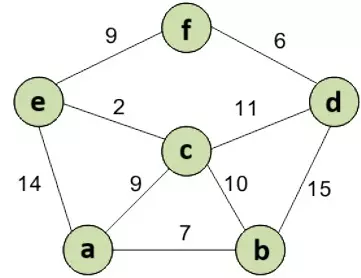
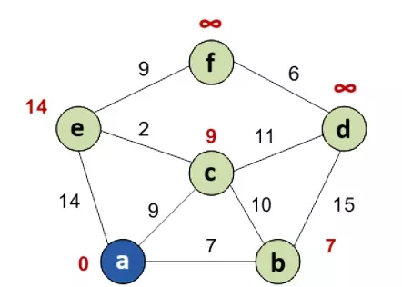
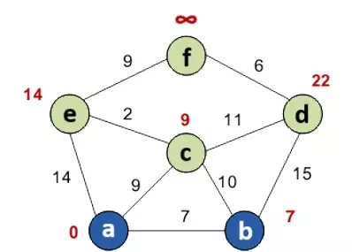
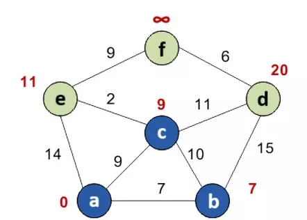
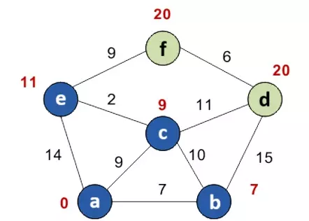
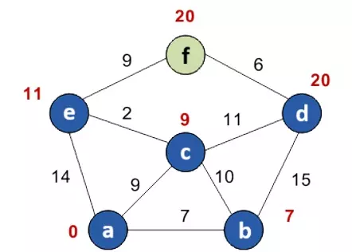
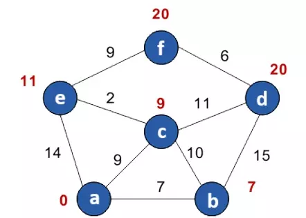

# Алгоритм Дейкстры (англ. Dijkstra’s algorithm)

__Алгоритм Дейкстры__ — классический алгоритм для поиска кратчайшего пути от одной вершины графа к другой. Работает для взвешенного графа, который не содержит рёбер с отрицательными весами.

  

__Сложность алгоритма:__ 

O(M*log2N)

<small>***N,M – количество вершин и рёбер соответственно***</small>

_____

#### Принцип работы:

Алгоритм Дейкстры начинается с установки начальной вершины и работы от этой точки. Он работает по принципу «жадного» алгоритма, что означает, что на каждом шаге он стремится минимизировать текущую общую стоимость пути.

__Для хранения данных инициализируются 4 множества__:
1. ***Costs*** – множество для хранения стоимостей вершин (изначально содержит только стоимость стартовой точки = 0);
2. ***ShortestPaths*** – множество для хранения кратчайших путей до вершин (изначально содержит только путь до стартовой точки);
3. ***Visited*** – множество, содержащее уже обработанные вершины (изначально содержит только стартовую точку);
4. ***NotVisititedButReachable*** – множество непосещеныых, но достижимых на определенный момент времени работы алгоритма, вершин (оптимальней представить в виде [очереди с приоритетом](../../DataStructures/PriorityQueue) с сортировкой по возрастанию).

__Последовательность действий:__

1. Заполняем ***costs***: 
    - стоимость стартовой вершины = 0; 
    - стоимость вершин-прямых соседей стартовой вершины — длина ребер от старта до них; 
    - стоимость остальных вершин — недостижимо большое число (в идеале — бесконечность, это отражает то, что расстояния от стартовой до других вершин пока неизвестны).  

   Добавляем прямых соседей стартовой точки в ***notVisititedButReachable***.

 

2. Из ***notVisititedButReachable*** выбираем вершину с наименьшей стоимостью – это текущая рассматриваемая вершина (***ТВ***).

 

3. Крутимся в цикле, пока конечная точка помечена как непосещенная (не присутствует в ***visited***) и очередь ***notVisititedButReachable*** не пуста:
   1. Находим прямых соседей ***КВ***;
   2. Для каждого соседа сравниваем его текущую стоимость и новую стоимость (новая стоимость = стоимость ***ТВ*** + длина ребра от соседа до ***ТВ***). Если новая стоимость меньше текущей — перезаписываем стоимость для соседа в ***costs*** и в ***notVisititedButReachable*** + обновляем путь до соседа в ***shortestPaths***;
   3. ***ТК*** помечаем как посещенную;
   4. Из очереди ***notVisititedButReachable*** выбираем вершину с наименьшей стоимостью и перезаписываем ***ТК***.  

 

4. Забираем и возвращаем стоимость и путь до конечной точки из ***costs*** и ***shortestPaths***.

_____

#### Пример работы:

__Задача__: найти кратчайший путь от вершины __a__ до вершины __f__.

Кружками обозначены вершины, линиями – пути между ними (ребра графа). В кружках обозначены номера вершин, над ребрами обозначен их вес – длина пути. Рядом с каждой вершиной красным обозначена метка – длина кратчайшего пути в эту вершину из вершины __a__ (стоимость вершины).

##### Шаг 1:
Стоимость стартовой вершины __a__ = 0, метки остальных вершин – недостижимо большое число (в идеале — бесконечность). Стоимость для прямых соседей __a__ (вершины __e__, __c__, __b__) — вес ребер между __a__ и соседом. Остальные вершины на данном этапе помечаются как недостижимые.

##### Шаг 2:
Из непосещенных вершин выбираем вершину с наименьшей стоимостью – это вершина __b__.

Пытаемся уменьшить стоимости соседей __b__, пытаясь пройти в них через __b__. Соседями __b__ являются __a__, __c__, __d__.

Вершина __a__ уже посещена. 
Следующий сосед __b__ — вершина __c__. Если идти в неё через __b__, то длина такого пути будет равна 17 (7 + 10 = 17). Но текущая стоимость __с__ равна 9, а 9 < 17, поэтому стоимость для __c__ не перезаписываем.
Ещё один сосед вершины __b__ — вершина __d__. Если идти в неё через __b__, то длина такого пути будет равна 22 (7 + 15 = 22). Поскольку 22 < ∞, устанавливаем стоимость вершины __d__ равной 22.

Все соседи вершины __b__ просмотрены, помечаем её как посещенную.

##### Шаг 3:
Повторяем шаг 2: из непосещенных вершин выбираем вершину с наименьшей стоимостью – это вершина __с__, ищем ее соседей и проверяем можно ли уменьшить их стоимость и перезаписываем ее, если можно. После помечаем вершину __c__ как посещенную.

##### Шаг 4:
Действуем аналогично шагам 2 и 3.

##### Шаг 5:
Аналогично шагам 2, 3 и 4.

##### Шаг 6:
Действия аналогичны действиям в шагах 2, 3, 4 и 5: выбираем последнюю непосещенную вершину __f__, проверяем ее соседей (они все уже помечены как посещенные, поэтому стоимости не перезаписываем), помечаем __f__ как посещенную – на этом работа алгоритма завершается и мы длину кратчайшего пути от __a__ до __f__, который равен ***20***.

_____
#### Источники:
+ [Prog-cpp](https://prog-cpp.ru/deikstra/)

+ [Habr](https://habr.com/ru/companies/otus/articles/748470/)

+ [Youtube video](https://youtu.be/NErrGZ64OdE?si=9G-DH7SuWDMj-1p1&t=1982)
