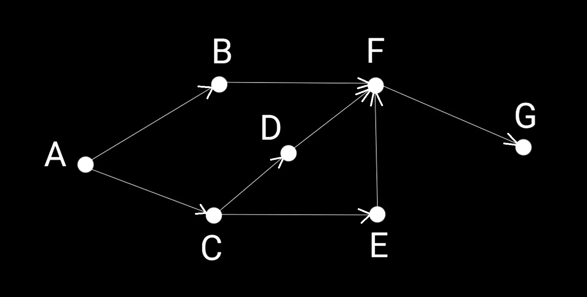
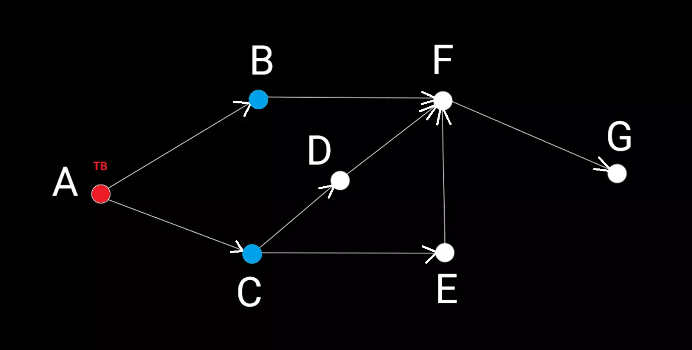
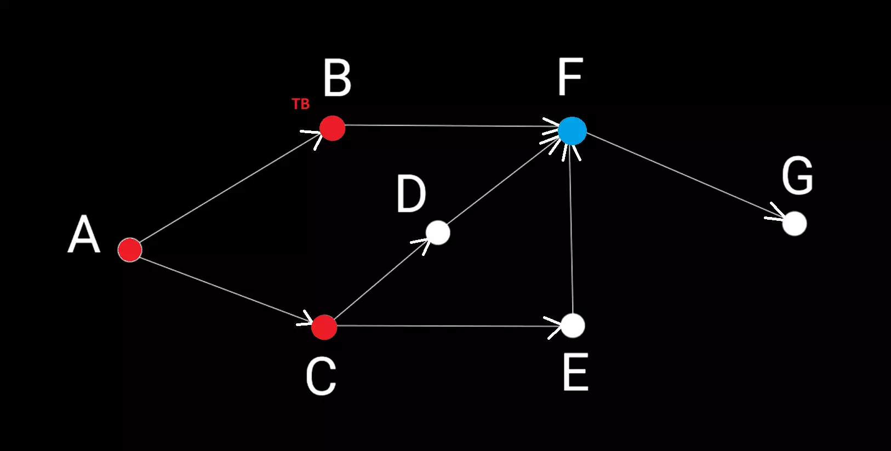
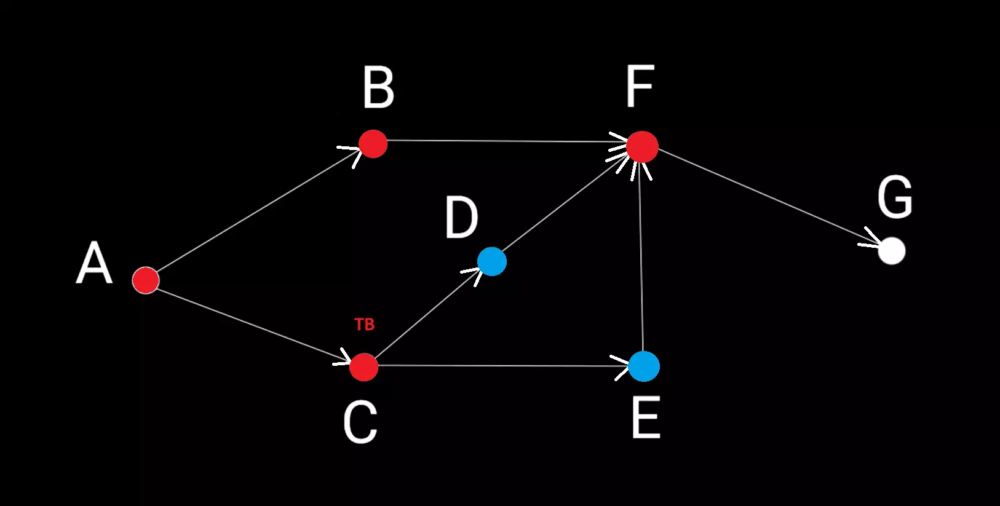
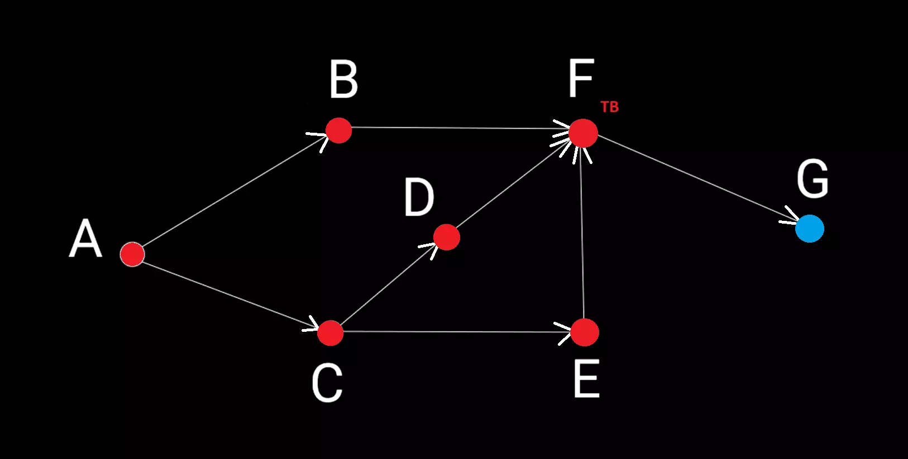
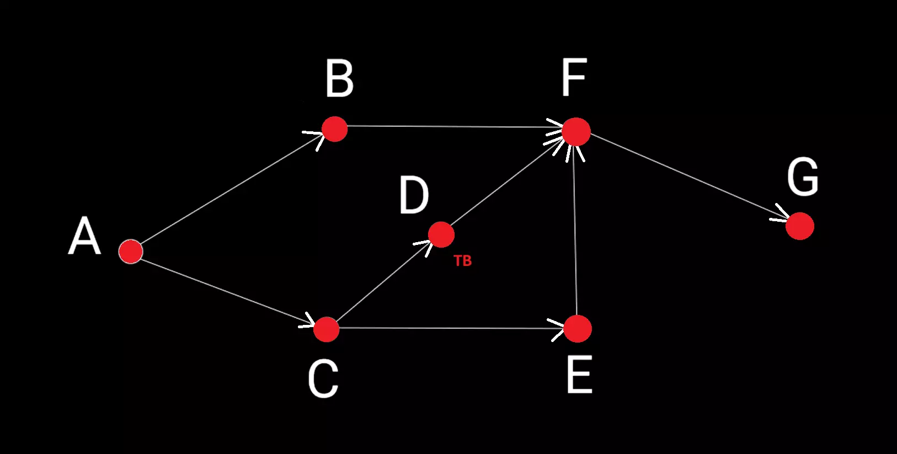
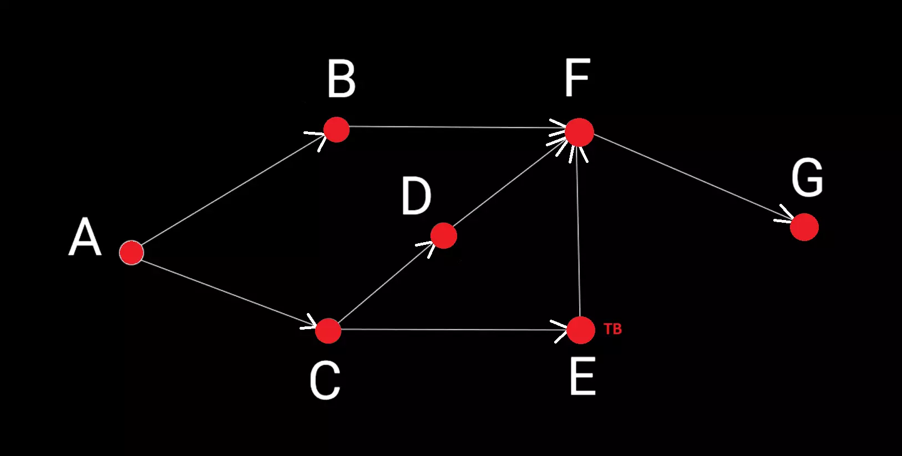
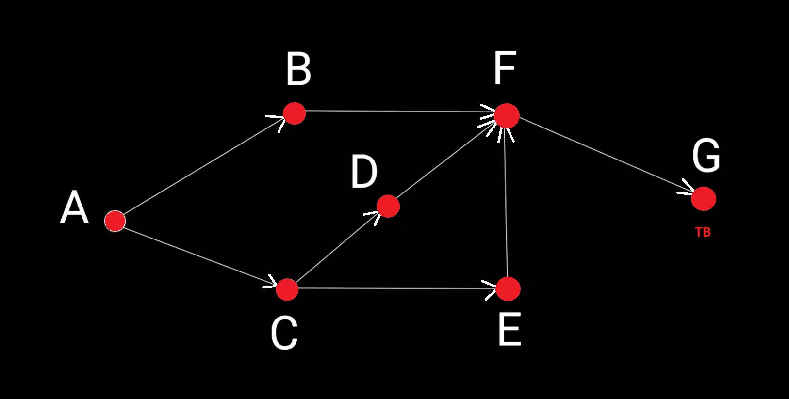

# Поиск в ширину (англ. Breadth-First Search, BFS)

__Поиск в ширину__ — один из основных алгоритмов на графах, позволяющий вычислить кратчайшие расстояния (в терминах количества рёбер) от заданной вершины невзвешенного графа до всех остальных вершин. Кроме того, поиск в ширину позволяет решать задачу проверки достижимости (существуют ли пути между заданной стартовой вершиной и остальными вершинами графа).

Поиск в ширину также называют обходом — так же, как поиск в глубину и все другие обходы, он посещает все вершины графа, достижимые из стартовой вершины, по одному разу, только в другом порядке: по увеличению расстояния до начальной вершины.

  

__Сложность алгоритма:__ 

O(V+E)

<small>***V, E – количество вершин и рёбер соответственно***</small>

_____
#### Принцип работы:

На вход алгоритма подаётся невзвешенный граф и имя стартовой вершины ***start***. Граф может быть как ориентированным, так и неориентированным — для алгоритма это не важно.

Суть BFS достаточно проста. Обход начинается с посещения определённой вершины. Затем алгоритм посещает соседей этой вершины. За ними - соседей соседей, и так далее. Вершины, которые требуется посетить, хранятся в виде очереди ***pointsQueue***. Посещенные вершины храняться в виде списка: 

***&nbsp; &nbsp; paths = {
&nbsp; &nbsp; &nbsp; &nbsp; "имя вершины": кратчайший путь до нее (массив)
&nbsp; &nbsp; }***.

 

__Последовательность действий:__

1. Изначально в ***paths*** помещаем только путь до стартовой вершины, в ***pointsQueue*** также добавляем стартовую вершину;

2. Крутимся в цикле, пока очередь ***pointsQueue*** не пуста:
   1. Забираем из очереди первый элемент ***ТВ*** и получаем его прямых соседей, в которые есть путь из ***ТВ***;
   2. Обрабатываем каждого соседа ***ТВ*** – ***N***. Если ***N*** нет в списке посещенных вершин ***paths***: 
&nbsp;    - добавляем ***N*** в конец очереди ***pointsQueue***;
&nbsp;    - помечаем вершину ***N*** как посещенную - в ***paths*** записываем путь до нее, складывающийся из пути до ***ТВ*** + имя ***N***;

3. Возвращаем ***paths***.

_____
#### Пример работы:
__Задача__: найти кратчайший путь от вершины __A__ до вершины __G__.

Кружками обозначены вершины, линиями – пути между ними (ребра графа). Посещенные вершины помечены красным, рассматриваемая в данный мемент вершина помечается ***ТВ***, соседи ***ТВ*** помечаются синим.

##### Шаг 1:
Стартовая вершина ***A*** помечается как посещенная (записывается в ***paths***) и добавляется в очередь вершин, которые надо рассмотреть ***pointsQueue***.
Забираем из ***pointsQueue*** первый элемент – вершину ***A*** – это рассматриваемая вершина (***ТВ***). Прямые соседи ***А***, в которые есть путь из ***A*** – вершины ***B*** и ***C*** – добавляем их в список посещенных ***paths*** и в конец очереди ***pointsQueue***. 

К концу шага:
- в списке посещенных ***paths*** есть [ A, B, C ];
- В очереди вершин, которые нужно посетить ***pointsQueue*** [ B, C ].

 

##### Шаг 2:
Забираем из ***pointsQueue*** первый элемент – вершину ***B*** – это рассматриваемая вершина (***ТВ***).
Прямой сосед ***B***, в который есть путь из ***B*** – вершина ***F*** – добавляем ee в список посещенных ***paths*** и в конец очереди ***pointsQueue***. 

К концу шага:
- в списке посещенных ***paths*** есть [ A, B, C, F ];
- В очереди вершин, которые нужно посетить ***pointsQueue*** [ C, F ].

 

##### Шаг 3:
Забираем из ***pointsQueue*** первый элемент – вершину ***C*** – это рассматриваемая вершина (***ТВ***).
Прямые соседи ***C***, в которые есть путь из ***C*** – вершины ***D*** и ***E*** – добавляем их в список посещенных ***paths*** и в конец очереди ***pointsQueue***. 

К концу шага:
- в списке посещенных ***paths*** есть [ A, B, C, F, D, E ];
- В очереди вершин, которые нужно посетить ***pointsQueue*** [ F, D, E ].

 

##### Шаг 4:
Забираем из ***pointsQueue*** первый элемент – вершину ***F*** – это рассматриваемая вершина (***ТВ***).
Прямой сосед ***F***, в который есть путь из ***F*** – вершина ***G*** – добавляем ee в список посещенных ***paths*** и в конец очереди ***pointsQueue***.  

К концу шага:
- в списке посещенных ***paths*** есть [ A, B, C, F, D, E, G ];
- В очереди вершин, которые нужно посетить ***pointsQueue*** [ D, E, G ].

 

##### Шаг 5:
Забираем из ***pointsQueue*** первый элемент – вершину ***D*** – это рассматриваемая вершина (***ТВ***). Прямой сосед ***D***, в который есть путь из ***D*** – вершина ***F*** – уже есть в ***paths***, поэтому в ***pointsQueue*** ее не добавляем.

К концу шага:
- в списке посещенных ***paths*** есть [ A, B, C, F, D, E, G ];
- В очереди вершин, которые нужно посетить ***pointsQueue*** [ E, G ].

 

##### Шаг 6:
Забираем из ***pointsQueue*** первый элемент – вершину ***E*** – это рассматриваемая вершина (***ТВ***). Прямой сосед ***E***, в который есть путь из ***E*** – вершина ***F*** – уже есть в ***paths***, поэтому в ***pointsQueue*** ее не добавляем.

К концу шага:
- в списке посещенных ***paths*** есть [ A, B, C, F, D, E, G ];
- В очереди вершин, которые нужно посетить ***pointsQueue*** [ G ].

 

##### Шаг 7:
Забираем из ***pointsQueue*** первый элемент – вершину ***G*** – это рассматриваемая вершина (***ТВ***). Прямых соседей у ***G*** нет.

__К концу шага очередь ***pointsQueue*** пуста – работа алгоритма окончена.__

_____
#### Источники:
+ [Youtube video](https://youtu.be/NErrGZ64OdE?si=_wTzdZeA_x7zOmig&t=1660)
+ [Algorithmica](https://ru.algorithmica.org/cs/shortest-paths/bfs/)
+ [Algowiki](https://algowiki-project.org/ru/%D0%9F%D0%BE%D0%B8%D1%81%D0%BA_%D0%B2_%D1%88%D0%B8%D1%80%D0%B8%D0%BD%D1%83_(BFS))
+ [Brestprog](https://brestprog.by/topics/bfs/)
