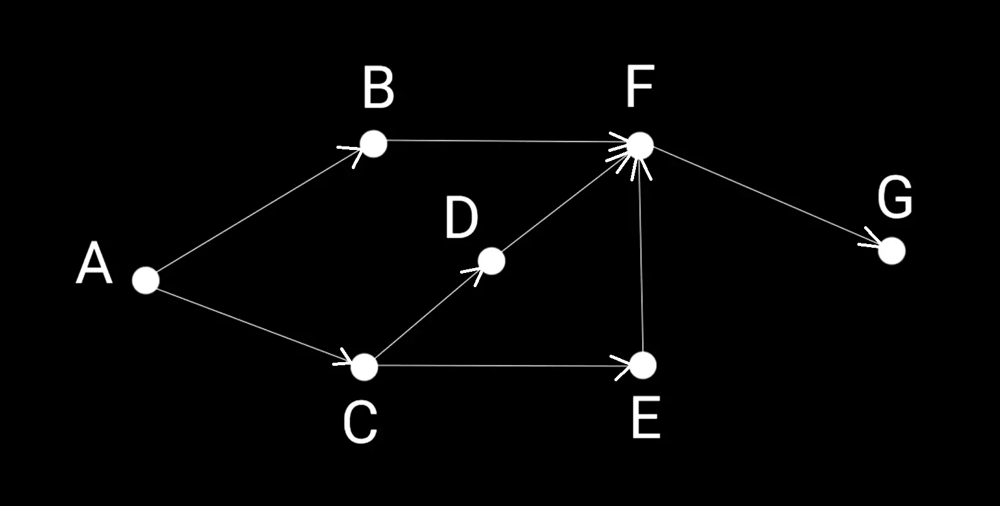
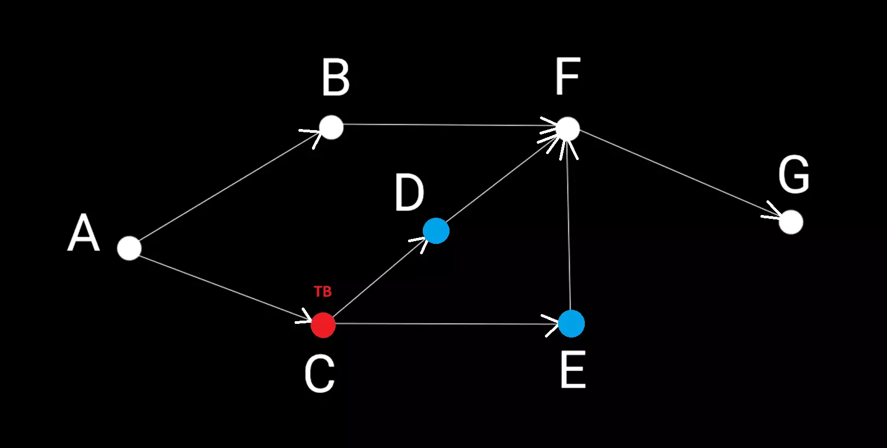
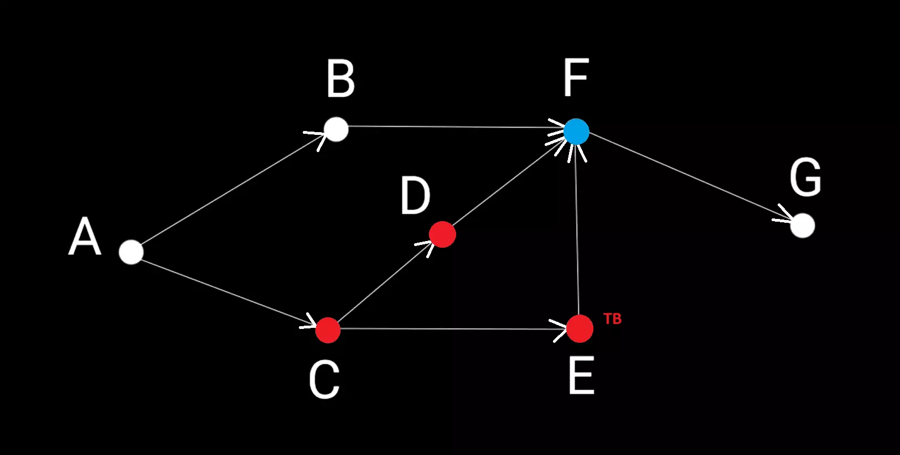
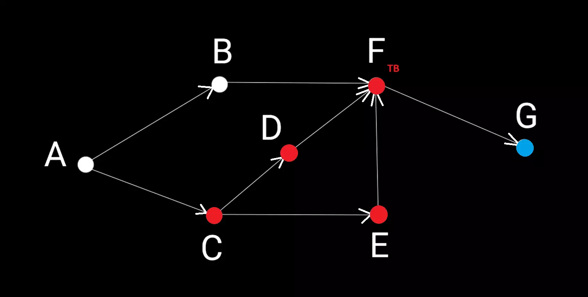
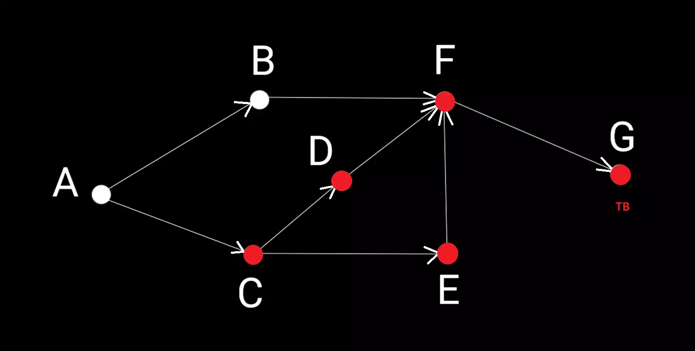
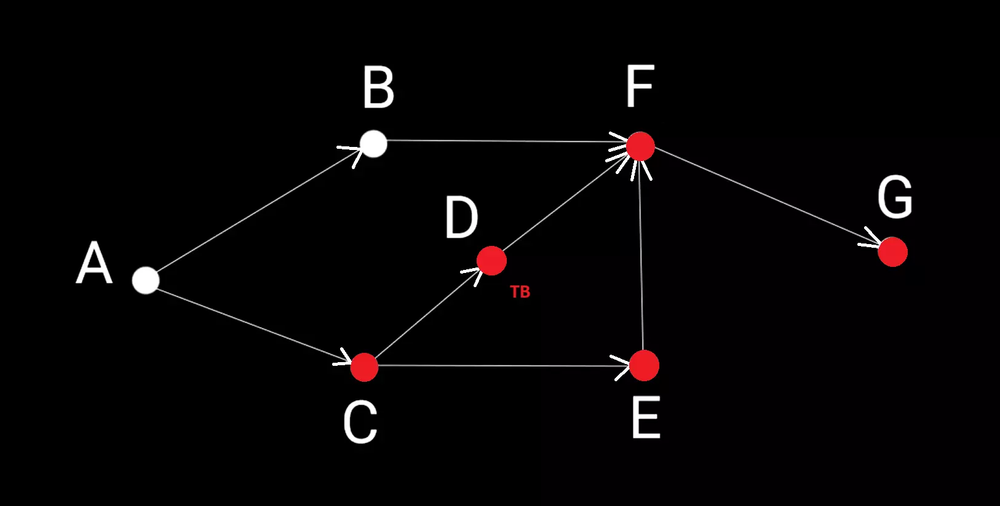

# Поиск в глубину (англ. Depth-First Search, DFS)

__Поиск в глубину__ — один из основных алгоритмов обхода графа, позволяющий получить список всех достижимых вершин графа. Стратегия поиска в глубину, как и следует из названия, состоит в том, чтобы идти «вглубь» графа, насколько это возможно.

На больших графах поиск в глубину серьёзно нагружает стек вызовов. В репозитории представлена нерекурсивная реализация алгоритма на основе [стека](../../../DataStructures//Stack).
 
 

__Сложность алгоритма:__ 

O(V+E)

<small>***V, E – количество вершин и рёбер соответственно***</small>

_____
#### Принцип работы:

На вход алгоритма подаётся невзвешенный граф и имя вершины ***reachableFrom***, для которой нужно получить список достижимых из нее вершин (если reachableFrom === null, то будет возвращен список вообще всех достижимых вершин графа). 
В случае, когда нужно применить DFS для взвешенного графа, то можно его привести к виду невзвешенного перед передачей в функцию.
Граф может быть как ориентированным, так и неориентированным — для алгоритма это не важно.

__Для хранения данных инициализируются 2 множества__:
1. ***VrtxsStack*** – множество вершин, которые надо обработать, представленное в виде [стека](../../../DataStructures//Stack);
2. ***ReachableVrtxs*** – список уже посещенных вершин.

 

__Последовательность действий:__

1. На старте в ***vrtxsStack*** и ***reachableVrtxs*** помещаем вершину ***reachableFrom*** (если ***reachableFrom*** === null, то добавляем в оба множества все корневые вершины графа);

2. Крутимся в цикле, пока стек ***vrtxsStack*** не пуст:
   1. Забираем из стека последний элемент ***ТВ*** и получаем его прямых соседей, в которые есть путь из ***ТВ***;
   2. Обрабатываем каждого соседа ***ТВ*** – ***N***. Если ***N*** нет в списке посещенных вершин ***reachableVrtxs***: 
&nbsp;    - добавляем ***N*** в конец стека ***vrtxsStack***;
&nbsp;    - помечаем вершину ***N*** как посещенную - добаляем ее в ***reachableVrtxs***;

3. Возвращаем ***reachableVrtxs***, преобразовав его в массив.

_____
#### Пример работы:
__Задача__: получить список вершин, достижимых из вершины __C__.

Кружками обозначены вершины, линиями – пути между ними (ребра графа). Посещенные вершины помечены красным, рассматриваемая в данный мемент вершина помечается ***ТВ***, соседи ***ТВ*** помечаются синим.

##### Шаг 1:
Стартовая вершина ***C*** помечается как посещенная (записывается в ***reachableVrtxs***) и добавляется в стек вершин, которые надо рассмотреть ***vrtxsStack***.
Забираем из ***vrtxsStack*** последний элемент – вершину ***C*** – это рассматриваемая вершина (***ТВ***). Прямые соседи ***C***, в которые есть путь из ***C*** – вершины ***D*** и ***E*** – добавляем их в список посещенных ***reachableVrtxs*** и в конец стека ***vrtxsStack***. 

К концу шага:
- в списке посещенных ***reachableVrtxs*** есть [ C, D, E ];
- В очереди вершин, которые нужно посетить ***vrtxsStack*** [ D, E ].

 

##### Шаг 2:
Забираем из ***vrtxsStack*** последний элемент – вершину ***E*** – это рассматриваемая вершина (***ТВ***).
Прямой сосед ***E***, в который есть путь из ***E*** – вершина ***F*** – добавляем ee в список посещенных ***reachableVrtxs*** и в конец стека ***vrtxsStack***. 

К концу шага:
- в списке посещенных ***reachableVrtxs*** есть [ C, D, E, F ];
- В очереди вершин, которые нужно посетить ***vrtxsStack*** [ D, F ].

 

##### Шаг 3:
Забираем из ***vrtxsStack*** последний элемент – вершину ***F*** – это рассматриваемая вершина (***ТВ***).
Прямой сосед ***F***, в который есть путь из ***F*** – вершина ***G*** – добавляем ее в список посещенных ***reachableVrtxs*** и в конец стека ***vrtxsStack***.

К концу шага:
- в списке посещенных ***reachableVrtxs*** есть [ C, D, E, F, G ];
- В очереди вершин, которые нужно посетить ***vrtxsStack*** [ D, G ].

 

##### Шаг 4:
Забираем из ***vrtxsStack*** последний элемент – вершину ***G*** – это рассматриваемая вершина (***ТВ***).
Прямых соседей ***G***, в которые есть путь из ***G***, поэтому переходим к следующему шагу.

К концу шага:
- в списке посещенных ***reachableVrtxs*** есть [ C, D, E, F, G ];
- В очереди вершин, которые нужно посетить ***vrtxsStack*** [ D ].

 

##### Шаг 5:
Забираем из ***vrtxsStack*** последний элемент – вершину ***D*** – это рассматриваемая вершина (***ТВ***).
Прямой сосед ***D***, в который есть путь из ***D*** – вершина ***F*** – уже есть в списке посещенных вершин ***reachableVrtxs***, поэтому никуда ее не добавляем.

__К концу шага стек ***vrtxsStack*** пуст – работа алгоритма окончена.__

_____
#### Источники:
+ [Wikipedia](https://ru.wikipedia.org/wiki/%D0%9F%D0%BE%D0%B8%D1%81%D0%BA_%D0%B2_%D0%B3%D0%BB%D1%83%D0%B1%D0%B8%D0%BD%D1%83)
+ [IFMO-Wiki](https://neerc.ifmo.ru/wiki/index.php?title=%D0%9E%D0%B1%D1%85%D0%BE%D0%B4_%D0%B2_%D0%B3%D0%BB%D1%83%D0%B1%D0%B8%D0%BD%D1%83,_%D1%86%D0%B2%D0%B5%D1%82%D0%B0_%D0%B2%D0%B5%D1%80%D1%88%D0%B8%D0%BD)

