# Нахождение всех простых циклов с заданной вершиной (англ. Finding all simple cycles with a given vertex)

Представленный алгоритм является частью [алгоритма Джонсона](../) (но может использоваться и отдельно от него) и ищет все простые циклы, в которых участвует переданная в качестве параметра вершина (простой цикл — это цикл, не проходящий дважды через одну вершину). В ходе работы использует [обход в глубину](../../../DFS/).

Для оптимизации его работы лучше передавать в качестве параметра [компоненту сильной связности](../../../FindSCC/), частью которой является переданная вершина.
 
 

__Сложность алгоритма:__ 

O(V+E)

<small>***V, E – количество вершин и рёбер соответственно***</small>

_____
#### Принцип работы:

На вход подается невзвешенная форма графа ***SCC*** и имя вершины ***withVertex***, c участием которой надо найти все простые циклы.

__Для хранения данных потребуется 6 множеств__:
1. ***outputCycles*** – массив, в который будут складываться все найденные циклы;
2. ***dfsStack*** – стек вершин для определения порядка их посещения при обходе в глубину;
3. ***blockedSet*** – список заблокированных вершин, которые DFS в данный момент должен игнорировать;
4. ***blockedMap*** – список вершин, которые могут быть разблокированы попутно с заданной;
5. ***startIndexForNbsCycling*** – множество, куда будут сохранятся индексы для корректной обработки соседей рассмариваемых вершин при обходе в глубину (необходим, т.к. DFS реализован без рекурсии);
6. ***partsOfTheCycles*** – список вершин, которые участвуют в уже найденных циклах.

 
 

__Последовательность действий:__

1. На старте в ***dfsStack*** и ***blockedSet*** помещаем вершину ***withVertex***;

 

2. Крутимся в цикле, пока стек ***dfsStack*** не пуст:

   1. Забираем из стека последний элемент ***ТВ*** и получаем его прямых соседей, в которые есть путь из ***ТВ***;
   2. Крутимся по списку соседей в цикле (стартуем с индекса, записанного в ***startIndexForNbsCycling*** || 0) и проверяем каждого соседа ***N*** на наличие в ***blockedSet*** и на равенство вершине ***withVertex*** (на каждой итерации обновляем индекс для последующих циклов по соседям этой же вершины ***ТВ*** в ***startIndexForNbsCycling***):
        &nbsp;    - если ***N*** равен ***withVertex***, то кладем содержимое ***dfsStack*** (это и есть цикл) в ***outputCycles*** и сохраняем все вершины из ***dfsStack*** в ***partsOfTheCycles***;
        &nbsp;    - если ***N*** нет в ***blockedSet***  – добавляем ***N*** в ***dfsStack*** и ***blockedSet***, а цикл по соседям прерываем(***\*\****);
    3. Если ни для одного из соседей не сработало условие из пункта (***\*\****), то извлекаем ***ТВ*** из ***dfsStack***, сбрасываем ей индекс в ***startIndexForNbsCycling*** и:
        &nbsp;    - если ***ТВ*** есть в ***partsOfTheCycles***, то извлекаем ***ТВ*** из ***blockedSet*** + проверяем ***blockedMap*** и разблокируем (удаляем из ***blockedSet***) вершины, которые могут быть разблокированы вместе с ***ТВ***;   
        &nbsp;    - иначе: извлекаем ***ТВ*** из ***dfsStack***, получаем список всех соседей ***ТВ***, которые есть в ***blockedSet***, и для каждого такого соседа в ***blockedMap*** делаем запись о том, что при его разблокировке можно разблокировать также и ***ТВ***;

 

3. Возвращаем ***outputCycles***.

 

_____
#### Пример работы:

__Задача__: найти все простые циклы с вершиной ***1***.

Кружками обозначены вершины, линиями – пути между ними (ребра графа). 
Узлы, по которым сейчас проходит путь DFS (есть в ***dfsStack*** и в ***blockedSet***), помечены серым.
Заблокированные вершины, которые лежат в ***blockedSet***, но их нет в ***dfsStack***, помечены черным цветом.
Рядом с вершинами фиолетовым цветом написан список вершин, которые могут быть разблокированы вместе с ней (это хранится в ***blockedMap***).
Рассматриваемая в данный момент вершина помечается ***ТВ***.

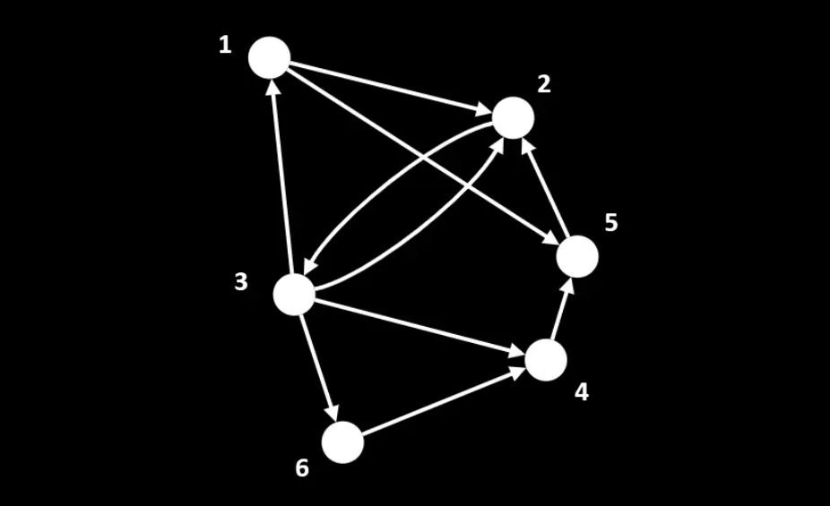

 

##### Шаг 1:
Инициализируем множества ***outputCycles***, ***dfsStack***, ***blockedSet***, ***blockedMap***, ***startIndexForNbsCycling*** и ***partsOfTheCycles***.

Кладем ***withVertex***, равную вершине ***1***, в ***dfsStack*** и ***blockedSet***.

Запускаем цикл, который будет работать, пока ***dfsStack*** не опустеет.

Получаем из ***dfsStack*** последний элемент – вершину ***1*** – это рассматриваемая вершина (***ТВ***). Получаем список прямых соседей ***1***, в которые можно попасть из ***1*** – [ 2, 5 ]. Последовательно обрабатываем вершины из этого списка: 
        &nbsp; &nbsp;    - вершины ***2*** нет в ***blockedSet*** – добавляем ***2*** в ***dfsStack*** и ***blockedSet***. Цикл по соседям прерываем. 

Индекс для старта последующих циклов по соседям вершины ***1*** в  ***startIndexForNbsCycling*** обновляем на 1. 

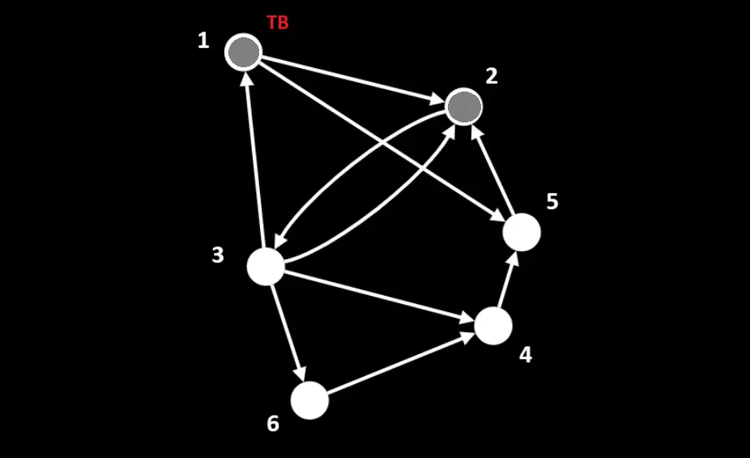

К концу шага:
- В стеке вершин, по которым идет DFS ***dfsStack*** : [ 1, 2 ];
- Список заблокированных вершин ***blockedSet*** : [ 1, 2 ];
- Cписок вершин, которые могут быть разблокированы попутно с заданной ***blockedMap*** : { };
- Индексы для старта циклов по соседям ***startIndexForNbsCycling*** : { 1: 1 };
- Вершины, которые участвуют в уже найденных циклах ***partsOfTheCycles*** : [ ];
- Найденные циклы ***outputCycles*** : [ ].

 

##### Шаг 2:
Получаем из ***dfsStack*** последний элемент – вершину ***2*** – это рассматриваемая вершина (***ТВ***). Получаем список прямых соседей ***2***, в которые можно попасть из ***2*** – [ 3 ]. Последовательно обрабатываем вершины из этого списка (в данном случае только одну): 
        &nbsp; &nbsp;    - вершины ***3*** нет в ***blockedSet*** – добавляем ***3*** в ***dfsStack*** и ***blockedSet***. 

Индекс для старта последующих циклов по соседям вершины ***2*** в  ***startIndexForNbsCycling*** обновляем на 1. 

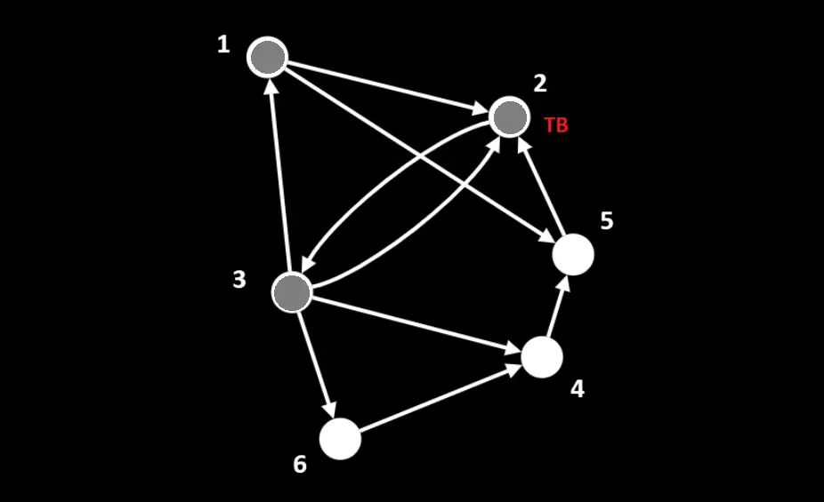

К концу шага:
- В стеке вершин, по которым идет DFS ***dfsStack*** : [ 1, 2, 3 ];
- Список заблокированных вершин ***blockedSet*** : [ 1, 2, 3 ];
- Cписок вершин, которые могут быть разблокированы попутно с заданной ***blockedMap*** : { };
- Индексы для старта циклов по соседям ***startIndexForNbsCycling*** : { 1: 1; 2: 1 };
- Вершины, которые участвуют в уже найденных циклах ***partsOfTheCycles*** : [ ];
- Найденные циклы ***outputCycles*** : [ ].

 

##### Шаг 3:
Получаем из ***dfsStack*** последний элемент – вершину ***3*** – это рассматриваемая вершина (***ТВ***). Получаем список прямых соседей ***3***, в которые можно попасть из ***3*** – [ 1, 2, 4, 6 ]. Последовательно обрабатываем вершины из этого списка: 
        &nbsp; &nbsp;    - вершина ***1*** соответствует ***withVertex*** – добавляем содержимое ***dfsStack*** (это и есть цикл) в ***outputCycles*** и сохраняем все вершины из ***dfsStack*** в ***partsOfTheCycles***;
        &nbsp; &nbsp;    - вершина ***2*** есть в ***blockedSet*** – ее пропускаем;
        &nbsp; &nbsp;    - вершины ***4*** нет в ***blockedSet*** – добавляем ***4*** в ***dfsStack*** и ***blockedSet***. Цикл по соседям прерываем. 

Индекс для старта последующих циклов по соседям вершины ***3*** в  ***startIndexForNbsCycling*** обновляем на 3.

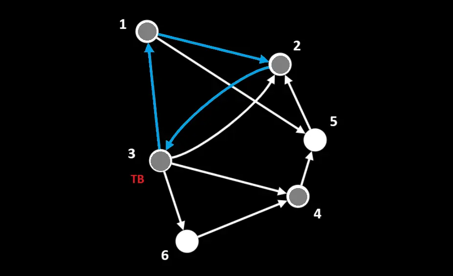

К концу шага:
- В стеке вершин, по которым идет DFS ***dfsStack*** : [ 1, 2, 3, 4 ];
- Список заблокированных вершин ***blockedSet*** : [ 1, 2, 3, 4 ];
- Cписок вершин, которые могут быть разблокированы попутно с заданной ***blockedMap*** : { };
- Индексы для старта циклов по соседям ***startIndexForNbsCycling*** : { 1: 1; 2: 1; 3: 3 };
- Вершины, которые участвуют в уже найденных циклах ***partsOfTheCycles*** : [ 1, 2, 3 ];
- Найденные циклы ***outputCycles*** : [ '1-2-3' ].

 

##### Шаг 4:
Получаем из ***dfsStack*** последний элемент – вершину ***4*** – это рассматриваемая вершина (***ТВ***). Получаем список прямых соседей ***4***, в которые можно попасть из ***4*** – [ 5 ]. Последовательно обрабатываем вершины из этого списка (в данном случае только одну): 
        &nbsp; &nbsp;    - вершины ***5*** нет в ***blockedSet*** – добавляем ***5*** в ***dfsStack*** и ***blockedSet***. 

Индекс для старта последующих циклов по соседям вершины ***4*** в  ***startIndexForNbsCycling*** обновляем на 1. 

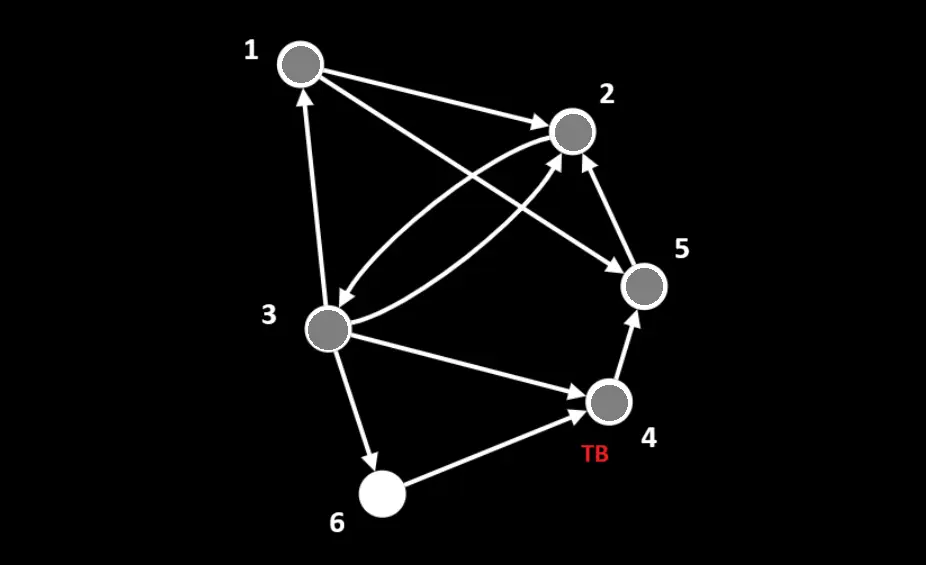

К концу шага:
- В стеке вершин, по которым идет DFS ***dfsStack*** : [ 1, 2, 3, 4, 5 ];
- Список заблокированных вершин ***blockedSet*** : [ 1, 2, 3, 4, 5 ];
- Cписок вершин, которые могут быть разблокированы попутно с заданной ***blockedMap*** : { };
- Индексы для старта циклов по соседям ***startIndexForNbsCycling*** : { 1: 1; 2: 1; 3: 3; 4: 1 };
- Вершины, которые участвуют в уже найденных циклах ***partsOfTheCycles*** : [ 1, 2, 3 ];
- Найденные циклы ***outputCycles*** : [ '1-2-3' ].

 

##### Шаг 5:
Получаем из ***dfsStack*** последний элемент – вершину ***5*** – это рассматриваемая вершина (***ТВ***). Получаем список прямых соседей ***5***, в которые можно попасть из ***5*** – [ 2 ]. Последовательно обрабатываем вершины из этого списка (в данном случае только одну):
        &nbsp; &nbsp;    - вершина ***2*** есть в ***blockedSet*** – ее пропускаем.

Индекс для старта последующих циклов по соседям вершины ***5*** в  ***startIndexForNbsCycling*** обновляем на 1. 

У вершины ***5*** не встречено ни одного незаблокированного соседа и ее нет в ***partsOfTheCycles*** &nbsp; => &nbsp; извлекаем ***5*** из ***dfsStack***, сбрасываем ей индекс в ***startIndexForNbsCycling***, а также получаем список всех соседей ***5***, которые есть в ***blockedSet*** – это [ 2 ] – и для каждого такого соседа в ***blockedMap*** делаем запись о том, что при его разблокировке можно разблокировать также и ***5***.

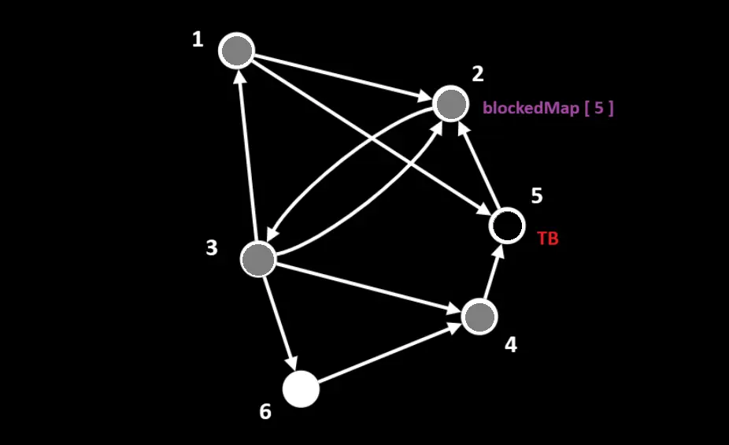

К концу шага:
- В стеке вершин, по которым идет DFS ***dfsStack*** : [ 1, 2, 3, 4 ];
- Список заблокированных вершин ***blockedSet*** : [ 1, 2, 3, 4, 5 ];
- Cписок вершин, которые могут быть разблокированы попутно с заданной ***blockedMap*** : { 2: [ 5 ] };
- Индексы для старта циклов по соседям ***startIndexForNbsCycling*** : { 1: 1; 2: 1; 3: 3; 4: 1 };
- Вершины, которые участвуют в уже найденных циклах ***partsOfTheCycles*** : [ 1, 2, 3 ];
- Найденные циклы ***outputCycles*** : [ '1-2-3' ].

 

##### Шаг 6:
Получаем из ***dfsStack*** последний элемент – вершину ***4*** – это рассматриваемая вершина (***ТВ***). Получаем список прямых соседей ***4***, в которые можно попасть из ***4*** и индекс которых в списке соседей >= 1 (взято из ***startIndexForNbsCycling***) – [ ]. 

У вершины ***4*** не встречено ни одного незаблокированного соседа и ее нет в ***partsOfTheCycles*** &nbsp; => &nbsp; извлекаем ***4*** из ***dfsStack***, сбрасываем ей индекс в ***startIndexForNbsCycling***, а также получаем список всех соседей ***4***, которые есть в ***blockedSet*** – это [ 5 ] – и для каждого такого соседа в ***blockedMap*** делаем запись о том, что при его разблокировке можно разблокировать также и ***4***.

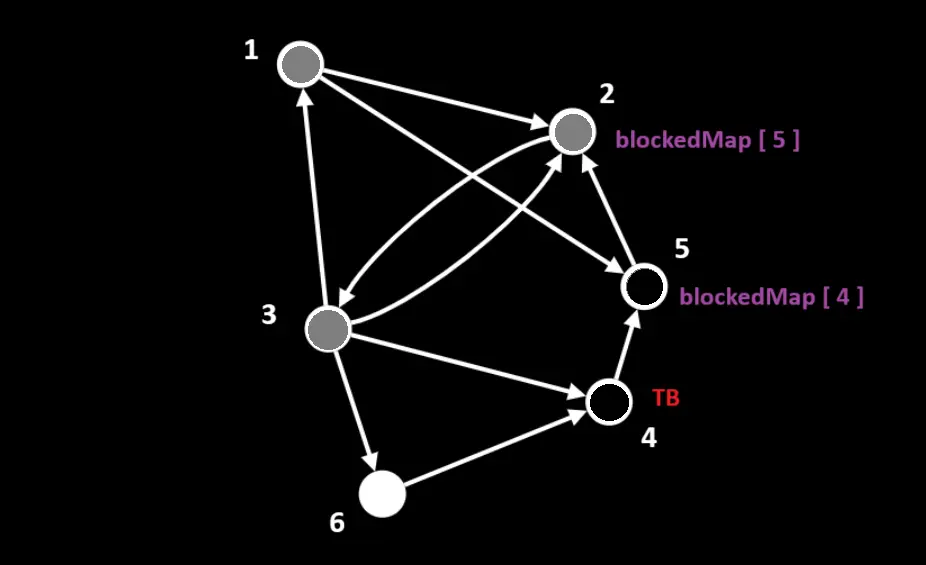

К концу шага:
- В стеке вершин, по которым идет DFS ***dfsStack*** : [ 1, 2, 3 ];
- Список заблокированных вершин ***blockedSet*** : [ 1, 2, 3, 4, 5 ];
- Cписок вершин, которые могут быть разблокированы попутно с заданной ***blockedMap*** : { 2: [ 5 ]; 5: [ 4 ] };
- Индексы для старта циклов по соседям ***startIndexForNbsCycling*** : { 1: 1; 2: 1; 3: 3 };
- Вершины, которые участвуют в уже найденных циклах ***partsOfTheCycles*** : [ 1, 2, 3 ];
- Найденные циклы ***outputCycles*** : [ '1-2-3' ].

 

##### Шаг 7:
Получаем из ***dfsStack*** последний элемент – вершину ***3*** – это рассматриваемая вершина (***ТВ***). Получаем список прямых соседей ***3***, в которые можно попасть из ***3*** и индекс которых в списке соседей >= 3 (взято из ***startIndexForNbsCycling***)  – [ 6 ]. Последовательно обрабатываем вершины из этого списка (в данном случае только одну): 
        &nbsp; &nbsp;    - вершины ***6*** нет в ***blockedSet*** – добавляем ***6*** в ***dfsStack*** и ***blockedSet***. 

Индекс для старта последующих циклов по соседям вершины ***3*** в  ***startIndexForNbsCycling*** обновляем на 4. 

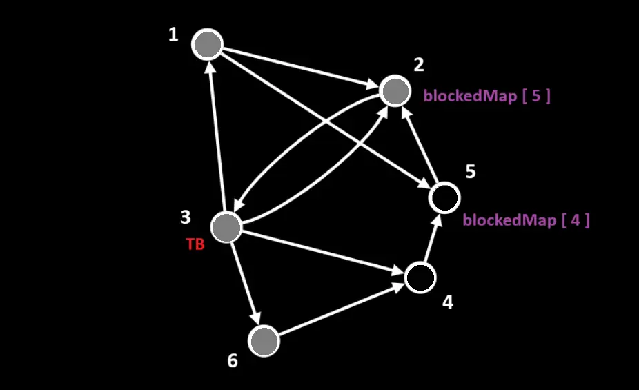

К концу шага:
- В стеке вершин, по которым идет DFS ***dfsStack*** : [ 1, 2, 3, 6 ];
- Список заблокированных вершин ***blockedSet*** : [ 1, 2, 3, 4, 5, 6 ];
- Cписок вершин, которые могут быть разблокированы попутно с заданной ***blockedMap*** : { 2: [ 5 ]; 5: [ 4 ] };
- Индексы для старта циклов по соседям ***startIndexForNbsCycling*** : { 1: 1; 2: 1; 3: 4 };
- Вершины, которые участвуют в уже найденных циклах ***partsOfTheCycles*** : [ 1, 2, 3 ];
- Найденные циклы ***outputCycles*** : [ '1-2-3' ].

 

##### Шаг 8:
Получаем из ***dfsStack*** последний элемент – вершину ***6*** – это рассматриваемая вершина (***ТВ***). Получаем список прямых соседей ***6***, в которые можно попасть из ***6*** – [ 4 ]. Последовательно обрабатываем вершины из этого списка (в данном случае только одну):
        &nbsp; &nbsp;    - вершина ***4*** есть в ***blockedSet*** – ее пропускаем.

Индекс для старта последующих циклов по соседям вершины ***6*** в  ***startIndexForNbsCycling*** обновляем на 1. 

У вершины ***6*** не встречено ни одного незаблокированного соседа и ее нет в ***partsOfTheCycles*** &nbsp; => &nbsp; извлекаем ***6*** из ***dfsStack***, сбрасываем ей индекс в ***startIndexForNbsCycling***, а также получаем список всех соседей ***6***, которые есть в ***blockedSet*** – это [ 4 ] – и для каждого такого соседа в ***blockedMap*** делаем запись о том, что при его разблокировке можно разблокировать также и ***6***.

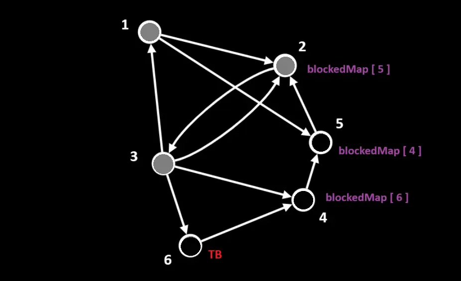

К концу шага:
- В стеке вершин, по которым идет DFS ***dfsStack*** : [ 1, 2, 3 ];
- Список заблокированных вершин ***blockedSet*** : [ 1, 2, 3, 4, 5, 6 ];
- Cписок вершин, которые могут быть разблокированы попутно с заданной ***blockedMap*** : { 2: [ 5 ]; 5: [ 4 ]; 4: [ 6 ] };
- Индексы для старта циклов по соседям ***startIndexForNbsCycling*** : { 1: 1; 2: 1; 3: 4 };
- Вершины, которые участвуют в уже найденных циклах ***partsOfTheCycles*** : [ 1, 2, 3 ];
- Найденные циклы ***outputCycles*** : [ '1-2-3' ].

 

##### Шаг 9:
Получаем из ***dfsStack*** последний элемент – вершину ***3*** – это рассматриваемая вершина (***ТВ***). Получаем список прямых соседей ***3***, в которые можно попасть из ***3*** и индекс которых в списке соседей >= 4 (взято из ***startIndexForNbsCycling***) – [ ]. 

У вершины ***3*** не встречено ни одного незаблокированного соседа и она есть в ***partsOfTheCycles*** &nbsp; => &nbsp; извлекаем ***3*** из ***dfsStack*** и из ***blockedSet***, сбрасываем ей индекс в ***startIndexForNbsCycling*** + проверяем ***blockedMap*** и разблокируем (удаляем из ***blockedSet***) вершины, которые могут быть разблокированы вместе с ***3*** (для ***3*** никаких вершин попутно разблокировать нельзя). 

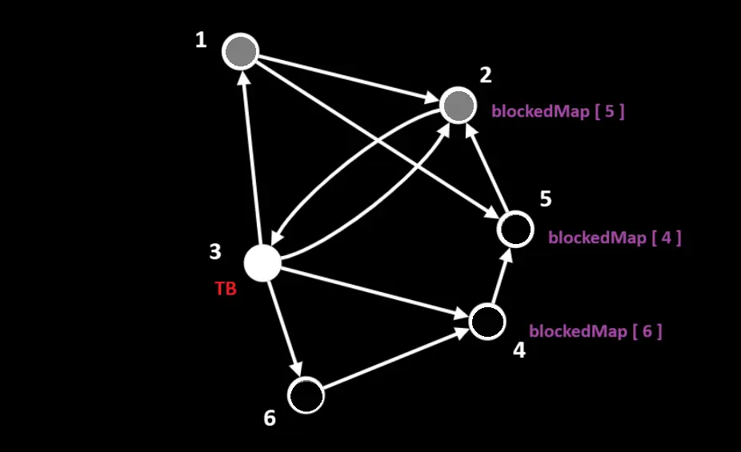

К концу шага:
- В стеке вершин, по которым идет DFS ***dfsStack*** : [ 1, 2 ];
- Список заблокированных вершин ***blockedSet*** : [ 1, 2, 4, 5, 6 ];
- Cписок вершин, которые могут быть разблокированы попутно с заданной ***blockedMap*** : { 2: [ 5 ]; 5: [ 4 ]; 4: [ 6 ] };
- Индексы для старта циклов по соседям ***startIndexForNbsCycling*** : { 1: 1; 2: 1 };
- Вершины, которые участвуют в уже найденных циклах ***partsOfTheCycles*** : [ 1, 2, 3 ];
- Найденные циклы ***outputCycles*** : [ '1-2-3' ].

 

##### Шаг 10:
Получаем из ***dfsStack*** последний элемент – вершину ***2*** – это рассматриваемая вершина (***ТВ***). Получаем список прямых соседей ***2***, в которые можно попасть из ***2*** и индекс которых в списке соседей >= 1 (взято из ***startIndexForNbsCycling***) – [ ]. 

У вершины ***2*** не встречено ни одного незаблокированного соседа и она есть в ***partsOfTheCycles*** &nbsp; => &nbsp; извлекаем ***2*** из ***dfsStack*** и из ***blockedSet***, сбрасываем ей индекс в ***startIndexForNbsCycling*** + проверяем ***blockedMap*** и разблокируем (удаляем из ***blockedSet***) вершины, которые могут быть разблокированы вместе с ***2*** (с ***2*** можно разблокировать ***5***, с ***5*** можно разблокировать ***4*** и с ***4*** можно разблокировать ***6*** – итого разблокируем еще [ 5, 4, 6 ]). 

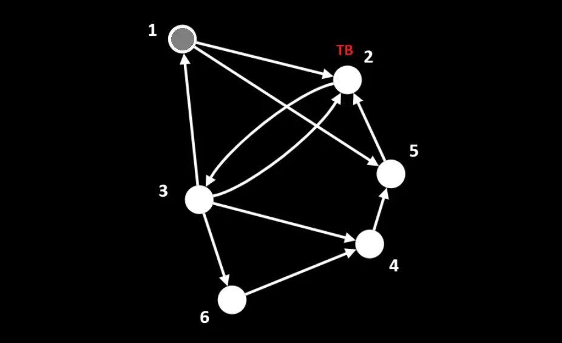

К концу шага:
- В стеке вершин, по которым идет DFS ***dfsStack*** : [ 1 ];
- Список заблокированных вершин ***blockedSet*** : [ 1 ];
- Cписок вершин, которые могут быть разблокированы попутно с заданной ***blockedMap*** : { };
- Индексы для старта циклов по соседям ***startIndexForNbsCycling*** : { 1: 1 };
- Вершины, которые участвуют в уже найденных циклах ***partsOfTheCycles*** : [ 1, 2, 3 ];
- Найденные циклы ***outputCycles*** : [ '1-2-3' ].

 

##### Шаг 11:
Получаем из ***dfsStack*** последний элемент – вершину ***1*** – это рассматриваемая вершина (***ТВ***). Получаем список прямых соседей ***1***, в которые можно попасть из ***1*** и индекс которых в списке соседей >= 1 (взято из ***startIndexForNbsCycling***)  – [ 5 ]. Последовательно обрабатываем вершины из этого списка (в данном случае только одну): 
        &nbsp; &nbsp;    - вершины ***5*** нет в ***blockedSet*** – добавляем ***5*** в ***dfsStack*** и ***blockedSet***. 

Индекс для старта последующих циклов по соседям вершины ***1*** в  ***startIndexForNbsCycling*** обновляем на 2. 

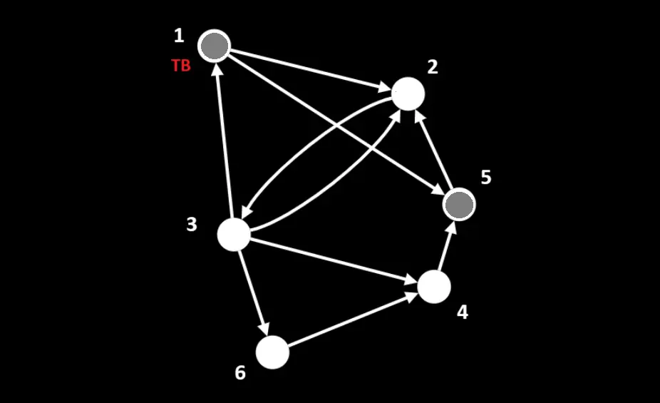

К концу шага:
- В стеке вершин, по которым идет DFS ***dfsStack*** : [ 1, 5 ];
- Список заблокированных вершин ***blockedSet*** : [ 1, 5 ];
- Cписок вершин, которые могут быть разблокированы попутно с заданной ***blockedMap*** : { };
- Индексы для старта циклов по соседям ***startIndexForNbsCycling*** : { 1: 2 };
- Вершины, которые участвуют в уже найденных циклах ***partsOfTheCycles*** : [ 1, 2, 3 ];
- Найденные циклы ***outputCycles*** : [ '1-2-3' ].

 

##### Шаг 12:
Получаем из ***dfsStack*** последний элемент – вершину ***5*** – это рассматриваемая вершина (***ТВ***). Получаем список прямых соседей ***5***, в которые можно попасть из ***5*** – [ 2 ]. Последовательно обрабатываем вершины из этого списка (в данном случае только одну): 
        &nbsp; &nbsp;    - вершины ***2*** нет в ***blockedSet*** – добавляем ***2*** в ***dfsStack*** и ***blockedSet***. 

Индекс для старта последующих циклов по соседям вершины ***5*** в  ***startIndexForNbsCycling*** обновляем на 1. 

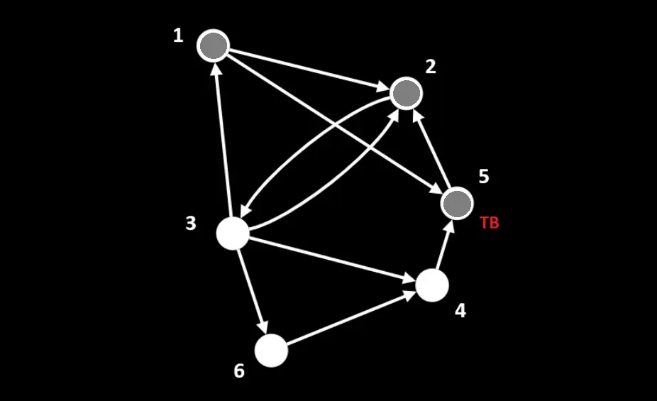

К концу шага:
- В стеке вершин, по которым идет DFS ***dfsStack*** : [ 1, 5, 2 ];
- Список заблокированных вершин ***blockedSet*** : [ 1, 5, 2 ];
- Cписок вершин, которые могут быть разблокированы попутно с заданной ***blockedMap*** : { };
- Индексы для старта циклов по соседям ***startIndexForNbsCycling*** : { 1: 2; 5: 1 };
- Вершины, которые участвуют в уже найденных циклах ***partsOfTheCycles*** : [ 1, 2, 3 ];
- Найденные циклы ***outputCycles*** : [ '1-2-3' ].

 

##### Шаг 13:
Получаем из ***dfsStack*** последний элемент – вершину ***2*** – это рассматриваемая вершина (***ТВ***). Получаем список прямых соседей ***2***, в которые можно попасть из ***2*** – [ 3 ]. Последовательно обрабатываем вершины из этого списка (в данном случае только одну): 
        &nbsp; &nbsp;    - вершины ***3*** нет в ***blockedSet*** – добавляем ***3*** в ***dfsStack*** и ***blockedSet***. 

Индекс для старта последующих циклов по соседям вершины ***2*** в  ***startIndexForNbsCycling*** обновляем на 1. 

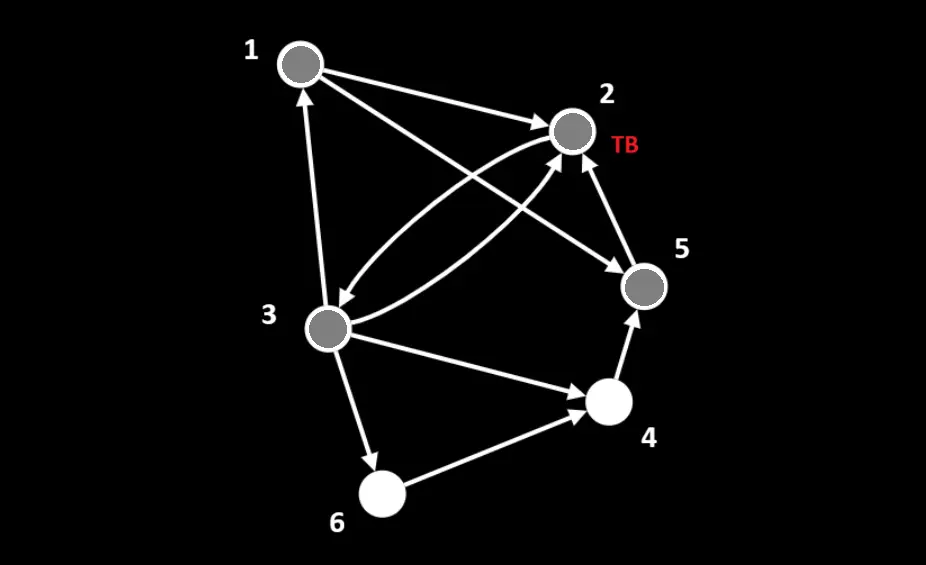

К концу шага:
- В стеке вершин, по которым идет DFS ***dfsStack*** : [ 1, 5, 2, 3 ];
- Список заблокированных вершин ***blockedSet*** : [ 1, 5, 2, 3 ];
- Cписок вершин, которые могут быть разблокированы попутно с заданной ***blockedMap*** : { };
- Индексы для старта циклов по соседям ***startIndexForNbsCycling*** : { 1: 2; 5: 1; 2: 1 };
- Вершины, которые участвуют в уже найденных циклах ***partsOfTheCycles*** : [ 1, 2, 3 ];
- Найденные циклы ***outputCycles*** : [ '1-2-3' ].

 

##### Шаг 14:
Получаем из ***dfsStack*** последний элемент – вершину ***3*** – это рассматриваемая вершина (***ТВ***). Получаем список прямых соседей ***3***, в которые можно попасть из ***3*** – [ 1, 2, 4, 6 ]. Последовательно обрабатываем вершины из этого списка: 
        &nbsp; &nbsp;    - вершина ***1*** соответствует ***withVertex*** – добавляем содержимое ***dfsStack*** (это и есть цикл) в ***outputCycles*** и сохраняем все вершины из ***dfsStack*** в ***partsOfTheCycles***;
        &nbsp; &nbsp;    - вершина ***2*** есть в ***blockedSet*** – ее пропускаем;
        &nbsp; &nbsp;    - вершины ***4*** нет в ***blockedSet*** – добавляем ***4*** в ***dfsStack*** и ***blockedSet***. Цикл по соседям прерываем. 

Индекс для старта последующих циклов по соседям вершины ***3*** в  ***startIndexForNbsCycling*** обновляем на 3.

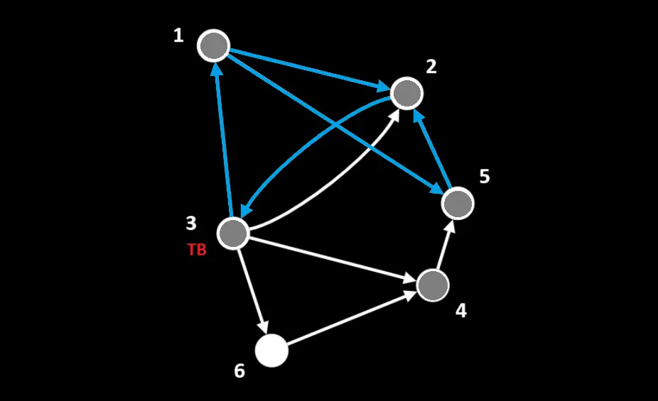

К концу шага:
- В стеке вершин, по которым идет DFS ***dfsStack*** : [ 1, 5, 2, 3, 4 ];
- Список заблокированных вершин ***blockedSet*** : [ 1, 5, 2, 3, 4 ];
- Cписок вершин, которые могут быть разблокированы попутно с заданной ***blockedMap*** : { };
- Индексы для старта циклов по соседям ***startIndexForNbsCycling*** : { 1: 2; 5: 1; 2: 1; 3: 3 };
- Вершины, которые участвуют в уже найденных циклах ***partsOfTheCycles*** : [ 1, 2, 3, 5 ];
- Найденные циклы ***outputCycles*** : [ '1-2-3', '1-5-2-3' ].

 

##### Шаг 15:
Получаем из ***dfsStack*** последний элемент – вершину ***4*** – это рассматриваемая вершина (***ТВ***). Получаем список прямых соседей ***4***, в которые можно попасть из ***4*** – [ 5 ]. Последовательно обрабатываем вершины из этого списка (в данном случае только одну):
        &nbsp; &nbsp;    - вершина ***5*** есть в ***blockedSet*** – ее пропускаем.

Индекс для старта последующих циклов по соседям вершины ***4*** в  ***startIndexForNbsCycling*** обновляем на 1. 

У вершины ***4*** не встречено ни одного незаблокированного соседа и ее нет в ***partsOfTheCycles*** &nbsp; => &nbsp; извлекаем ***4*** из ***dfsStack***, сбрасываем ей индекс в ***startIndexForNbsCycling***, а также получаем список всех соседей ***4***, которые есть в ***blockedSet*** – это [ 5 ] – и для каждого такого соседа в ***blockedMap*** делаем запись о том, что при его разблокировке можно разблокировать также и ***4***.

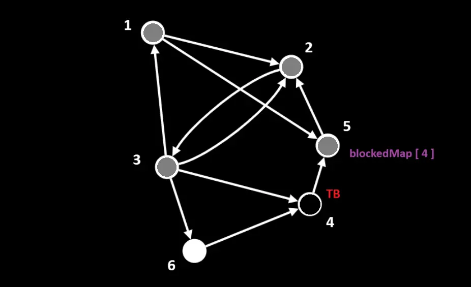

К концу шага:
- В стеке вершин, по которым идет DFS ***dfsStack*** : [ 1, 5, 2, 3 ];
- Список заблокированных вершин ***blockedSet*** : [ 1, 5, 2, 3, 4 ];
- Cписок вершин, которые могут быть разблокированы попутно с заданной ***blockedMap*** : { 5: [ 4 ] };
- Индексы для старта циклов по соседям ***startIndexForNbsCycling*** : { 1: 2; 5: 1; 2: 1; 3: 3 };
- Вершины, которые участвуют в уже найденных циклах ***partsOfTheCycles*** : [ 1, 2, 3, 5 ];
- Найденные циклы ***outputCycles*** : [ '1-2-3', '1-5-2-3' ].

 

##### Шаг 16:
Получаем из ***dfsStack*** последний элемент – вершину ***3*** – это рассматриваемая вершина (***ТВ***). Получаем список прямых соседей ***3***, в которые можно попасть из ***3*** и индекс которых в списке соседей >= 3 (взято из ***startIndexForNbsCycling***)  – [ 6 ]. Последовательно обрабатываем вершины из этого списка (в данном случае только одну): 
        &nbsp; &nbsp;    - вершины ***6*** нет в ***blockedSet*** – добавляем ***6*** в ***dfsStack*** и ***blockedSet***. 

Индекс для старта последующих циклов по соседям вершины ***3*** в  ***startIndexForNbsCycling*** обновляем на 4. 

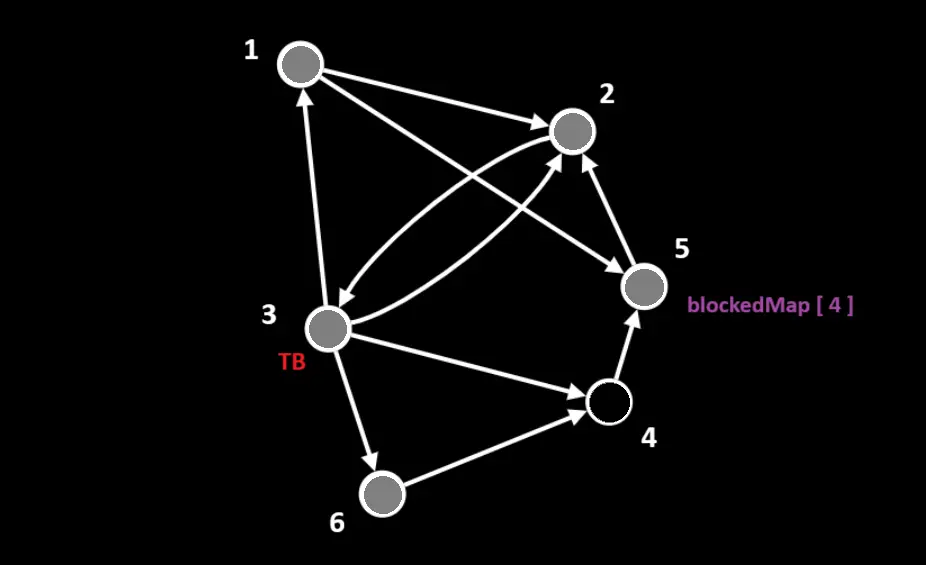

К концу шага:
- В стеке вершин, по которым идет DFS ***dfsStack*** : [ 1, 5, 2, 3, 6 ];
- Список заблокированных вершин ***blockedSet*** : [ 1, 5, 2, 3, 4, 6 ];
- Cписок вершин, которые могут быть разблокированы попутно с заданной ***blockedMap*** : { 5: [ 4 ] };
- Индексы для старта циклов по соседям ***startIndexForNbsCycling*** : { 1: 2; 5: 1; 2: 1; 3: 4 };
- Вершины, которые участвуют в уже найденных циклах ***partsOfTheCycles*** : [ 1, 2, 3, 5 ];
- Найденные циклы ***outputCycles*** : [ '1-2-3', '1-5-2-3' ].

 

##### Шаг 17:
Получаем из ***dfsStack*** последний элемент – вершину ***6*** – это рассматриваемая вершина (***ТВ***). Получаем список прямых соседей ***6***, в которые можно попасть из ***6*** – [ 4 ]. Последовательно обрабатываем вершины из этого списка (в данном случае только одну):
        &nbsp; &nbsp;    - вершина ***4*** есть в ***blockedSet*** – ее пропускаем.

Индекс для старта последующих циклов по соседям вершины ***6*** в  ***startIndexForNbsCycling*** обновляем на 1. 

У вершины ***6*** не встречено ни одного незаблокированного соседа и ее нет в ***partsOfTheCycles*** &nbsp; => &nbsp; извлекаем ***6*** из ***dfsStack***, сбрасываем ей индекс в ***startIndexForNbsCycling***, а также получаем список всех соседей ***6***, которые есть в ***blockedSet*** – это [ 4 ] – и для каждого такого соседа в ***blockedMap*** делаем запись о том, что при его разблокировке можно разблокировать также и ***6***.

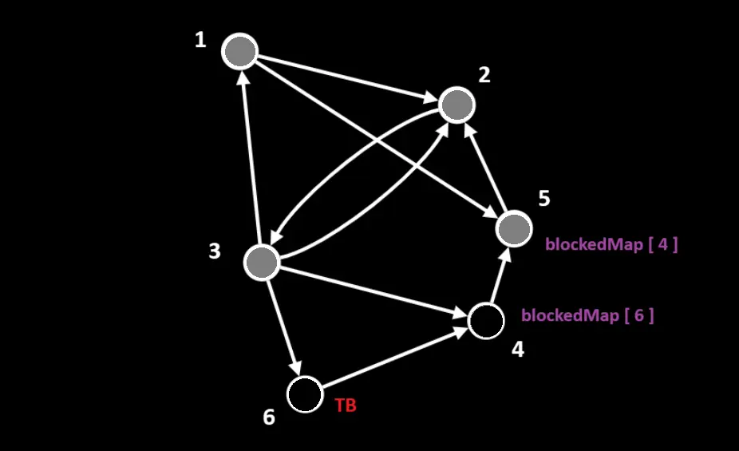

К концу шага:
- В стеке вершин, по которым идет DFS ***dfsStack*** : [ 1, 5, 2, 3 ];
- Список заблокированных вершин ***blockedSet*** : [ 1, 5, 2, 3, 4, 6 ];
- Cписок вершин, которые могут быть разблокированы попутно с заданной ***blockedMap*** : { 5: [ 4 ]; 4: [ 6 ] };
- Индексы для старта циклов по соседям ***startIndexForNbsCycling*** : { 1: 2; 5: 1; 2: 1; 3: 4 };
- Вершины, которые участвуют в уже найденных циклах ***partsOfTheCycles*** : [ 1, 2, 3, 5 ];
- Найденные циклы ***outputCycles*** : [ '1-2-3', '1-5-2-3' ].

 

##### Шаг 18:
Получаем из ***dfsStack*** последний элемент – вершину ***3*** – это рассматриваемая вершина (***ТВ***). Получаем список прямых соседей ***3***, в которые можно попасть из ***3*** и индекс которых в списке соседей >= 4 (взято из ***startIndexForNbsCycling***) – [ ]. 

У вершины ***3*** не встречено ни одного незаблокированного соседа и она есть в ***partsOfTheCycles*** &nbsp; => &nbsp; извлекаем ***3*** из ***dfsStack*** и из ***blockedSet***, сбрасываем ей индекс в ***startIndexForNbsCycling*** + проверяем ***blockedMap*** и разблокируем (удаляем из ***blockedSet***) вершины, которые могут быть разблокированы вместе с ***3*** (для ***3*** никаких вершин попутно разблокировать нельзя). 

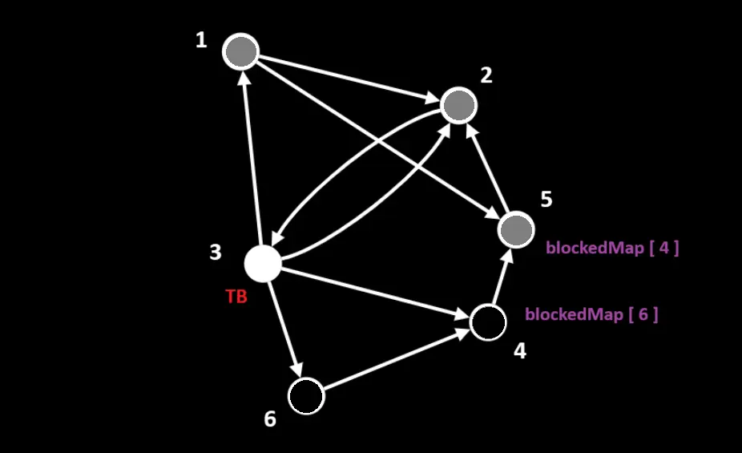

К концу шага:
- В стеке вершин, по которым идет DFS ***dfsStack*** : [ 1, 5, 2 ];
- Список заблокированных вершин ***blockedSet*** : [ 1, 5, 2, 4, 6 ];
- Cписок вершин, которые могут быть разблокированы попутно с заданной ***blockedMap*** : { 5: [ 4 ]; 4: [ 6 ] };
- Индексы для старта циклов по соседям ***startIndexForNbsCycling*** : { 1: 2; 5: 1; 2: 1 };
- Вершины, которые участвуют в уже найденных циклах ***partsOfTheCycles*** : [ 1, 2, 3, 5 ];
- Найденные циклы ***outputCycles*** : [ '1-2-3', '1-5-2-3' ].

 

##### Шаг 19:
Получаем из ***dfsStack*** последний элемент – вершину ***2*** – это рассматриваемая вершина (***ТВ***). Получаем список прямых соседей ***2***, в которые можно попасть из ***2*** и индекс которых в списке соседей >= 1 (взято из ***startIndexForNbsCycling***) – [ ]. 

У вершины ***2*** не встречено ни одного незаблокированного соседа и она есть в ***partsOfTheCycles*** &nbsp; => &nbsp; извлекаем ***2*** из ***dfsStack*** и из ***blockedSet***, сбрасываем ей индекс в ***startIndexForNbsCycling*** + проверяем ***blockedMap*** и разблокируем (удаляем из ***blockedSet***) вершины, которые могут быть разблокированы вместе с ***2*** (для ***2*** никаких вершин попутно разблокировать нельзя). 

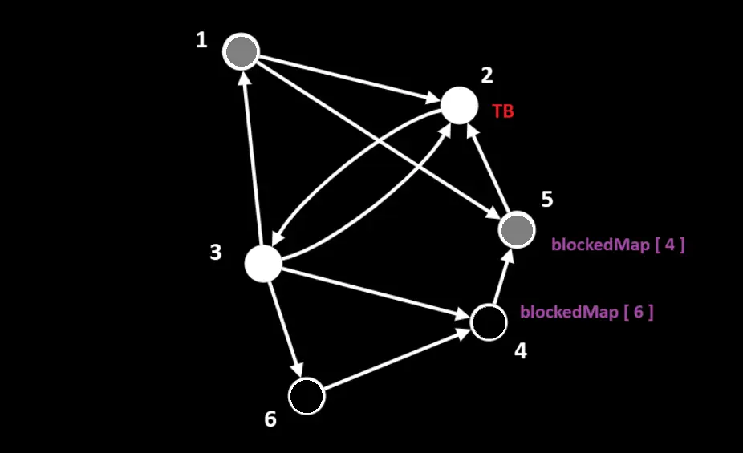

К концу шага:
- В стеке вершин, по которым идет DFS ***dfsStack*** : [ 1, 5 ];
- Список заблокированных вершин ***blockedSet*** : [ 1, 5, 4, 6 ];
- Cписок вершин, которые могут быть разблокированы попутно с заданной ***blockedMap*** : { 5: [ 4 ]; 4: [ 6 ] };
- Индексы для старта циклов по соседям ***startIndexForNbsCycling*** : { 1: 2; 5: 1 };
- Вершины, которые участвуют в уже найденных циклах ***partsOfTheCycles*** : [ 1, 2, 3, 5 ];
- Найденные циклы ***outputCycles*** : [ '1-2-3', '1-5-2-3' ].

 

##### Шаг 20:
Получаем из ***dfsStack*** последний элемент – вершину ***5*** – это рассматриваемая вершина (***ТВ***). Получаем список прямых соседей ***5***, в которые можно попасть из ***5*** и индекс которых в списке соседей >= 1 (взято из ***startIndexForNbsCycling***) – [ ]. 

У вершины ***5*** не встречено ни одного незаблокированного соседа и она есть в ***partsOfTheCycles*** &nbsp; => &nbsp; извлекаем ***5*** из ***dfsStack*** и из ***blockedSet***, сбрасываем ей индекс в ***startIndexForNbsCycling*** + проверяем ***blockedMap*** и разблокируем (удаляем из ***blockedSet***) вершины, которые могут быть разблокированы вместе с ***5*** (с ***5*** можно разблокировать ***4***, а с ***4*** можно разблокировать ***6*** – итого разблокируем еще [ 4, 6 ]). 

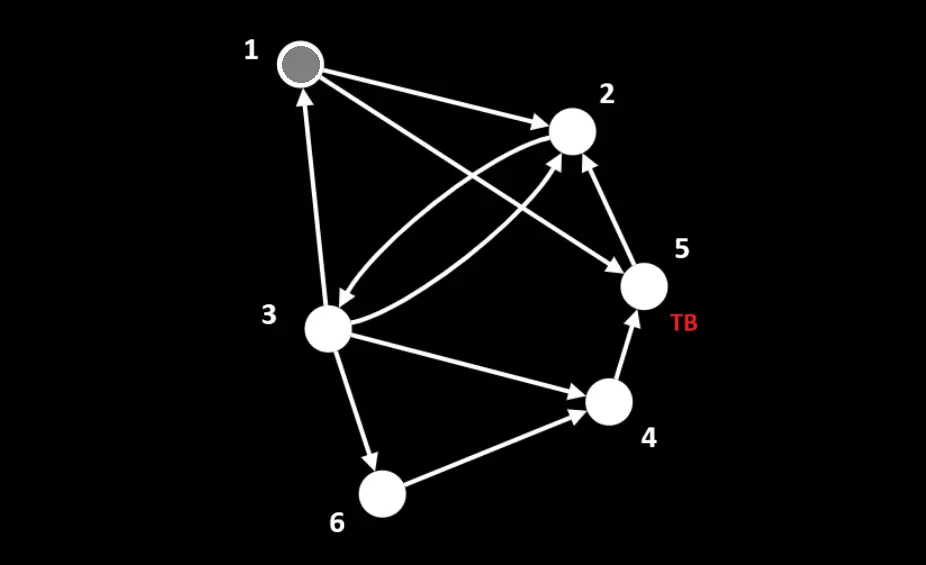

К концу шага:
- В стеке вершин, по которым идет DFS ***dfsStack*** : [ 1 ];
- Список заблокированных вершин ***blockedSet*** : [ 1 ];
- Cписок вершин, которые могут быть разблокированы попутно с заданной ***blockedMap*** : { };
- Индексы для старта циклов по соседям ***startIndexForNbsCycling*** : { 1: 2 };
- Вершины, которые участвуют в уже найденных циклах ***partsOfTheCycles*** : [ 1, 2, 3, 5 ];
- Найденные циклы ***outputCycles*** : [ '1-2-3', '1-5-2-3' ].

 

##### Шаг 21:
Получаем из ***dfsStack*** последний элемент – вершину ***1*** – это рассматриваемая вершина (***ТВ***). Получаем список прямых соседей ***1***, в которые можно попасть из ***1*** и индекс которых в списке соседей >= 2 (взято из ***startIndexForNbsCycling***) – [ ]. 

У вершины ***1*** не встречено ни одного незаблокированного соседа и она есть в ***partsOfTheCycles*** &nbsp; => &nbsp; извлекаем ***1*** из ***dfsStack*** и из ***blockedSet***, сбрасываем ей индекс в ***startIndexForNbsCycling*** + проверяем ***blockedMap*** и разблокируем (удаляем из ***blockedSet***) вершины, которые могут быть разблокированы вместе с ***1*** (для ***1*** никаких вершин попутно разблокировать нельзя). 

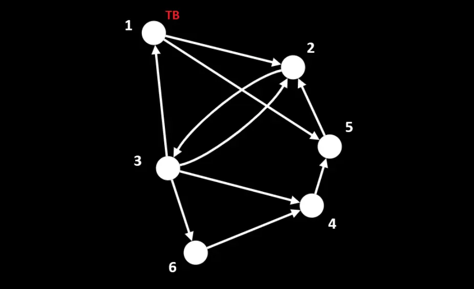

__К концу шага стек ***dfsStack*** пуст – работа алгоритма окончена – возвращаем ***outputCycles***.__

_____
#### Источники:
+ [Youtube video](https://www.youtube.com/watch?v=johyrWospv0)