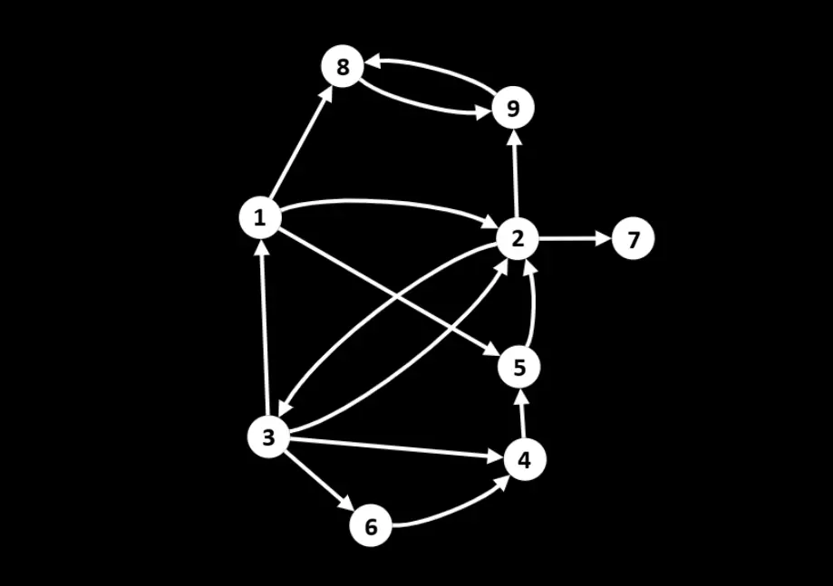
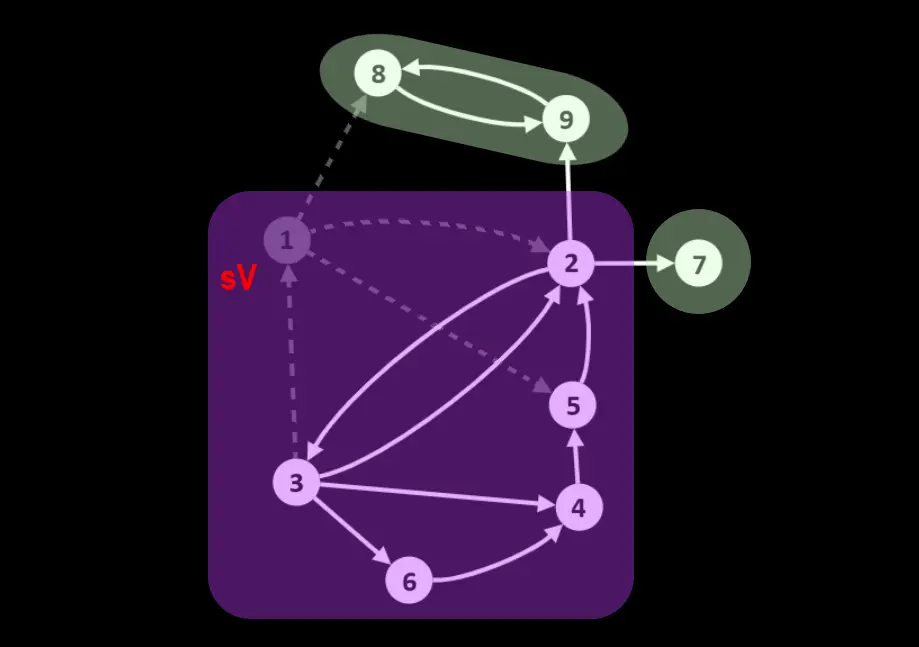
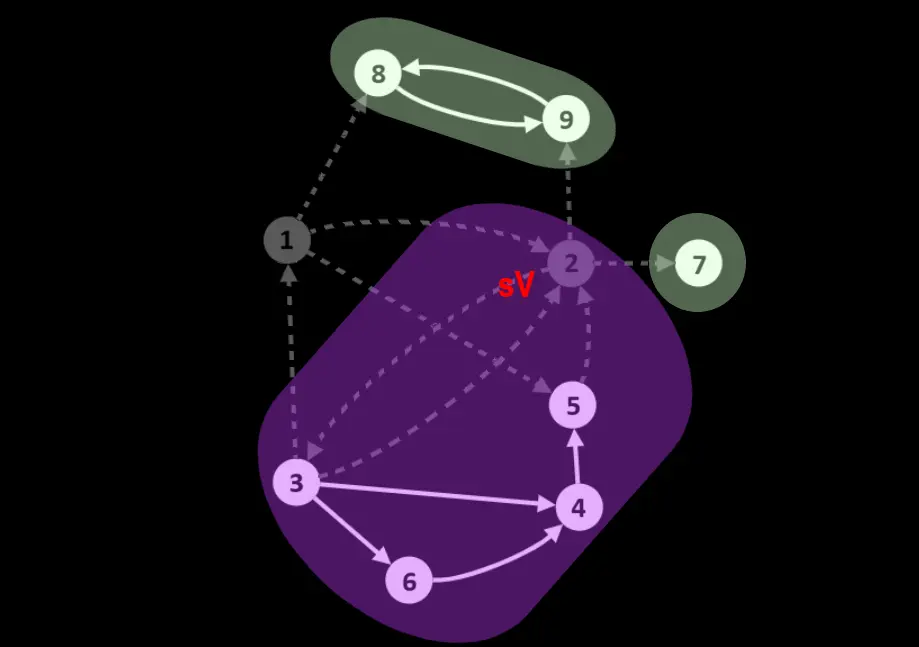
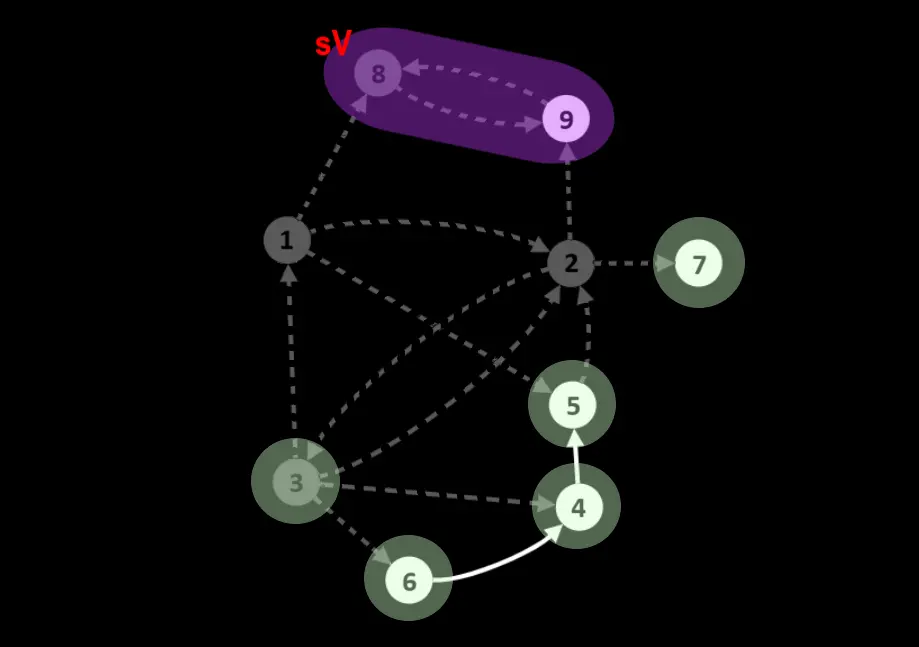
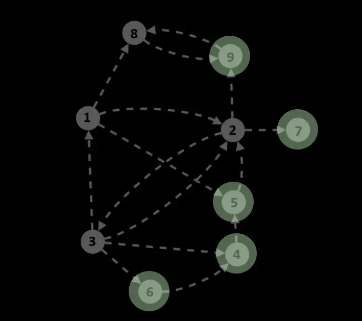

# Алгоритм Джонсона (англ. Johnson's algorithm)

__Алгоритм Джонсона__ — алгоритм для нахождения всех простых циклов в ориентированном графе (простой цикл — это цикл, не проходящий дважды через одну вершину). 

 

__Сложность алгоритма:__ 

O(V+E)(C+1)

<small>***V, E – количество вершин и рёбер соответственно, С – количество циклов в графе***</small>

_____
#### Принцип работы:

На вход подается невзвешенная форма графа ***graph***.

__Для хранения данных потребуется 2 множества__:
1. ***outputCycles*** – массив, в который будут попадать все циклы, найденные с помощью ***[getAllCyclesWithVrtx](./GetAllCyclesWithAGivenVertex/)***;
2. ***SCCs*** – компоненты сильной связности текущей формы графа.

 
 

__Последовательность действий:__

1. Делаем глубокое копирование переданного графа, сохраняем в переменную ***graph***;

 

2. Получаем разбиение ***graph*** на компоненты сильной связности (с помощью [алгоритма Тарьяна](../../FindSCC/TarjansAlgorithm/) и [функции, преобразующей области в компоненты сильной связности](../../FindSCC/GetSCCFromSCR/) ), сохраняем это разбиение в ***SCCs***;

 

3. Крутимся в цикле, пока массив ***SCCs*** не пуст:

    1. Забираем из ***SCCs*** последний элемент ***currSCC***;
    2. Проверяем, что ***currSCC*** не образована изолированной вершиной (то есть вершиной, не имеющей ни одного инцидентного ребра в ***currSCC***):
        &nbsp;    - если это изолированная вершина – удаляем ее из ***graph*** и переходим к следующей итерации цикла;
        &nbsp;    - иначе: выбираем из ***currSCC*** произвольный узел ***startVertex***, запускаем ***[getAllCyclesWithVrtx](./GetAllCyclesWithAGivenVertex/)*** с параметрами ***startVertex*** и ***currSCC*** и добавляем полученные циклы в ***outputCycles***. Затем удаляем из ***graph*** вершину ***startVertex***, делаем для ***graph*** новое разбиение на компоненты сильной связности и сохраняем его в ***SCCs***;

 

4. Возвращаем ***outputCycles***.
    
 

_____
#### Пример работы:

__Задача__: найти все простые циклы переданного графа.

Кружками обозначены вершины, линиями – пути между ними (ребра графа). 
Компонента сильной связности (***currSCC***), которая на текущей итерации обрабатывается ***getAllCyclesWithVrtx***, обведена фиолетовым, остальные КСС – зеленым.
Вершина, для которой на текущей итерации ищутся циклы с ее участием (***startVertex***), помечается ***sV***.
Узлы и ребра, удаленые из текущей формы графа, отмечены серым.

 

##### Шаг 1:
Делаем глубокое копирование переданного графа, сохраняем в переменную ***graph*** и далее работаем с только с этой копией. Инициализируем ***outputCycles***.

Получаем разбиение ***graph*** на области сильной связности с помощью алгоритма Тарьяна, преобразуем их в компоненты сильной связности (КСС) и сохраняем в массив ***SCCs***.

Забираем из ***SCCs*** последний элемент – КСС, содержащую вершины [ 1, 2, 3, 4, 5, 6 ] – это ***currSCC***. 
Проверяем, что ***currSCC*** образована не изолированной вершиной, выбираем из нее произвольный узел ***startVertex*** – вершину ***1*** – и запускаем ***getAllCyclesWithVrtx*** с параметрами ***startVertex*** и ***currSCC***. Полученные циклы добавляем в ***outputCycles***.

Удаляем из ***graph*** вершину ***1***. 

К концу шага:
- Найденные циклы ***outputCycles*** : [ '1-2-3', '1-5-2-3' ].

Делаем для ***graph*** новое разбиение на компоненты сильной связности и сохраняем его в ***SCCs***.

 

##### Шаг 2:
Забираем из ***SCCs*** последний элемент – КСС, содержащую вершины [ 2, 3, 4, 5, 6 ] – это ***currSCC***. 
Проверяем, что ***currSCC*** образована не изолированной вершиной, выбираем из нее произвольный узел ***startVertex*** – вершину ***2*** – и запускаем ***getAllCyclesWithVrtx*** с параметрами ***startVertex*** и ***currSCC***. Полученные циклы добавляем в ***outputCycles***.

Удаляем из ***graph*** вершину ***2***. 

К концу шага:
- Найденные циклы ***outputCycles*** : [ '1-2-3', '1-5-2-3', '2-3', '2-3-4-5', '2-3-6-4-5' ].

Делаем для ***graph*** новое разбиение на компоненты сильной связности и сохраняем его в ***SCCs***.

 

##### Шаг 3:
Забираем из ***SCCs*** последний элемент – КСС, содержащую вершины [ 3 ] – это ***currSCC***. ***currSCC*** образована изолированной вершиной – удаляем ее из ***graph*** и переходим к следующей итерации цикла.

Забираем из ***SCCs*** последний элемент – КСС, содержащую вершины [ 8, 9 ] – это ***currSCC***. 
Проверяем, что ***currSCC*** образована не изолированной вершиной, выбираем из нее произвольный узел ***startVertex*** – вершину ***8*** – и запускаем ***getAllCyclesWithVrtx*** с параметрами ***startVertex*** и ***currSCC***. Полученные циклы добавляем в ***outputCycles***.

Удаляем из ***graph*** вершину ***8***. 

К концу шага:
- Найденные циклы ***outputCycles*** : [ '1-2-3', '1-5-2-3', '2-3', '2-3-4-5', '2-3-6-4-5', '8-9' ].

Делаем для ***graph*** новое разбиение на компоненты сильной связности и сохраняем его в ***SCCs***.

 

##### Шаг 4:
В  ***SCCs*** остались только компоненты, образованные изолированными вершинами – последовательно извлекаем их.

__К концу шага массив ***SCCs*** пуст – работа алгоритма окончена – возвращаем ***outputCycles***.__

_____
#### Источники:
+ [Youtube video](https://www.youtube.com/watch?v=johyrWospv0)

