# Проверка графа на ацикличность (англ. Checking a graph for acyclicity)

Циклом в графе называется ненулевой путь, ведущий из вершины v в саму себя. Граф называют ацикличным, если в нем нет циклов.
Для заданного графа нужно определить, содержит ли он хотя бы один цикл. Будем решать задачу с помощью [поиска в глубину](../../DFS).

 

__Сложность (соответствует сложности DFS):__ 

O(V+E)

<small>***V, E – количество вершин и рёбер соответственно***</small>

_____
#### Принцип работы:

В ходе проверки проведем серию поисков в глубину в графе. Т.е. из каждой вершины, в которую мы ещё ни разу не приходили, запустим [DFS](../../DFS), который при входе в вершину будет красить её в серый цвет, а при выходе - в чёрный. И если DFS пытается пойти в серую вершину, то это означает, что цикл найден.

 

__Для работы алгоритма нужны 2 функции__:
1. ***checkPathsFromOneVrtx*** – вспомогательная функция, запускающая для поиска циклов DFS из заданной вершины;
2. ***isTheGraphAcyclic*** – основная функция, обеспечивающая то, чтобы ***checkPathsFromOneVrtx*** прошелся по всем вершинам графа.

 

На вход основной функции ***isTheGraphAcyclic*** подаётся невзвешенный граф, на вход ***checkPathsFromOneVrtx*** – этот же самый граф и имя вершины ***start***, с которой следует начать DFS.

 

#### Про вспомогательную функцию ***сheckPathsFromOneVrtx***:

__Для хранения данных в сheckPathsFromOneVrtx инициализируются 3 множества__:
1. ***vStack*** – множество вершин, которые надо обработать, представленное в виде [стека](../../../../DataStructures/Stack);
2. ***visited*** – список уже посещенных вершин. Каждая вершина в этом списке помечена серым или черным цветом. Серым, если еще не все пути из этой вершины рассмотрены, черным – если  рассмотрены уже все возможные пути из них.
3. ***output*** – результат выполнения функции  – объект, с 2 свойствами: ***isTheCycleFound*** (отвечает на вопрос был ли найден цикл при запуске с заданным ***start***) и ***processedVs*** (список вершин, которые были посещены).

__Последовательность действий в сheckPathsFromOneVrtx:__

1. На старте в ***vStack***, ***visited*** и ***processedVs*** помещаем вершину ***start*** (в ***visited*** кладем ***start*** под серым цветом);

2. Крутимся в цикле, пока стек ***vStack*** не пуст:
   1. Забираем из стека последний элемент ***ТВ*** и получаем его прямых соседей, в которые есть путь из ***ТВ***;
   2. Крутимся по списку соседей в цикле и проверяем каждого соседа ***N*** на наличие в ***visited***:
&nbsp;    - если ***N*** нет в ***visited*** вообще – добавляем ***N*** в ***vStack***, ***visited*** (под серым цветом) и ***processedVs***, а цикл по соседям прерываем;
&nbsp;    - если ***N*** есть в ***visited*** под серым цветом – это значит, что цикл найден, работа ***сheckPathsFromOneVrtx*** закончена – возвращаем ***output*** (***\*\****);
    3. Если ни для одного из соседей не сработало ни одно из «если» в предыдущем пункте, то из ***vStack*** извлекаем ***ТВ***, а в ***visited*** помечаем ***ТВ*** черным цветом;

3. Если функция не прервала свою работу на пункте (***\*\****), возвращаем ***output*** с ***isTheCycleFound*** = false и списком посещенных вершин ***processedVs***.

 

#### Про основную функцию ***isTheGraphAcyclic***:

Для хранения списка вершин, которые должны быть посещены при работе  ***сheckPathsFromOneVrtx***, будет использоваться массив ***verticesToCheck***.

__Последовательность действий в isTheGraphAcyclic:__
1. На старте в ***verticesToCheck*** помещаем все достижимые вершины графа (получаем их список с помощью [DFS](../../DFS));

2. Крутимся в цикле, пока массив ***verticesToCheck*** не пуст:
    1. Запускаем ***сheckPathsFromOneVrtx*** в качестве параметра ***start*** передаем нулевой элемент из массива ***verticesToCheck*** – получаем ***output*** с полями ***isTheCycleFound***  и ***processedVs*** (***\*\*\****);
    2. Если ***isTheCycleFound*** === true – цикл в графе найден, работа функции окончена, если же ***isTheCycleFound*** === false – убираем из ***verticesToCheck*** вершины, полученные в ***output*** ***processedVs***;

3. Если функция не прервала свою работу на пункте (***\*\*\****), то граф ацикличен  – возвращаем true.

_____
#### Пример работы:
__Задача__: проверить граф на ацикличность.

Кружками обозначены вершины, линиями – пути между ними (ребра графа). 
Вершины, по которым сейчас проходит путь DFS, помечены серым.
Вершины, для которых уже рассмотрены все возможные пути из них, помечены черным крестиком. 
Рассматриваемая в данный момент вершина помечается ***ТВ***.

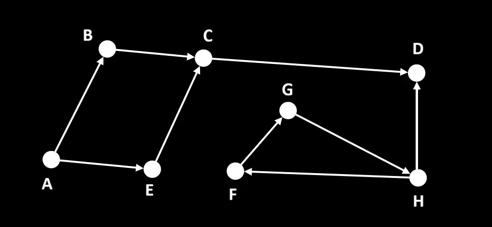

##### Шаг 1:
Передаем в функцию ***isTheGraphAcyclic*** граф, который хотим проверить на ацикличность.
С помощью DFS получаем список всех достижимых вершин графа ***verticesToCheck***: [ 'A', 'B', 'C', 'D', 'E', 'F', 'G', 'H' ]. 
Забираем из этого списка нулевой элемент ***A*** и передаем его в качестве второго аргумента в ***сheckPathsFromOneVrtx*** и исходный граф в качестве первого.

Внутри ***checkPathsFromOneVrtx*** инициализируем:
1.  ***vStack*** – множество вершин, которые надо обработать, представленное в виде [стека](../../../../DataStructures/Stack);
2.  ***visited*** – список уже посещенных вершин, которые будут в нем помечаться серым или черным цветом;
3. ***output*** – результат выполнения функции ***checkPathsFromOneVrtx***  – объект, с ключами: ***isTheCycleFound*** и ***processedVs*** (список посещенных вершин).

Кладем в ***vStack***, в ***processedVs*** и в ***visited*** под серым цветом вершину ***A***, переданную в функцию в качестве аргумента ***start***.

Запускаем цикл, который будет работать, пока ***vStack*** не опустеет.

Получаем из ***vStack*** последний элемент - вершину ***A*** – это рассматриваемая вершина (***ТВ***). Получаем список прямых соседей ***A***, в которые можно попасть из ***A*** – [ B, E ]. Последовательно обрабатываем вершины из этого списка: вершины ***B*** нет в ***visited***, поэтому добавляем ее в ***processedVs***, кладем в конец ***vStack*** и в ***visited*** под серым цветом, а цикл по списку соседей прерываем.

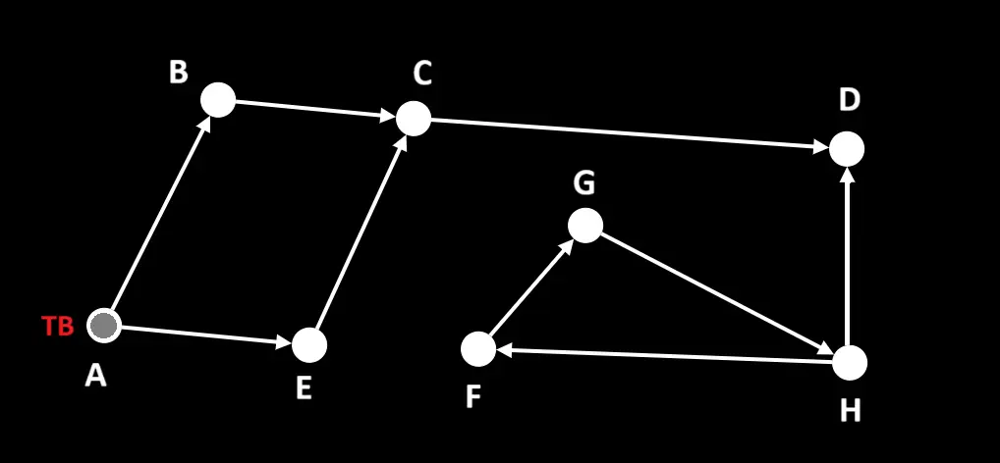

К концу шага:
- В списке вершин, которые нужно рассмотреть ***vStack*** [ A, B ];
- в списке посещенных ***visited***: { A: grey, B: grey };
- В ***output.processedVs***: [ A, B ];
- В ***verticesToCheck***, который объявлен в ***isTheGraphAcyclic*** : [ 'A', 'B', 'C', 'D', 'E', 'F', 'G', 'H' ] (без изменений).

 

##### Шаг 2:
Получаем из ***vStack*** последний элемент - вершину ***B*** – это рассматриваемая вершина (***ТВ***). Получаем список прямых соседей ***B***, в которые можно попасть из ***B*** – [ C ]. Последовательно обрабатываем вершины из этого списка (в данном случае только 1): вершины ***C*** нет в ***visited***, поэтому добавляем ее в ***processedVs***, кладем в конец ***vStack*** и в ***visited*** под серым цветом.

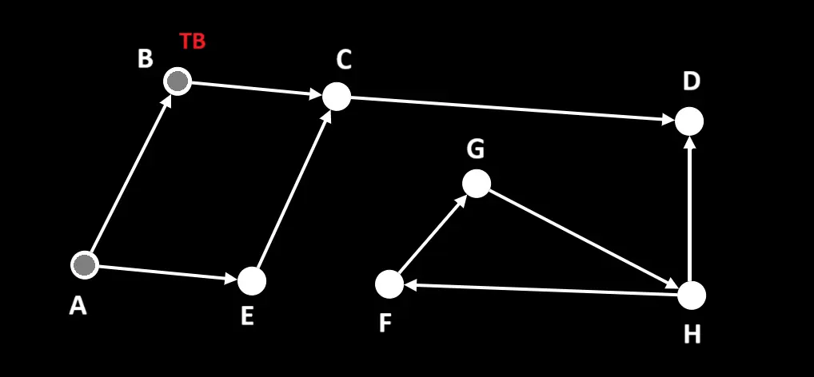

К концу шага:
- В списке вершин, которые нужно рассмотреть ***vStack*** [ A, B, C ];
- в списке посещенных ***visited***: { A: grey, B: grey, C: grey };
- В ***output.processedVs***: [ A, B, C ];
- В ***verticesToCheck***, который объявлен в ***isTheGraphAcyclic*** : [ 'A', 'B', 'C', 'D', 'E', 'F', 'G', 'H' ] (без изменений).

 

##### Шаг 3:
Получаем из ***vStack*** последний элемент - вершину ***C*** – это рассматриваемая вершина (***ТВ***). Получаем список прямых соседей ***C***, в которые можно попасть из ***C*** – [ D ]. Последовательно обрабатываем вершины из этого списка (в данном случае только 1): вершины ***D*** нет в ***visited***, поэтому добавляем ее в ***processedVs***, кладем в конец ***vStack*** и в ***visited*** под серым цветом.

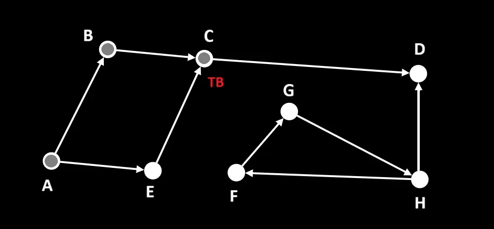

К концу шага:
- В списке вершин, которые нужно рассмотреть ***vStack*** [ A, B, C, D ];
- в списке посещенных ***visited***: { A: grey, B: grey, C: grey, D: grey };
- В ***output.processedVs***: [ A, B, C, D ];
- В ***verticesToCheck***, который объявлен в ***isTheGraphAcyclic*** : [ 'A', 'B', 'C', 'D', 'E', 'F', 'G', 'H' ] (без изменений).

 

##### Шаг 4:
Получаем из ***vStack*** последний элемент - вершину ***D*** – это рассматриваемая вершина (***ТВ***). Получаем список прямых соседей ***D***, в которые можно попасть из ***D*** – [ ]. Так как у ***D*** нет ни одного «серого» или непосещенного соседа – удаляем из ***vStack*** вершину ***D*** и в ***visited*** помечаем ее черным цветом.

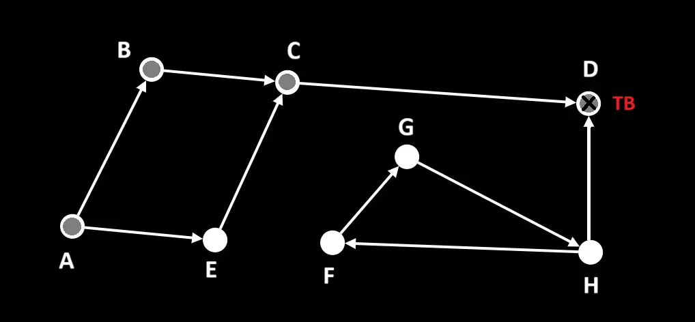

К концу шага:
- В списке вершин, которые нужно рассмотреть ***vStack*** [ A, B, C ];
- в списке посещенных ***visited***: { A: grey, B: grey, C: grey, D: black };
- В ***output.processedVs***: [ A, B, C, D ];
- В ***verticesToCheck***, который объявлен в ***isTheGraphAcyclic*** : [ 'A', 'B', 'C', 'D', 'E', 'F', 'G', 'H' ] (без изменений).

 

##### Шаг 5:
Получаем из ***vStack*** последний элемент - вершину ***C*** – это рассматриваемая вершина (***ТВ***). Получаем список прямых соседей ***C***, в которые можно попасть из ***C*** – [ ]. Так как у ***C*** нет ни одного «серого» или непосещенного соседа – удаляем из ***vStack*** вершину ***C*** и в ***visited*** помечаем ее черным цветом.

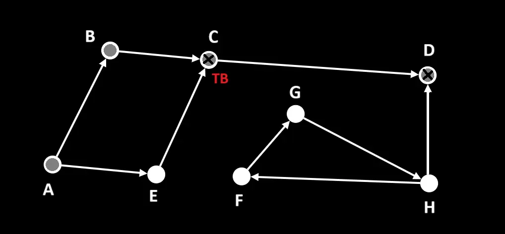

К концу шага:
- В списке вершин, которые нужно рассмотреть ***vStack*** [ A, B ];
- в списке посещенных ***visited***: { A: grey, B: grey, C: black, D: black };
- В ***output.processedVs***: [ A, B, C, D ];
- В ***verticesToCheck***, который объявлен в ***isTheGraphAcyclic*** : [ 'A', 'B', 'C', 'D', 'E', 'F', 'G', 'H' ] (без изменений).

 

##### Шаг 6:
Получаем из ***vStack*** последний элемент - вершину ***B*** – это рассматриваемая вершина (***ТВ***). Получаем список прямых соседей ***B***, в которые можно попасть из ***B*** – [ ]. Так как у ***B*** нет ни одного «серого» или непосещенного соседа – удаляем из ***vStack*** вершину ***B*** и в ***visited*** помечаем ее черным цветом.

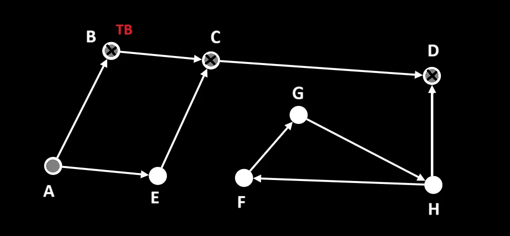

К концу шага:
- В списке вершин, которые нужно рассмотреть ***vStack*** [ A ];
- в списке посещенных ***visited***: { A: grey, B: black, C: black, D: black };
- В ***output.processedVs***: [ A, B, C, D ];
- В ***verticesToCheck***, который объявлен в ***isTheGraphAcyclic*** : [ 'A', 'B', 'C', 'D', 'E', 'F', 'G', 'H' ] (без изменений).

 

##### Шаг 7:
Получаем из ***vStack*** последний элемент - вершину ***A*** – это рассматриваемая вершина (***ТВ***). Получаем список прямых соседей ***A***, в которые можно попасть из ***A*** – [ B, E ]. Последовательно обрабатываем вершины из этого списка: вершина ***B*** уже есть в ***visited*** под черным цветом – ее пропускаем, вершины ***E*** нет в ***visited***, поэтому добавляем ее в ***processedVs***, кладем в конец ***vStack*** и в ***visited*** под серым цветом, а цикл по списку соседей прерываем.

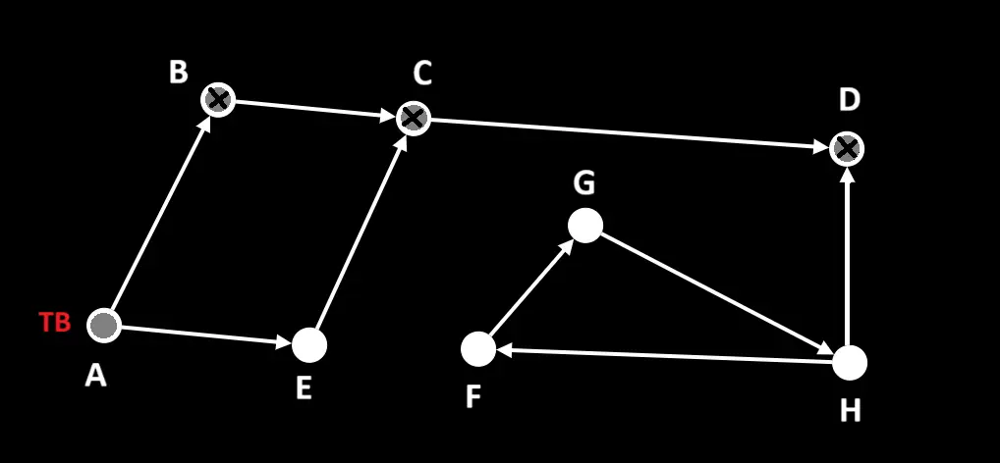

К концу шага:
- В списке вершин, которые нужно рассмотреть ***vStack*** [ A, E ];
- в списке посещенных ***visited***: { A: grey, B: black, C: black, D: black, E: grey };
- В ***output.processedVs***: [ A, B, C, D, E ];
- В ***verticesToCheck***, который объявлен в ***isTheGraphAcyclic*** : [ 'A', 'B', 'C', 'D', 'E', 'F', 'G', 'H' ] (без изменений).

 

##### Шаг 8:
Получаем из ***vStack*** последний элемент - вершину ***E*** – это рассматриваемая вершина (***ТВ***). Получаем список прямых соседей ***E***, в которые можно попасть из ***E*** – [ C ]. Так как у ***E*** нет ни одного «серого» или непосещенного соседа – удаляем из ***vStack*** вершину ***E*** и в ***visited*** помечаем ее черным цветом.

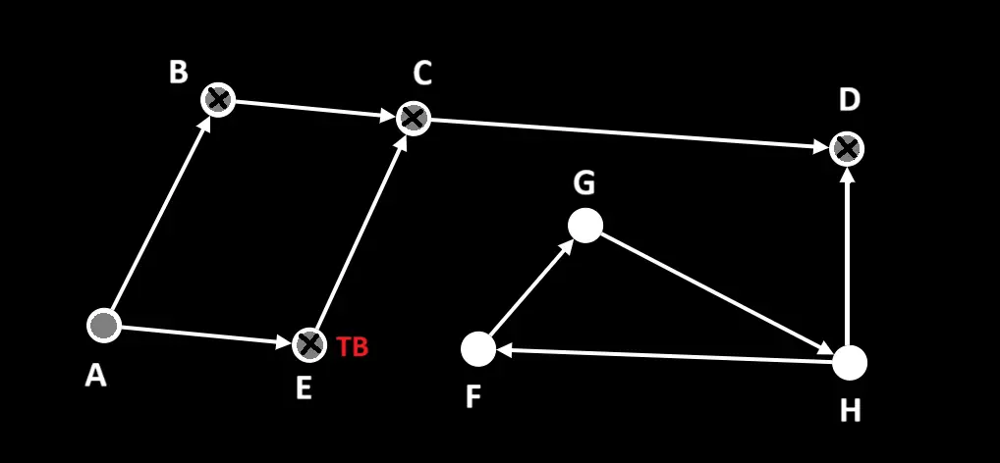

К концу шага:
- В списке вершин, которые нужно рассмотреть ***vStack*** [ A ];
- в списке посещенных ***visited***: { A: grey, B: black, C: black, D: black, E: black };
- В ***output.processedVs***: [ A, B, C, D, E ];
- В ***verticesToCheck***, который объявлен в ***isTheGraphAcyclic*** : [ 'A', 'B', 'C', 'D', 'E', 'F', 'G', 'H' ] (без изменений).

 

##### Шаг 9:
Получаем из ***vStack*** последний элемент - вершину ***A*** – это рассматриваемая вершина (***ТВ***). Получаем список прямых соседей ***A***, в которые можно попасть из ***A*** – [ B, E ]. Так как у ***A*** нет ни одного «серого» или непосещенного соседа – удаляем из ***vStack*** вершину ***A*** и в ***visited*** помечаем ее черным цветом.

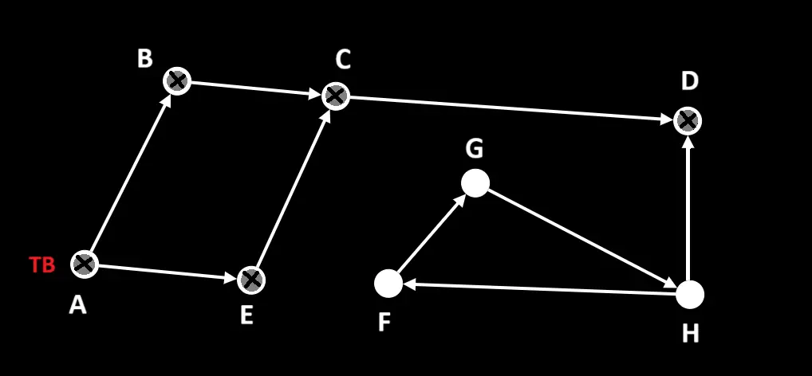

К концу шага:
***vStack*** опустел – работа ***checkPathsFromOneVrtx*** окончена – возвращаем ***output*** = { ***isTheCycleFound***: false, ***processedVs***: [ A, B, C, D, E ] }.
Из ***verticesToCheck***, который объявлен в ***isTheGraphAcyclic***, удаляем вершины, которые содержаться в ***output.processedVs*** и получаем: [ 'F', 'G', 'H' ].

 

##### Шаг 10:
Внутри ***isTheGraphAcyclic*** забираем из отфильтрованного списка ***verticesToCheck*** нулевой элемент ***F*** и передаем его в качестве второго аргумента в ***сheckPathsFromOneVrtx*** и исходный граф в качестве первого.

Внутри ***checkPathsFromOneVrtx*** инициализируем: ***vStack***, ***visited*** и ***output*** с ключами ***isTheCycleFound*** и ***processedVs***.

Кладем в ***vStack***, в ***processedVs*** и в ***visited*** под серым цветом вершину ***F***, переданную в функцию в качестве аргумента ***start***.

Запускаем цикл, который будет работать, пока ***vStack*** не опустеет.

Получаем из ***vStack*** последний элемент - вершину ***F*** – это рассматриваемая вершина (***ТВ***). Получаем список прямых соседей ***F***, в которые можно попасть из ***F*** – [ G ]. Последовательно обрабатываем вершины из этого списка (в данном случае только 1): вершины ***G*** нет в ***visited***, поэтому добавляем ее в ***processedVs***, кладем в конец ***vStack*** и в ***visited*** под серым цветом.

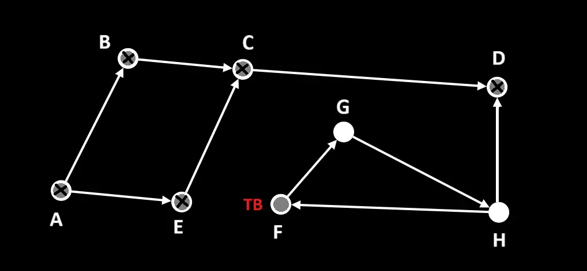

К концу шага:
- В списке вершин, которые нужно рассмотреть ***vStack*** [ F, G ];
- в списке посещенных ***visited***: { F: grey, G: grey };
- В ***output.processedVs***: [ F, G ];
- В ***verticesToCheck***, который объявлен в ***isTheGraphAcyclic*** : [ 'F', 'G', 'H' ] (без изменений).

 

##### Шаг 11:
Получаем из ***vStack*** последний элемент - вершину ***G*** – это рассматриваемая вершина (***ТВ***). Получаем список прямых соседей ***G***, в которые можно попасть из ***G*** – [ H ]. Последовательно обрабатываем вершины из этого списка (в данном случае только 1): вершины ***H*** нет в ***visited***, поэтому добавляем ее в ***processedVs***, кладем в конец ***vStack*** и в ***visited*** под серым цветом.

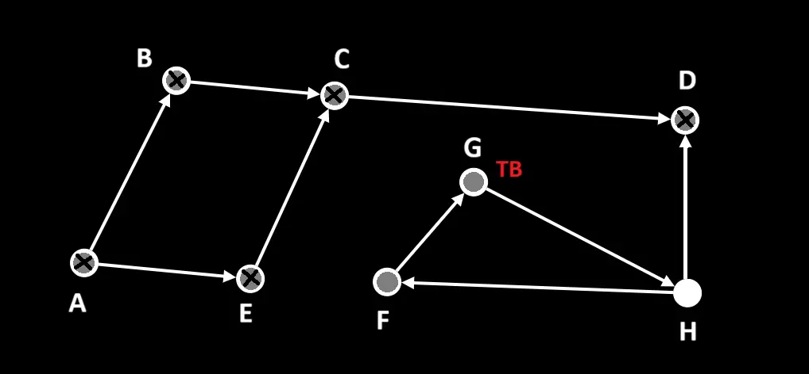

К концу шага:
- В списке вершин, которые нужно рассмотреть ***vStack*** [ F, G, H ];
- в списке посещенных ***visited***: { F: grey, G: grey, H: grey };
- В ***output.processedVs***: [ F, G, H ];
- В ***verticesToCheck***, который объявлен в ***isTheGraphAcyclic*** : [ 'F', 'G', 'H' ] (без изменений).

 

##### Шаг 12:
Получаем из ***vStack*** последний элемент - вершину ***H*** – это рассматриваемая вершина (***ТВ***). Получаем список прямых соседей ***H***, в которые можно попасть из ***H*** – [ F ]. Последовательно обрабатываем вершины из этого списка (в данном случае только 1): вершина ***F*** уже есть в ***visited*** под серым цветом и это значит, что цикл найден. Меняем в ***output.isTheCycleFound*** = true  и возвращаем его из ***checkPathsFromOneVrtx***.

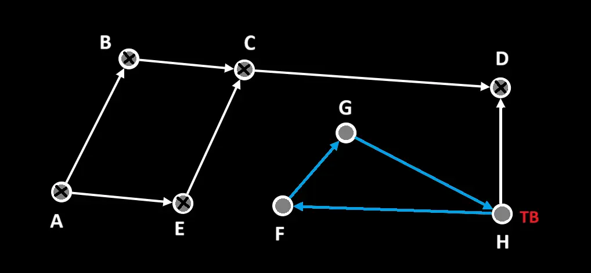

Работа ***isTheGraphAcyclic*** окончена, она возвращает false.

_____
#### Источники:
+ [Youtube video](https://www.youtube.com/watch?v=pB83tSvoBuc)
+ [IFMO-Wiki](https://neerc.ifmo.ru/wiki/index.php?title=%D0%98%D1%81%D0%BF%D0%BE%D0%BB%D1%8C%D0%B7%D0%BE%D0%B2%D0%B0%D0%BD%D0%B8%D0%B5_%D0%BE%D0%B1%D1%85%D0%BE%D0%B4%D0%B0_%D0%B2_%D0%B3%D0%BB%D1%83%D0%B1%D0%B8%D0%BD%D1%83_%D0%B4%D0%BB%D1%8F_%D0%BF%D0%BE%D0%B8%D1%81%D0%BA%D0%B0_%D1%86%D0%B8%D0%BA%D0%BB%D0%B0)

