# Алгоритм Косараджу (англ. Kosaraju's algorithm)

__Алгоритм Косараджу__ — алгоритм поиска [областей сильной связности](../) в ориентированном графе. В ходе своей работы использует [обход в глубину](../../DFS/).

 

__Сложность алгоритма:__ 

O(V+E)

<small>***V, E – количество вершин и рёбер соответственно***</small>

_____
#### Принцип работы:

На вход подается невзвешенная форма графа.

__Для хранения данных потребуется 4 множества__:
- <small>*На уровне области видимости функции инициализируется*:</small>
    1. ***graphColoring*** – раскраска графа, в которой по итогу окажутся все вершины, распределенные по множествам в ходе работы DFS;
    2. ***reversedTopSort*** – перевернутый массив топологически отсосртированных вершин инвертированного графа;
- <small> *На уровне области видимости цикла, каждая итерация которого запускает DFS для вершины из ***reversedTopSort***, инициализируется:*</small>
    1. ***vStack*** – множество вершин, которые надо обработать, представленное в виде [стека](../../../../DataStructures/Stack/);
    2. ***inTheCurrPath*** – список вершин, которые являются частью пути, по которому сейчас проходит DFS.

 
 

__Последовательность действий:__

1. Строим вспомогательный инвертированный граф, в котором направление всех ребер изменено на противоположное. 

 

2. Запускаем на инвертированном графе [топологическую сортировку](../../TopologicalSort/), меняем порядок вершин на противоположный и получаем ***reversedTopSort***. Инициализируем пременную с идентификатором текущего множества ***color*** ;

 

3. Раскрашиваем исходный граф, запуская DFS в порядке топологической сортировки, полученной на инвертированном графе: 
    
    в цикле от узлов из ***reversedTopSort*** (на каждой итерации это будет вершина ***start***), которые еще не отнесены ни к одному множеству, запускаем обход в глубину. Вершины начинаем брать с конца массива:

    1. Проверяем ***start*** на принадлежность к множеству вершин (эта информация хранится в ***graphColoring***). Если она уже отнесена к какому-либо множеству – эту итерацию цикла пропускаем; 

    2. Объявляем пустые множества ***vStack*** и ***inTheCurrPath***, помещаем в них ***start***;

    3. Крутимся в цикле, пока стек ***vStack*** не пуст:

        1. Забираем из стека последний элемент ***ТВ*** и получаем его прямых соседей, в которые есть путь из ***ТВ***;
        2. Крутимся по списку соседей в цикле и проверяем каждого соседа ***N*** на наличие в ***inTheCurrPath*** и на принадлежность к какому-либо множеству в ***graphColoring***. В случае, когда ***N*** нет ни в одном из множеств – добавляем ***N*** в ***vStack*** и в ***inTheCurrPath***, а цикл по соседям прерываем; 
        3. Если в пункте ***b*** ни одна вершина не была добавлена в ***vStack*** и в ***inTheCurrPath***, то из ***vStack*** извлекаем ***ТВ***, также удаляем ее из ***inTheCurrPath*** и в ***graphColoring*** ставим ей текущую пометку множества ***color*** ;

    4. Обновляем значение ***color*** ;

 

4. Преобразуем ***graphColoring*** : распределяем вершины с одинаковым идентификатором цвета по массивам – это и есть области сильной связности.

_____
#### Пример работы:

__Задача__: найти области сильной связности графа.

Кружками обозначены вершины, линиями – пути между ними (ребра графа). 
Вершины, по которым сейчас проходит путь DFS, помечены серым.
Вершины, которые уже отнесены к какому-то множеству в ***graphColoring*** помечены черным с идентификатором множества. 
Рассматриваемая в данный момент вершина помечается ***ТВ***.

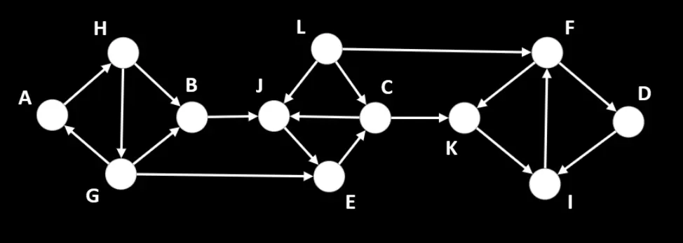

##### Шаг 1:
Пробегаясь по списку смежности оригинального графа, строим его инвертированную форму.

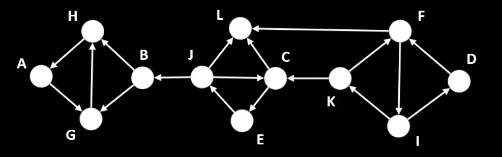  

 

##### Шаг 2:
Запускаем на инвертированном графе [топологическую сортировку](../../TopologicalSort/), меняем порядок вершин на противоположный и получаем ***reversedTopSort*** : [ A, H, G, B, L, C, J, E, K, I, F, D ]. 
Инициализируем пременную с идентификатором текущего множества ***color***.

К концу шага:
- Раскраска графа ***graphColoring*** : { };
- В ***reversedTopSort*** : [ A, H, G, B, L, C, J, E, K, I, F, D ];
- Текущий идентификатор метки множества ***color*** : 1

 

##### Шаг 3:    
Забираем из ***reversedTopSort*** последний элемент – вершину ***D***, проверяем, что в ***graphColoring*** вершина ***D*** не отнесена ни к одному множеству, и запускаем из нее обход в глубину.

Инициализируем  ***vStack*** – множество вершин, которые надо обработать, представленное в виде [стека](../../../../DataStructures/Stack/) и ***inTheCurrPath*** – список вершин, по которым сейчас проходит путь DFS.
Кладем в ***vStack*** и в ***inTheCurrPath*** вершину ***D***.

Запускаем цикл, который будет работать, пока ***vStack*** не опустеет.

Получаем из ***vStack*** последний элемент – вершину ***D*** – это рассматриваемая вершина (***ТВ***). Получаем список прямых соседей ***D***, в которые можно попасть из ***D*** – [ I ]. Последовательно обрабатываем вершины из этого списка (в данном случае только 1): вершины ***I*** нет в ***inTheCurrPath*** и она не отнесена ни к одному множеству в ***graphColoring***, поэтому кладем ее в конец ***vStack*** и в ***inTheCurrPath***.

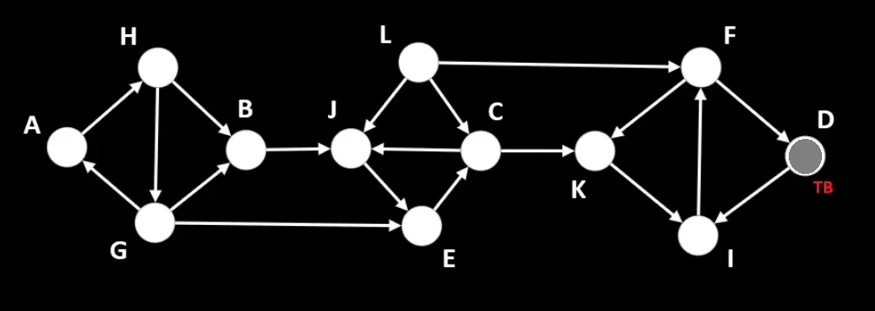

К концу шага:
- В стеке текущей итерации DFS ***vStack*** [ D, I ];
- В списке вершин, по которым проходит путь ***inTheCurrPath***: [ D, I ];
- Раскраска графа ***graphColoring*** : { };
- В ***reversedTopSort*** : [ A, H, G, B, L, C, J, E, K, I, F ];
- Текущий идентификатор метки множества ***color*** : 1

 

##### Шаг 4: 
Получаем из ***vStack*** последний элемент – вершину ***I*** – это рассматриваемая вершина (***ТВ***). Получаем список прямых соседей ***I***, в которые можно попасть из ***I*** – [ F ]. Последовательно обрабатываем вершины из этого списка (в данном случае только 1): вершины ***F*** нет в ***inTheCurrPath*** и она не отнесена ни к одному множеству в ***graphColoring***, поэтому кладем ее в конец ***vStack*** и в ***inTheCurrPath***.

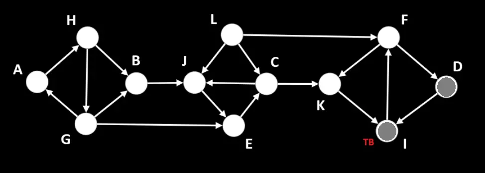

К концу шага:
- В стеке текущей итерации DFS ***vStack*** [ D, I, F ];
- В списке вершин, по которым проходит путь ***inTheCurrPath***: [ D, I, F ];
- Раскраска графа ***graphColoring*** : { };
- В ***reversedTopSort*** : [ A, H, G, B, L, C, J, E, K, I, F ];
- Текущий идентификатор метки множества ***color*** : 1

 

##### Шаг 5: 
Получаем из ***vStack*** последний элемент – вершину ***F*** – это рассматриваемая вершина (***ТВ***). Получаем список прямых соседей ***F***, в которые можно попасть из ***F*** – [ D, K ]. Последовательно обрабатываем вершины из этого списка: вершина ***D*** уже есть в ***inTheCurrPath*** – ее пропускаем, вершины ***K*** нет в ***inTheCurrPath*** и она не отнесена ни к одному множеству в ***graphColoring***, поэтому кладем ее в конец ***vStack*** и в ***inTheCurrPath***.

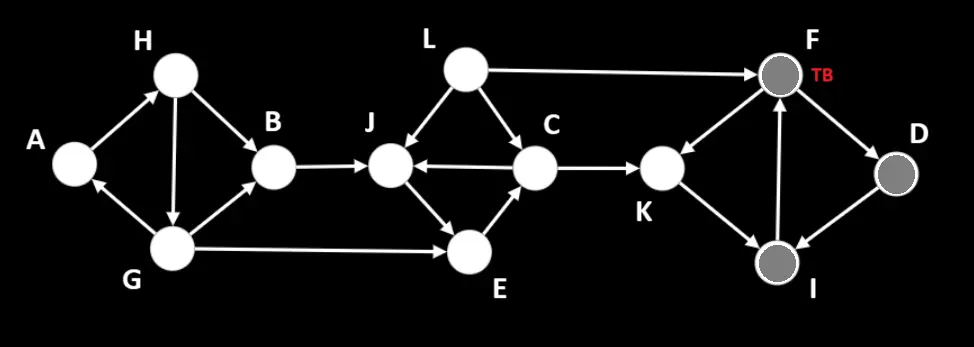

К концу шага:
- В стеке текущей итерации DFS ***vStack*** [ D, I, F, K ];
- В списке вершин, по которым проходит путь ***inTheCurrPath***: [ D, I, F, K ];
- Раскраска графа ***graphColoring*** : { };
- В ***reversedTopSort*** : [ A, H, G, B, L, C, J, E, K, I, F ];
- Текущий идентификатор метки множества ***color*** : 1

 

##### Шаг 6: 
Получаем из ***vStack*** последний элемент – вершину ***K*** – это рассматриваемая вершина (***ТВ***). Получаем список прямых соседей ***K***, в которые можно попасть из ***K*** – [ I ]. Так как вершина ***I*** уже есть в ***inTheCurrPath*** и у ***K*** нет ни одного непосещенного соседа – удаляем ее из ***vStack***, ***inTheCurrPath*** и помечаем в ***graphColoring*** текущей меткой множества.

К концу шага:
- В стеке текущей итерации DFS ***vStack*** [ D, I, F ];
- В списке вершин, по которым проходит путь ***inTheCurrPath***: [ D, I, F ];
- Раскраска графа ***graphColoring*** : { K: 1 };
- В ***reversedTopSort*** : [ A, H, G, B, L, C, J, E, K, I, F ];
- Текущий идентификатор метки множества ***color*** : 1

 

##### Шаг 7: 
Получаем из ***vStack*** последний элемент – вершину ***F*** – это рассматриваемая вершина (***ТВ***). Получаем список прямых соседей ***F***, в которые можно попасть из ***F*** – [ D, K ]. Так как вершина ***D*** в ***inTheCurrPath***, а у ***K*** уже есть пометка множества – у ***F*** нет ни одного непосещенного соседа – удаляем ***F*** из ***vStack***, ***inTheCurrPath*** и помечаем в ***graphColoring*** текущей меткой множества.

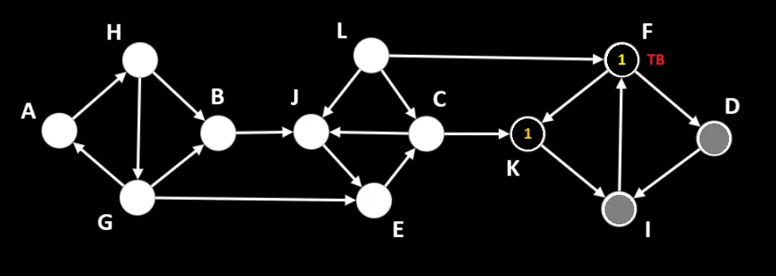

К концу шага:
- В стеке текущей итерации DFS ***vStack*** [ D, I ];
- В списке вершин, по которым проходит путь ***inTheCurrPath***: [ D, I ];
- Раскраска графа ***graphColoring*** : { K: 1, F: 1 };
- В ***reversedTopSort*** : [ A, H, G, B, L, C, J, E, K, I, F ];
- Текущий идентификатор метки множества ***color*** : 1

 

##### Шаг 8: 
Получаем из ***vStack*** последний элемент – вершину ***I*** – это рассматриваемая вершина (***ТВ***). Получаем список прямых соседей ***I***, в которые можно попасть из ***I*** – [ F ]. Так как у ***F*** уже есть пометка множества – у ***I*** нет ни одного непосещенного соседа – удаляем ***I*** из ***vStack***, ***inTheCurrPath*** и помечаем в ***graphColoring*** текущей меткой множества.

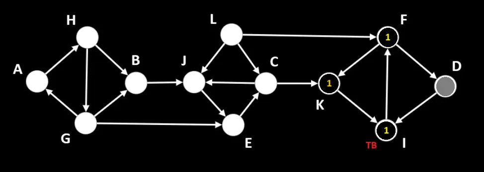

К концу шага:
- В стеке текущей итерации DFS ***vStack*** [ D ];
- В списке вершин, по которым проходит путь ***inTheCurrPath***: [ D ];
- Раскраска графа ***graphColoring*** : { K: 1, F: 1, I: 1, };
- В ***reversedTopSort*** : [ A, H, G, B, L, C, J, E, K, I, F ];
- Текущий идентификатор метки множества ***color*** : 1

 

##### Шаг 9: 
Получаем из ***vStack*** последний элемент – вершину ***D*** – это рассматриваемая вершина (***ТВ***). Получаем список прямых соседей ***D***, в которые можно попасть из ***D*** – [ I ]. Так как у ***I*** уже есть пометка множества – у ***D*** нет ни одного непосещенного соседа – удаляем ***D*** из ***vStack***, ***inTheCurrPath*** и помечаем в ***graphColoring*** текущей меткой множества.

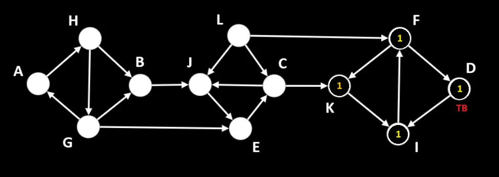

К концу шага:
- В стеке текущей итерации DFS ***vStack*** [ ];
- В списке вершин, по которым проходит путь ***inTheCurrPath***: [ ];
- Раскраска графа ***graphColoring*** : { K: 1, F: 1, I: 1, D: 1 };
- В ***reversedTopSort*** : [ A, H, G, B, L, C, J, E, K, I, F ];

***DFS, стартующий из D, закончил свою работу. 
Обновляем идентификатор метки множества color на 2 и переходим к следующей вершине из reversedTopSort.***

 

##### Шаг 10:
Забираем из ***reversedTopSort*** последний элемент – вершину ***F***. В ***graphColoring*** она уже имеет метку множества, поэтому переходим к следующим вершинам – ***I*** и ***K***. С ними аналогичная ситуация – их тоже пропускаем.

Следующая вершина из ***reversedTopSort*** – вершина ***E***, проверяем, что в ***graphColoring*** вершина ***E*** не отнесена ни к одному множеству, и запускаем из нее обход в глубину.

Снова инициализируем  ***vStack*** и ***inTheCurrPath***, кладем в них вершину ***E***.

Запускаем цикл, который будет работать, пока ***vStack*** не опустеет.

Получаем из ***vStack*** последний элемент – вершину ***E*** – это рассматриваемая вершина (***ТВ***). Получаем список прямых соседей ***E***, в которые можно попасть из ***E*** – [ C ]. Последовательно обрабатываем вершины из этого списка (в данном случае только 1): вершины ***C*** нет в ***inTheCurrPath*** и она не отнесена ни к одному множеству в ***graphColoring***, поэтому кладем ее в конец ***vStack*** и в ***inTheCurrPath***.

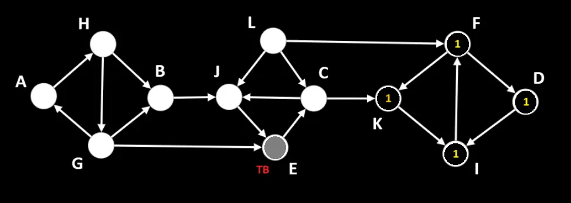

К концу шага:
- В стеке текущей итерации DFS ***vStack*** [ E, C ];
- В списке вершин, по которым проходит путь ***inTheCurrPath***: [ E, C ];
- Раскраска графа ***graphColoring*** : { K: 1, F: 1, I: 1, D: 1 };
- В ***reversedTopSort*** : [ A, H, G, B, L, C, J ];
- Текущий идентификатор метки множества ***color*** : 2

 

##### Шаг 11:
Получаем из ***vStack*** последний элемент – вершину ***C*** – это рассматриваемая вершина (***ТВ***). Получаем список прямых соседей ***C***, в которые можно попасть из ***C*** – [ J, K ]. Последовательно обрабатываем вершины из этого списка: вершины ***J*** нет в ***inTheCurrPath*** и она не отнесена ни к одному множеству в ***graphColoring***, поэтому кладем ее в конец ***vStack*** и в ***inTheCurrPath***, а цикл по соседям прерываем.

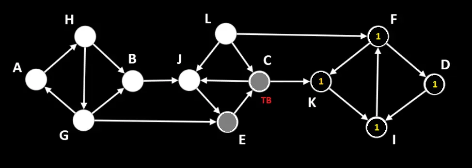

К концу шага:
- В стеке текущей итерации DFS ***vStack*** [ E, C, J ];
- В списке вершин, по которым проходит путь ***inTheCurrPath***: [ E, C, J ];
- Раскраска графа ***graphColoring*** : { K: 1, F: 1, I: 1, D: 1 };
- В ***reversedTopSort*** : [ A, H, G, B, L, C, J ];
- Текущий идентификатор метки множества ***color*** : 2

 

##### Шаг 12: 
Получаем из ***vStack*** последний элемент – вершину ***J*** – это рассматриваемая вершина (***ТВ***). Получаем список прямых соседей ***J***, в которые можно попасть из ***J*** – [ E ]. Так как вершина ***E*** уже есть в ***inTheCurrPath*** и у ***J*** нет ни одного непосещенного соседа – удаляем ее из ***vStack***, ***inTheCurrPath*** и помечаем в ***graphColoring*** текущей меткой множества.

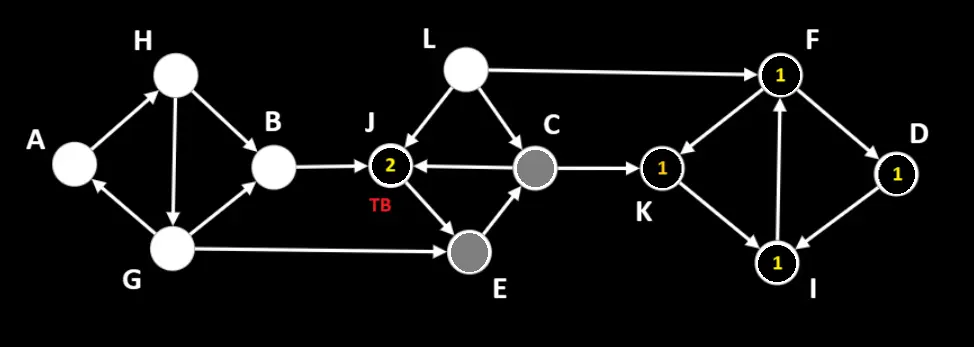

К концу шага:
- В стеке текущей итерации DFS ***vStack*** [ E, C ];
- В списке вершин, по которым проходит путь ***inTheCurrPath***: [ E, C ];
- Раскраска графа ***graphColoring*** : { K: 1, F: 1, I: 1, D: 1, J: 2 };
- В ***reversedTopSort*** : [ A, H, G, B, L, C, J ];
- Текущий идентификатор метки множества ***color*** : 2

 

##### Шаг 13: 
Получаем из ***vStack*** последний элемент – вершину ***C*** – это рассматриваемая вершина (***ТВ***). Получаем список прямых соседей ***C***, в которые можно попасть из ***C*** – [ J, K ]. Так как и ***J***, и ***K*** уже имеют пометки множества – у ***С*** нет ни одного непосещенного соседа – удаляем ***С*** из ***vStack***, ***inTheCurrPath*** и помечаем в ***graphColoring*** текущей меткой множества.

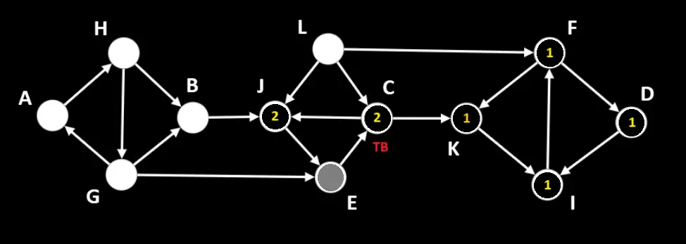

К концу шага:
- В стеке текущей итерации DFS ***vStack*** [ E ];
- В списке вершин, по которым проходит путь ***inTheCurrPath***: [ E ];
- Раскраска графа ***graphColoring*** : { K: 1, F: 1, I: 1, D: 1, J: 2, C: 2 };
- В ***reversedTopSort*** : [ A, H, G, B, L, C, J ];
- Текущий идентификатор метки множества ***color*** : 2

 

##### Шаг 14: 
Получаем из ***vStack*** последний элемент – вершину ***E*** – это рассматриваемая вершина (***ТВ***). Получаем список прямых соседей ***E***, в которые можно попасть из ***E*** – [ C ]. Так как ***C*** уже имеет метку множества – у ***E*** нет ни одного непосещенного соседа – удаляем ***E*** из ***vStack***, ***inTheCurrPath*** и помечаем в ***graphColoring*** текущей меткой множества.

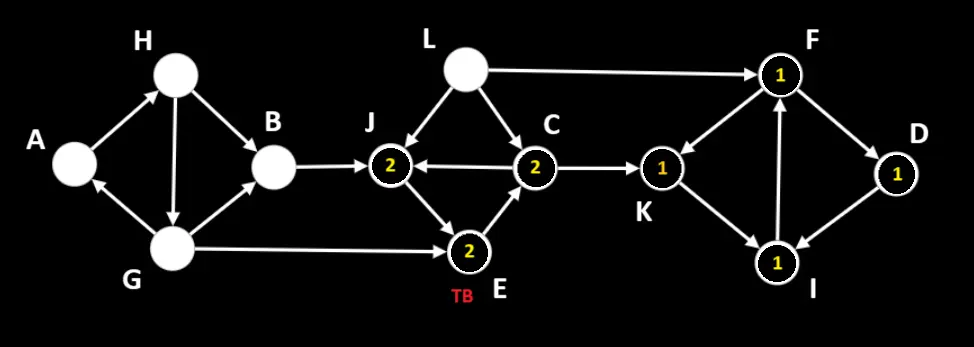

К концу шага:
- В стеке текущей итерации DFS ***vStack*** [ ];
- В списке вершин, по которым проходит путь ***inTheCurrPath***: [ ];
- Раскраска графа ***graphColoring*** : { K: 1, F: 1, I: 1, D: 1, J: 2, C: 2, E: 2 };
- В ***reversedTopSort*** : [ A, H, G, B, L, C, J ];

***DFS, стартующий из E, закончил свою работу. 
Обновляем идентификатор метки множества color на 3 и переходим к следующей вершине из reversedTopSort.***

 

##### Шаг 15:
Забираем из ***reversedTopSort*** последний элемент – вершину ***J***. В ***graphColoring*** она уже имеет метку множества, поэтому переходим к следующей вершине – ***С***. С ней аналогичная ситуация и ее тоже пропускаем.

Следующая вершина из ***reversedTopSort*** – вершина ***L***, проверяем, что в ***graphColoring*** вершина ***L*** не отнесена ни к одному множеству, и запускаем из нее обход в глубину.

Снова инициализируем  ***vStack*** и ***inTheCurrPath***, кладем в них вершину ***L***.

Запускаем цикл, который будет работать, пока ***vStack*** не опустеет.

Получаем из ***vStack*** последний элемент – вершину ***L*** – это рассматриваемая вершина (***ТВ***). Получаем список прямых соседей ***L***, в которые можно попасть из ***L*** – [ C, F, J ]. Так как и ***C***, и ***F***, и ***J*** уже имеют пометки множества – у ***L*** нет ни одного непосещенного соседа – удаляем ***L*** из ***vStack***, ***inTheCurrPath*** и помечаем в ***graphColoring*** текущей меткой множества.

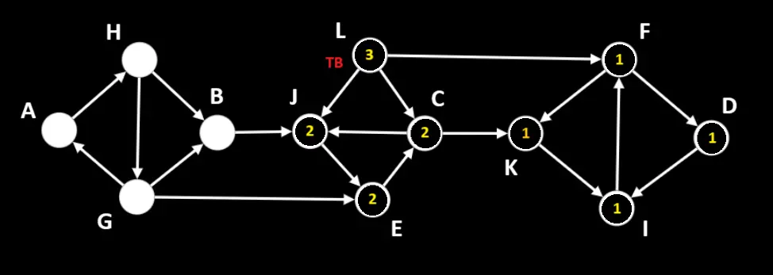

К концу шага:
- В стеке текущей итерации DFS ***vStack*** [ ];
- В списке вершин, по которым проходит путь ***inTheCurrPath***: [ ];
- Раскраска графа ***graphColoring*** : { K: 1, F: 1, I: 1, D: 1, J: 2, C: 2, E: 2, L: 3 };
- В ***reversedTopSort*** : [ A, H, G, B ];

***DFS, стартующий из L, закончил свою работу. 
Обновляем идентификатор метки множества color на 4 и переходим к следующей вершине из reversedTopSort.***

 

##### Шаг 16:
Забираем из ***reversedTopSort*** последний элемент – вершину ***B***, проверяем, что в ***graphColoring*** вершина ***B*** не отнесена ни к одному множеству, и запускаем из нее обход в глубину.

Снова инициализируем  ***vStack*** и ***inTheCurrPath***, кладем в них вершину ***B***.

Запускаем цикл, который будет работать, пока ***vStack*** не опустеет.

Получаем из ***vStack*** последний элемент – вершину ***B*** – это рассматриваемая вершина (***ТВ***). Получаем список прямых соседей ***B***, в которые можно попасть из ***B*** – [ J ]. 
Так как ***J*** уже имеет пометку множества – у ***B*** нет ни одного непосещенного соседа – удаляем ***B*** из ***vStack***, ***inTheCurrPath*** и помечаем в ***graphColoring*** текущей меткой множества.

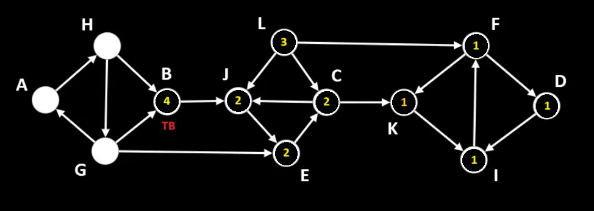

К концу шага:
- В стеке текущей итерации DFS ***vStack*** [ ];
- В списке вершин, по которым проходит путь ***inTheCurrPath***: [ ];
- Раскраска графа ***graphColoring*** : { K: 1, F: 1, I: 1, D: 1, J: 2, C: 2, E: 2, L: 3, B: 4 };
- В ***reversedTopSort*** : [ A, H, G ];

***DFS, стартующий из B, закончил свою работу. 
Обновляем идентификатор метки множества color на 5 и переходим к следующей вершине из reversedTopSort.***

 

##### Шаг 17:
Забираем из ***reversedTopSort*** последний элемент – вершину ***G***, проверяем, что в ***graphColoring*** вершина ***G*** не отнесена ни к одному множеству, и запускаем из нее обход в глубину.

Снова инициализируем  ***vStack*** и ***inTheCurrPath***, кладем в них вершину ***G***.

Запускаем цикл, который будет работать, пока ***vStack*** не опустеет.

Получаем из ***vStack*** последний элемент – вершину ***G*** – это рассматриваемая вершина (***ТВ***). Получаем список прямых соседей ***G***, в которые можно попасть из ***G*** – [ A, B, E ]. Последовательно обрабатываем вершины из этого списка: вершины ***A*** нет в ***inTheCurrPath*** и она не отнесена ни к одному множеству в ***graphColoring***, поэтому кладем ее в конец ***vStack*** и в ***inTheCurrPath***, а цикл по соседям прерываем.

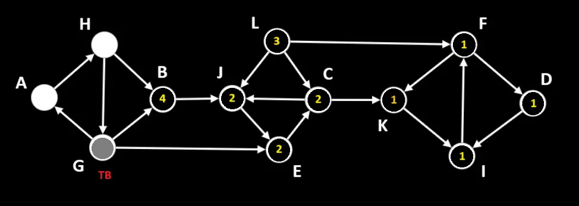

К концу шага:
- В стеке текущей итерации DFS ***vStack*** [ G, A ];
- В списке вершин, по которым проходит путь ***inTheCurrPath***: [ G, A ];
- Раскраска графа ***graphColoring*** : { K: 1, F: 1, I: 1, D: 1, J: 2, C: 2, E: 2, L: 3, B: 4 };
- В ***reversedTopSort*** : [ A, H ];
- Текущий идентификатор метки множества ***color*** : 5

 

##### Шаг 18:
Получаем из ***vStack*** последний элемент – вершину ***A*** – это рассматриваемая вершина (***ТВ***). Получаем список прямых соседей ***A***, в которые можно попасть из ***A*** – [ H ]. Последовательно обрабатываем вершины из этого списка (в данном случае только 1): вершины ***H*** нет в ***inTheCurrPath*** и она не отнесена ни к одному множеству в ***graphColoring***, поэтому кладем ее в конец ***vStack*** и в ***inTheCurrPath***.

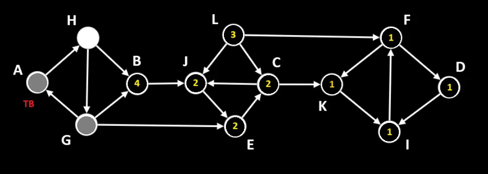

К концу шага:
- В стеке текущей итерации DFS ***vStack*** [ G, A, H ];
- В списке вершин, по которым проходит путь ***inTheCurrPath***: [ G, A, H ];
- Раскраска графа ***graphColoring*** : { K: 1, F: 1, I: 1, D: 1, J: 2, C: 2, E: 2, L: 3, B: 4 };
- В ***reversedTopSort*** : [ A, H ];
- Текущий идентификатор метки множества ***color*** : 5

 

##### Шаг 19:
Получаем из ***vStack*** последний элемент – вершину ***H*** – это рассматриваемая вершина (***ТВ***). Получаем список прямых соседей ***H***, в которые можно попасть из ***H*** – [ B, G ]. Вершина ***B*** уже имеет пометку множества в ***graphColoring***, а ***G*** есть в ***inTheCurrPath*** – у ***H*** нет ни одного непосещенного соседа – удаляем ее из ***vStack***, ***inTheCurrPath*** и помечаем в ***graphColoring*** текущей меткой множества.

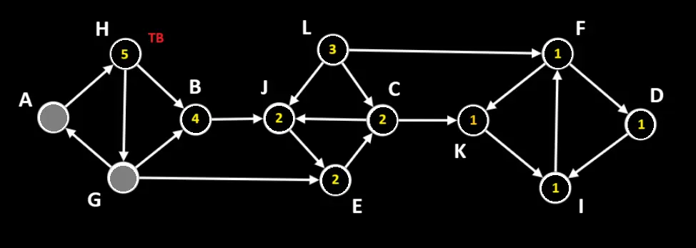

К концу шага:
- В стеке текущей итерации DFS ***vStack*** [ G, A ];
- В списке вершин, по которым проходит путь ***inTheCurrPath***: [ G, A ];
- Раскраска графа ***graphColoring*** : { K: 1, F: 1, I: 1, D: 1, J: 2, C: 2, E: 2, L: 3, B: 4, H: 5 };
- В ***reversedTopSort*** : [ A, H ];
- Текущий идентификатор метки множества ***color*** : 5

 

##### Шаг 20:
Получаем из ***vStack*** последний элемент – вершину ***A*** – это рассматриваемая вершина (***ТВ***). Получаем список прямых соседей ***A***, в которые можно попасть из ***A*** – [ H ]. Так как вершина ***H*** уже имеет пометку множества в ***graphColoring*** – у ***A*** нет ни одного непосещенного соседа – удаляем ее из ***vStack***, ***inTheCurrPath*** и помечаем в ***graphColoring*** текущей меткой множества.

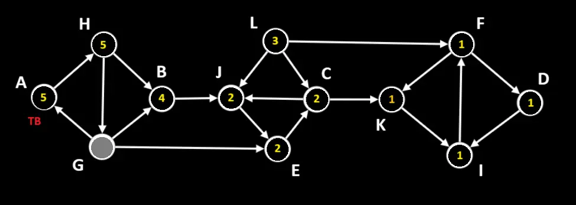

К концу шага:
- В стеке текущей итерации DFS ***vStack*** [ G ];
- В списке вершин, по которым проходит путь ***inTheCurrPath***: [ G ];
- Раскраска графа ***graphColoring*** : { K: 1, F: 1, I: 1, D: 1, J: 2, C: 2, E: 2, L: 3, B: 4, H: 5, A: 5 };
- В ***reversedTopSort*** : [ A, H ];
- Текущий идентификатор метки множества ***color*** : 5

 

##### Шаг 21:
Получаем из ***vStack*** последний элемент – вершину ***G*** – это рассматриваемая вершина (***ТВ***). Получаем список прямых соседей ***G***, в которые можно попасть из ***G*** – [ A, B, E ]. 
Так как и ***A***, и ***B***, и ***E*** уже имеют пометки множества – у ***G*** нет ни одного непосещенного соседа – удаляем ***G*** из ***vStack***, ***inTheCurrPath*** и помечаем в ***graphColoring*** текущей меткой множества.

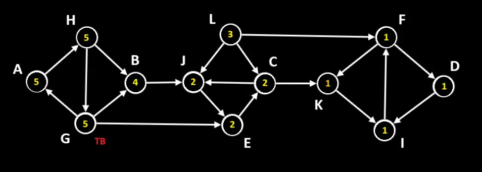

К концу шага:
- В стеке текущей итерации DFS ***vStack*** [ ];
- В списке вершин, по которым проходит путь ***inTheCurrPath***: [ ];
- Раскраска графа ***graphColoring*** : { K: 1, F: 1, I: 1, D: 1, J: 2, C: 2, E: 2, L: 3, B: 4, H: 5, A: 5, G: 5 };
- В ***reversedTopSort*** : [ A, H ];

***DFS, стартующий из G, закончил свою работу. 
Обновляем идентификатор метки множества color и переходим к следующей вершине из reversedTopSort.***

 

##### Шаг 22:
Забираем из ***reversedTopSort*** последний элемент – вершину ***H***. В ***graphColoring*** она уже имеет метку множества, поэтому переходим к следующей вершине – ***A***. С ней аналогичная ситуация и ее тоже пропускаем. 

Массив ***reversedTopSort*** пуст – сортировка вершин по областям сильной связности окончена.

Преобразуем ***graphColoring*** : распределяем вершины с одинаковым идентификатором цвета по массивам – это области сильной связности переданного графа.

_____
#### Источники:
+ [Youtube video](https://www.youtube.com/watch?v=-UgiBh1IMQU)
+ [Wikipedia](https://ru.wikipedia.org/wiki/%D0%90%D0%BB%D0%B3%D0%BE%D1%80%D0%B8%D1%82%D0%BC_%D0%9A%D0%BE%D1%81%D0%B0%D1%80%D0%B0%D0%B9%D1%8E)

