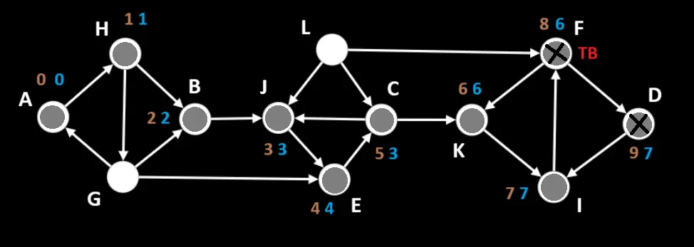
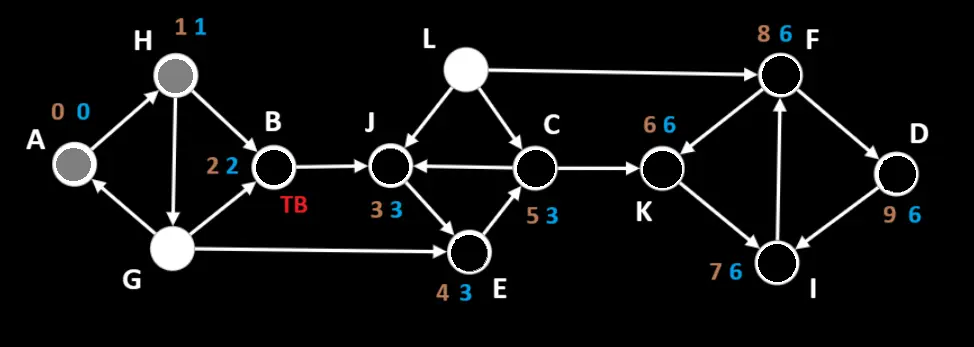

# Алгоритм Тарьяна (англ. Tarjan's algorithm)

__Алгоритм Тарьяна__ — алгоритм поиска [областей сильной связности](../) в ориентированном графе. Алгоритм Тарьяна можно понимать как вариацию алгоритма [обхода в глубину](../../DFS/), в котором при посещении вершины и окончании обработки вершины выполняются дополнительные действия.

 

__Сложность алгоритма:__ 

O(V+E)

<small>***V, E – количество вершин и рёбер соответственно***</small>

_____
#### Принцип работы:

На вход подается невзвешенная форма графа.

__Для хранения данных потребуется 4 множества__:
- <small>*На уровне области видимости функции инициализируется*:</small>
    1. ***allVertices*** – список всех вершин графа, в котором будет храниться информация о «времени входа» DFS в каждую вершину (поле ***index***) и наименьший индекс вершины, которая достижима из данной (поле ***lowlink***);
    2. ***verticesStack*** – вспомогательный [стек](../../../../DataStructures/Stack/) вершин, который необходим для формирования областей сильной связности в процессе обхода в глубину;
    3. ***isInVerticesStack*** – список вершин, которые в данный момент времени находятся в ***verticesStack*** (нужно, чтобы проверять принадлежность вершины стеку за O(1))
- <small> *На уровне области видимости цикла, каждая итерация которого запускает DFS для вершины из ***allVertices***, инициализируется:*</small>
    1. ***dfsStack*** – множество вершин, отсортированное в обратном топологическом порядке, по которым «идет» DFS. Представленно также в виде [стека](../../../../DataStructures/Stack/);

 
 

__Последовательность действий:__

1. Проходимся по списку смежности графа и заполняем список ***allVertices*** всеми вершинами графа (каждая вершина имеет поля ***index*** и ***lowlink*** = null). Также инициализируем пустые множества ***verticesStack***, ***isInVerticesStack*** и объявляем переменную с количеством уже посещенных DFS'ом вершин ***time***;

 

2. В цикле от каждой вершины из ***allVertices***, которая еще ни разу не была посещена DFS (т. е. ***index*** = null), запускаем обход в глубину. На каждой итерации это будет вершина ***start*** :

    1. Создаем пустой ***dfsStack***, кладем в него ***start***. Также добавляем ***start*** в ***verticesStack***, в ***isInVerticesStack*** и присваиваем ***allVertices[start].index*** = ***allVertices[start].lowlink*** = ***time*** (оба поля сразу после добаления вершины в ***dfsStack*** равны «времени посещения» DFS'ом вершины), инкрементируем ***time***;
    

    2. Крутимся в цикле, пока стек ***dfsStack*** не пуст:

        1. Забираем из стека последний элемент ***ТВ*** и получаем его прямых соседей, в которые есть путь из ***ТВ***;
        2. Крутимся по списку соседей в цикле и проверяем каждого соседа ***N*** на значение поля ***index*** и на наличие в ***isInVerticesStack***: 
        &nbsp; &nbsp;   - в случае, когда у ***N*** поле ***index*** в ***allVertices*** = null  – добавляем ***N*** в ***dfsStack***, в ***verticesStack***, в ***isInVerticesStack*** и присваиваем ***allVertices[N].index*** = ***allVertices[N].lowlink*** = ***time*** (оба поля сразу после добаления вершины в ***dfsStack*** равны «времени посещения» DFS'ом вершины), инкрементируем ***time***, цикл по соседям прерываем;
        &nbsp; &nbsp;   - иначе, если ***N*** есть в ***isInVerticesStack*** – значит мы наткнулись на вершину, по которой уже проходилась текущая итерация DFS – сравниваем поле ***lowlink*** у ***ТВ*** и у ***N***, выбираем наименьшее значение и обновляем ***lowlink*** для ***ТВ*** на это значение;
        3. Если на этапе выполнения пункта ***b*** ни одна новая вершина не была добавлена в ***dfsStack***, в ***verticesStack***, в ***isInVerticesStack*** – значит DFS уже посетил всех прямых соседей ***ТВ*** : 
        &nbsp; &nbsp;   - из ***dfsStack*** извлекаем ***ТВ*** ;
        &nbsp; &nbsp;   - проверяем значения ***index*** и ***lowlink*** у ***ТВ*** и, если они равны,  то это означает, что  ***ТВ*** является корнем текущей области сильной связности и все вершины в ***verticesStack*** от  ***ТВ*** и выше образуют эту область – извлекаем из ***verticesStack*** все вершины выше ***ТВ*** и саму ***ТВ***, также удаляем их из  ***isInVerticesStack*** и обновляем для каждой извлеченной вершины значение ***lowlink*** на значение ***lowlink*** ***ТВ***;
        
  

3. Преобразуем ***allVertices*** : распределяем вершины с одинаковым ***lowlink*** по массивам – это и есть области сильной связности.

_____
#### Пример работы:

__Задача__: найти области сильной связности графа.

Узлы, по которым сейчас проходит путь DFS (которые находятся в ***dfsStack*** и ***verticesStack***), помечены серым.
Вершина, рассматриваемая на текущей итерации DFS, помечается ***ТВ***.
Вершины, все прямые соседи которых DFS'ом уже посещены, но ни к какой области связности эти вершины еще не отнесены (т.е. которые удалены из ***dfsStack***, но еще содержатся в ***verticesStack***), помечены черным крестиком.
Узлы, которые уже отнесены к какой-либо области сильной связности (удалены из ***dfsStack*** и ***verticesStack*** и имеют ***index*** в ***allVertices***), помечены черным.

 

##### Шаг 1:
Пробегаясь по списку смежности графа заполняем список ***allVertices*** всеми вершинами графа. Также инициализируем пустые множества ***verticesStack***, ***isInVerticesStack*** и объявляем переменную с количеством уже посещенных DFS'ом вершин ***time***.

Берем из ***allVertices*** первую вершину, ***index*** у которой равен null – это вершина ***A***. 

Инициализируем  ***dfsStack*** – стек вершин, по которым сейчас «идет» DFS.

Добавляем вершину ***A*** в ***verticesStack***, в ***isInVerticesStack*** и в ***dfsStack*** + присваиваем значения полям ***index*** и ***lowlink*** для ***A***, равные текущему значению ***time***. Инкрементируем ***time***.

Запускаем цикл, который будет работать, пока ***dfsStack*** не опустеет.

Получаем из ***dfsStack*** последний элемент – вершину ***A*** – это рассматриваемая вершина (***ТВ***). Получаем список прямых соседей ***A***, в которые можно попасть из ***A*** – [ H ]. Последовательно обрабатываем вершины из этого списка (в данном случае только 1): 
        &nbsp; &nbsp;   - у вершины ***H*** поле ***index*** в ***allVertices*** равно null, поэтому добавляем ***H*** в ***dfsStack***, в ***verticesStack***, в ***isInVerticesStack*** + присваиваем значения полям ***index*** и ***lowlink*** для ***H***, равные текущему значению ***time***. Инкрементируем ***time***.

К концу шага:
- В стеке вершин, по которым идет DFS ***dfsStack*** : [ A, H ]; 
- Во вспомогательном стеке ***verticesStack***, который необходим для формирования областей сильной связности: [ A, H ];
- В списке ***allVertices***, хранящим ***index*** и ***lowlink*** для каждой вершины: {
  &nbsp; &nbsp; &nbsp; A: { index: 0, lowlink: 0 }, H: { index: 1, lowlink: 1 },
  &nbsp; &nbsp; &nbsp; B: { index: null, lowlink: null }, J: { index: null, lowlink: null },
  &nbsp; &nbsp; &nbsp; C: { index: null, lowlink: null }, K: { index: null, lowlink: null },
  &nbsp; &nbsp; &nbsp; D: { index: null, lowlink: null }, I: { index: null, lowlink: null },
  &nbsp; &nbsp; &nbsp; E: { index: null, lowlink: null }, F: { index: null, lowlink: null },
  &nbsp; &nbsp; &nbsp; G: { index: null, lowlink: null }, L: { index: null, lowlink: null } 
 &nbsp; &nbsp;}
- Количество уже посещенных DFS'ом вершин ***time*** : 2

 

##### Шаг 2:
Получаем из ***dfsStack*** последний элемент – вершину ***H*** – это рассматриваемая вершина (***ТВ***). Получаем список прямых соседей ***H***, в которые можно попасть из ***H*** – [ B, G ]. Последовательно обрабатываем вершины из этого списка: 
        &nbsp; &nbsp;   - у вершины ***B*** поле ***index*** в ***allVertices*** равно null, поэтому добавляем ***B*** в ***dfsStack***, в ***verticesStack***, в ***isInVerticesStack*** + присваиваем значения полям ***index*** и ***lowlink*** для ***B***, равные текущему значению ***time***. Инкрементируем ***time***. Цикл по соседям прерываем.

К концу шага:
- В стеке вершин, по которым идет DFS ***dfsStack*** : [ A, H, B ]; 
- Во вспомогательном стеке ***verticesStack***, который необходим для формирования областей сильной связности: [ A, H, B ];
- В списке ***allVertices***, хранящим ***index*** и ***lowlink*** для каждой вершины: {
  &nbsp; &nbsp; &nbsp; A: { index: 0, lowlink: 0 }, H: { index: 1, lowlink: 1 },
  &nbsp; &nbsp; &nbsp; B: { index: 2, lowlink: 2 }, J: { index: null, lowlink: null },
  &nbsp; &nbsp; &nbsp; C: { index: null, lowlink: null }, K: { index: null, lowlink: null },
  &nbsp; &nbsp; &nbsp; D: { index: null, lowlink: null }, I: { index: null, lowlink: null },
  &nbsp; &nbsp; &nbsp; E: { index: null, lowlink: null }, F: { index: null, lowlink: null },
  &nbsp; &nbsp; &nbsp; G: { index: null, lowlink: null }, L: { index: null, lowlink: null } 
 &nbsp; &nbsp;}
- Количество уже посещенных DFS'ом вершин ***time*** : 3

 

##### Шаг 3:
Получаем из ***dfsStack*** последний элемент – вершину ***B*** – это рассматриваемая вершина (***ТВ***). Получаем список прямых соседей ***B***, в которые можно попасть из ***B*** – [ J ]. Последовательно обрабатываем вершины из этого списка (в данном случае только 1): 
        &nbsp; &nbsp;   - у вершины ***J*** поле ***index*** в ***allVertices*** равно null, поэтому добавляем ***J*** в ***dfsStack***, в ***verticesStack***, в ***isInVerticesStack*** + присваиваем значения полям ***index*** и ***lowlink*** для ***J***, равные текущему значению ***time***. Инкрементируем ***time***.

К концу шага:
- В стеке вершин, по которым идет DFS ***dfsStack*** : [ A, H, B, J ]; 
- Во вспомогательном стеке ***verticesStack***, который необходим для формирования областей сильной связности: [ A, H, B, J ];
- В списке ***allVertices***, хранящим ***index*** и ***lowlink*** для каждой вершины: {
  &nbsp; &nbsp; &nbsp; A: { index: 0, lowlink: 0 }, H: { index: 1, lowlink: 1 },
  &nbsp; &nbsp; &nbsp; B: { index: 2, lowlink: 2 }, J: { index: 3, lowlink: 3 },
  &nbsp; &nbsp; &nbsp; C: { index: null, lowlink: null }, K: { index: null, lowlink: null },
  &nbsp; &nbsp; &nbsp; D: { index: null, lowlink: null }, I: { index: null, lowlink: null },
  &nbsp; &nbsp; &nbsp; E: { index: null, lowlink: null }, F: { index: null, lowlink: null },
  &nbsp; &nbsp; &nbsp; G: { index: null, lowlink: null }, L: { index: null, lowlink: null } 
 &nbsp; &nbsp;}
- Количество уже посещенных DFS'ом вершин ***time*** : 4

 

##### Шаг 4:
Получаем из ***dfsStack*** последний элемент – вершину ***J*** – это рассматриваемая вершина (***ТВ***). Получаем список прямых соседей ***J***, в которые можно попасть из ***J*** – [ E ]. Последовательно обрабатываем вершины из этого списка (в данном случае только 1): 
        &nbsp; &nbsp;   - у вершины ***E*** поле ***index*** в ***allVertices*** равно null, поэтому добавляем ***E*** в ***dfsStack***, в ***verticesStack***, в ***isInVerticesStack*** + присваиваем значения полям ***index*** и ***lowlink*** для ***E***, равные текущему значению ***time***. Инкрементируем ***time***.

К концу шага:
- В стеке вершин, по которым идет DFS ***dfsStack*** : [ A, H, B, J, E ]; 
- Во вспомогательном стеке ***verticesStack***, который необходим для формирования областей сильной связности: [ A, H, B, J, E ];
- В списке ***allVertices***, хранящим ***index*** и ***lowlink*** для каждой вершины: {
  &nbsp; &nbsp; &nbsp; A: { index: 0, lowlink: 0 }, H: { index: 1, lowlink: 1 },
  &nbsp; &nbsp; &nbsp; B: { index: 2, lowlink: 2 }, J: { index: 3, lowlink: 3 },
  &nbsp; &nbsp; &nbsp; C: { index: null, lowlink: null }, K: { index: null, lowlink: null },
  &nbsp; &nbsp; &nbsp; D: { index: null, lowlink: null }, I: { index: null, lowlink: null },
  &nbsp; &nbsp; &nbsp; E: { index: 4, lowlink: 4 }, F: { index: null, lowlink: null },
  &nbsp; &nbsp; &nbsp; G: { index: null, lowlink: null }, L: { index: null, lowlink: null } 
 &nbsp; &nbsp;}
- Количество уже посещенных DFS'ом вершин ***time*** : 5

 

##### Шаг 5:
Получаем из ***dfsStack*** последний элемент – вершину ***E*** – это рассматриваемая вершина (***ТВ***). Получаем список прямых соседей ***E***, в которые можно попасть из ***E*** – [ C ]. Последовательно обрабатываем вершины из этого списка (в данном случае только 1): 
        &nbsp; &nbsp;   - у вершины ***C*** поле ***index*** в ***allVertices*** равно null, поэтому добавляем ***C*** в ***dfsStack***, в ***verticesStack***, в ***isInVerticesStack*** + присваиваем значения полям ***index*** и ***lowlink*** для ***C***, равные текущему значению ***time***. Инкрементируем ***time***.

К концу шага:
- В стеке вершин, по которым идет DFS ***dfsStack*** : [ A, H, B, J, E, C ]; 
- Во вспомогательном стеке ***verticesStack***, который необходим для формирования областей сильной связности: [ A, H, B, J, E, C ];
- В списке ***allVertices***, хранящим ***index*** и ***lowlink*** для каждой вершины: {
  &nbsp; &nbsp; &nbsp; A: { index: 0, lowlink: 0 }, H: { index: 1, lowlink: 1 },
  &nbsp; &nbsp; &nbsp; B: { index: 2, lowlink: 2 }, J: { index: 3, lowlink: 3 },
  &nbsp; &nbsp; &nbsp; C: { index: 5, lowlink: 5 }, K: { index: null, lowlink: null },
  &nbsp; &nbsp; &nbsp; D: { index: null, lowlink: null }, I: { index: null, lowlink: null },
  &nbsp; &nbsp; &nbsp; E: { index: 4, lowlink: 4 }, F: { index: null, lowlink: null },
  &nbsp; &nbsp; &nbsp; G: { index: null, lowlink: null }, L: { index: null, lowlink: null } 
 &nbsp; &nbsp;}
- Количество уже посещенных DFS'ом вершин ***time*** : 6

 

##### Шаг 6:
Получаем из ***dfsStack*** последний элемент – вершину ***C*** – это рассматриваемая вершина (***ТВ***). Получаем список прямых соседей ***C***, в которые можно попасть из ***C*** – [ J, K ]. Последовательно обрабатываем вершины из этого списка: 
        &nbsp; &nbsp;   - вершина ***J*** уже есть в ***verticesStack*** – сравниваем поля ***lowlink*** у ***C*** и ***J***, выбираем наименьшее значение и обновляем ***lowlink*** для ***C*** на 3;
        &nbsp; &nbsp;   - у вершины ***K*** поле ***index*** в ***allVertices*** равно null, поэтому добавляем ***K*** в ***dfsStack***, в ***verticesStack***, в ***isInVerticesStack*** + присваиваем значения полям ***index*** и ***lowlink*** для ***K***, равные текущему значению ***time***. Инкрементируем ***time***.

К концу шага:
- В стеке вершин, по которым идет DFS ***dfsStack*** : [ A, H, B, J, E, C, K ]; 
- Во вспомогательном стеке ***verticesStack***, который необходим для формирования областей сильной связности: [ A, H, B, J, E, C, K ];
- В списке ***allVertices***, хранящим ***index*** и ***lowlink*** для каждой вершины: {
  &nbsp; &nbsp; &nbsp; A: { index: 0, lowlink: 0 }, H: { index: 1, lowlink: 1 },
  &nbsp; &nbsp; &nbsp; B: { index: 2, lowlink: 2 }, J: { index: 3, lowlink: 3 },
  &nbsp; &nbsp; &nbsp; C: { index: 5, lowlink: 3 }, K: { index: 6, lowlink: 6 },
  &nbsp; &nbsp; &nbsp; D: { index: null, lowlink: null }, I: { index: null, lowlink: null },
  &nbsp; &nbsp; &nbsp; E: { index: 4, lowlink: 4 }, F: { index: null, lowlink: null },
  &nbsp; &nbsp; &nbsp; G: { index: null, lowlink: null }, L: { index: null, lowlink: null } 
 &nbsp; &nbsp;}
- Количество уже посещенных DFS'ом вершин ***time*** : 7

 

##### Шаг 7:
Получаем из ***dfsStack*** последний элемент – вершину ***K*** – это рассматриваемая вершина (***ТВ***). Получаем список прямых соседей ***K***, в которые можно попасть из ***K*** – [ I ]. Последовательно обрабатываем вершины из этого списка (в данном случае только 1): 
        &nbsp; &nbsp;   - у вершины ***I*** поле ***index*** в ***allVertices*** равно null, поэтому добавляем ***I*** в ***dfsStack***, в ***verticesStack***, в ***isInVerticesStack*** + присваиваем значения полям ***index*** и ***lowlink*** для ***I***, равные текущему значению ***time***. Инкрементируем ***time***.

К концу шага:
- В стеке вершин, по которым идет DFS ***dfsStack*** : [ A, H, B, J, E, C, K, I ]; 
- Во вспомогательном стеке ***verticesStack***, который необходим для формирования областей сильной связности: [ A, H, B, J, E, C, K, I ];
- В списке ***allVertices***, хранящим ***index*** и ***lowlink*** для каждой вершины: {
  &nbsp; &nbsp; &nbsp; A: { index: 0, lowlink: 0 }, H: { index: 1, lowlink: 1 },
  &nbsp; &nbsp; &nbsp; B: { index: 2, lowlink: 2 }, J: { index: 3, lowlink: 3 },
  &nbsp; &nbsp; &nbsp; C: { index: 5, lowlink: 3 }, K: { index: 6, lowlink: 6 },
  &nbsp; &nbsp; &nbsp; D: { index: null, lowlink: null }, I: { index: 7, lowlink: 7 },
  &nbsp; &nbsp; &nbsp; E: { index: 4, lowlink: 4 }, F: { index: null, lowlink: null },
  &nbsp; &nbsp; &nbsp; G: { index: null, lowlink: null }, L: { index: null, lowlink: null } 
 &nbsp; &nbsp;}
- Количество уже посещенных DFS'ом вершин ***time*** : 8

 

##### Шаг 8:
Получаем из ***dfsStack*** последний элемент – вершину ***I*** – это рассматриваемая вершина (***ТВ***). Получаем список прямых соседей ***I***, в которые можно попасть из ***I*** – [ F ]. Последовательно обрабатываем вершины из этого списка (в данном случае только 1): 
        &nbsp; &nbsp;   - у вершины ***F*** поле ***index*** в ***allVertices*** равно null, поэтому добавляем ***F*** в ***dfsStack***, в ***verticesStack***, в ***isInVerticesStack*** + присваиваем значения полям ***index*** и ***lowlink*** для ***F***, равные текущему значению ***time***. Инкрементируем ***time***.

К концу шага:
- В стеке вершин, по которым идет DFS ***dfsStack*** : [ A, H, B, J, E, C, K, I, F ]; 
- Во вспомогательном стеке ***verticesStack***, который необходим для формирования областей сильной связности: [ A, H, B, J, E, C, K, I, F ];
- В списке ***allVertices***, хранящим ***index*** и ***lowlink*** для каждой вершины: {
  &nbsp; &nbsp; &nbsp; A: { index: 0, lowlink: 0 }, H: { index: 1, lowlink: 1 },
  &nbsp; &nbsp; &nbsp; B: { index: 2, lowlink: 2 }, J: { index: 3, lowlink: 3 },
  &nbsp; &nbsp; &nbsp; C: { index: 5, lowlink: 3 }, K: { index: 6, lowlink: 6 },
  &nbsp; &nbsp; &nbsp; D: { index: null, lowlink: null }, I: { index: 7, lowlink: 7 },
  &nbsp; &nbsp; &nbsp; E: { index: 4, lowlink: 4 }, F: { index: 8, lowlink: 8 },
  &nbsp; &nbsp; &nbsp; G: { index: null, lowlink: null }, L: { index: null, lowlink: null } 
 &nbsp; &nbsp;}
- Количество уже посещенных DFS'ом вершин ***time*** : 9

 

##### Шаг 9:
Получаем из ***dfsStack*** последний элемент – вершину ***F*** – это рассматриваемая вершина (***ТВ***). Получаем список прямых соседей ***F***, в которые можно попасть из ***F*** – [ D, K ]. Последовательно обрабатываем вершины из этого списка (в данном случае только 1): 
        &nbsp; &nbsp;   - у вершины ***D*** поле ***index*** в ***allVertices*** равно null, поэтому добавляем ***D*** в ***dfsStack***, в ***verticesStack***, в ***isInVerticesStack*** + присваиваем значения полям ***index*** и ***lowlink*** для ***D***, равные текущему значению ***time***. Инкрементируем ***time***. Цикл по соседям прерываем.

К концу шага:
- В стеке вершин, по которым идет DFS ***dfsStack*** : [ A, H, B, J, E, C, K, I, F, D ]; 
- Во вспомогательном стеке ***verticesStack***, который необходим для формирования областей сильной связности: [ A, H, B, J, E, C, K, I, F, D ];
- В списке ***allVertices***, хранящим ***index*** и ***lowlink*** для каждой вершины: {
  &nbsp; &nbsp; &nbsp; A: { index: 0, lowlink: 0 }, H: { index: 1, lowlink: 1 },
  &nbsp; &nbsp; &nbsp; B: { index: 2, lowlink: 2 }, J: { index: 3, lowlink: 3 },
  &nbsp; &nbsp; &nbsp; C: { index: 5, lowlink: 3 }, K: { index: 6, lowlink: 6 },
  &nbsp; &nbsp; &nbsp; D: { index: 9, lowlink: 9 }, I: { index: 7, lowlink: 7 },
  &nbsp; &nbsp; &nbsp; E: { index: 4, lowlink: 4 }, F: { index: 8, lowlink: 8 },
  &nbsp; &nbsp; &nbsp; G: { index: null, lowlink: null }, L: { index: null, lowlink: null } 
 &nbsp; &nbsp;}
- Количество уже посещенных DFS'ом вершин ***time*** : 10

 

##### Шаг 10:
Получаем из ***dfsStack*** последний элемент – вершину ***D*** – это рассматриваемая вершина (***ТВ***). Получаем список прямых соседей ***D***, в которые можно попасть из ***D*** – [ I ]. Последовательно обрабатываем вершины из этого списка (в данном случае только 1): 
        &nbsp; &nbsp;   - вершина ***I*** уже есть в ***verticesStack*** – сравниваем поля ***lowlink*** у ***D*** и ***I***, выбираем наименьшее значение и обновляем ***lowlink*** для ***D*** на 7.

DFS уже посетил всех прямых соседей ***D***. Удаляем вершину ***D*** из ***dfsStack***. Проверяем ***index*** и ***lowlink*** у ***D*** – они не равны – переходим к следующему шагу.

К концу шага:
- В стеке вершин, по которым идет DFS ***dfsStack*** : [ A, H, B, J, E, C, K, I, F ]; 
- Во вспомогательном стеке ***verticesStack***, который необходим для формирования областей сильной связности: [ A, H, B, J, E, C, K, I, F, D ];
- В списке ***allVertices***, хранящим ***index*** и ***lowlink*** для каждой вершины: {
  &nbsp; &nbsp; &nbsp; A: { index: 0, lowlink: 0 }, H: { index: 1, lowlink: 1 },
  &nbsp; &nbsp; &nbsp; B: { index: 2, lowlink: 2 }, J: { index: 3, lowlink: 3 },
  &nbsp; &nbsp; &nbsp; C: { index: 5, lowlink: 3 }, K: { index: 6, lowlink: 6 },
  &nbsp; &nbsp; &nbsp; D: { index: 9, lowlink: 7 }, I: { index: 7, lowlink: 7 },
  &nbsp; &nbsp; &nbsp; E: { index: 4, lowlink: 4 }, F: { index: 8, lowlink: 8 },
  &nbsp; &nbsp; &nbsp; G: { index: null, lowlink: null }, L: { index: null, lowlink: null } 
 &nbsp; &nbsp;}
- Количество уже посещенных DFS'ом вершин ***time*** : 10

 

##### Шаг 11:
Получаем из ***dfsStack*** последний элемент – вершину ***F*** – это рассматриваемая вершина (***ТВ***). Получаем список прямых соседей ***F***, в которые можно попасть из ***F*** – [ D, K ]. Последовательно обрабатываем вершины из этого списка: 
        &nbsp; &nbsp;   - вершина ***D*** уже есть в ***verticesStack*** – сравниваем поля ***lowlink*** у ***F*** и ***D***, выбираем наименьшее значение и обновляем ***lowlink*** для ***F*** на 7;
        &nbsp; &nbsp;   - вершина ***K*** уже есть в ***verticesStack*** – сравниваем поля ***lowlink*** у ***F*** и ***K***, выбираем наименьшее значение и обновляем ***lowlink*** для ***F*** на 6.

DFS уже посетил всех прямых соседей ***F***. Удаляем вершину ***F*** из ***dfsStack***. Проверяем ***index*** и ***lowlink*** у ***F*** – они не равны – переходим к следующему шагу.

К концу шага:
- В стеке вершин, по которым идет DFS ***dfsStack*** : [ A, H, B, J, E, C, K, I ]; 
- Во вспомогательном стеке ***verticesStack***, который необходим для формирования областей сильной связности: [ A, H, B, J, E, C, K, I, F, D ];
- В списке ***allVertices***, хранящим ***index*** и ***lowlink*** для каждой вершины: {
  &nbsp; &nbsp; &nbsp; A: { index: 0, lowlink: 0 }, H: { index: 1, lowlink: 1 },
  &nbsp; &nbsp; &nbsp; B: { index: 2, lowlink: 2 }, J: { index: 3, lowlink: 3 },
  &nbsp; &nbsp; &nbsp; C: { index: 5, lowlink: 3 }, K: { index: 6, lowlink: 6 },
  &nbsp; &nbsp; &nbsp; D: { index: 9, lowlink: 7 }, I: { index: 7, lowlink: 7 },
  &nbsp; &nbsp; &nbsp; E: { index: 4, lowlink: 4 }, F: { index: 8, lowlink: 6 },
  &nbsp; &nbsp; &nbsp; G: { index: null, lowlink: null }, L: { index: null, lowlink: null } 
 &nbsp; &nbsp;}
- Количество уже посещенных DFS'ом вершин ***time*** : 10

 

##### Шаг 12:
Получаем из ***dfsStack*** последний элемент – вершину ***I*** – это рассматриваемая вершина (***ТВ***). Получаем список прямых соседей ***I***, в которые можно попасть из ***I*** – [ F ]. Последовательно обрабатываем вершины из этого списка (в данном случае только 1): 
        &nbsp; &nbsp;   - вершина ***F*** уже есть в ***verticesStack*** – сравниваем поля ***lowlink*** у ***I*** и ***F***, выбираем наименьшее значение и обновляем ***lowlink*** для ***I*** на 6.

DFS уже посетил всех прямых соседей ***I***. Удаляем вершину ***I*** из ***dfsStack***. Проверяем ***index*** и ***lowlink*** у ***I*** – они не равны – переходим к следующему шагу.

К концу шага:
- В стеке вершин, по которым идет DFS ***dfsStack*** : [ A, H, B, J, E, C, K ]; 
- Во вспомогательном стеке ***verticesStack***, который необходим для формирования областей сильной связности: [ A, H, B, J, E, C, K, I, F, D ];
- В списке ***allVertices***, хранящим ***index*** и ***lowlink*** для каждой вершины: {
  &nbsp; &nbsp; &nbsp; A: { index: 0, lowlink: 0 }, H: { index: 1, lowlink: 1 },
  &nbsp; &nbsp; &nbsp; B: { index: 2, lowlink: 2 }, J: { index: 3, lowlink: 3 },
  &nbsp; &nbsp; &nbsp; C: { index: 5, lowlink: 3 }, K: { index: 6, lowlink: 6 },
  &nbsp; &nbsp; &nbsp; D: { index: 9, lowlink: 7 }, I: { index: 7, lowlink: 6 },
  &nbsp; &nbsp; &nbsp; E: { index: 4, lowlink: 4 }, F: { index: 8, lowlink: 6 },
  &nbsp; &nbsp; &nbsp; G: { index: null, lowlink: null }, L: { index: null, lowlink: null } 
 &nbsp; &nbsp;}
- Количество уже посещенных DFS'ом вершин ***time*** : 10

 

##### Шаг 13:
Получаем из ***dfsStack*** последний элемент – вершину ***K*** – это рассматриваемая вершина (***ТВ***). Получаем список прямых соседей ***K***, в которые можно попасть из ***K*** – [ I ]. Последовательно обрабатываем вершины из этого списка (в данном случае только 1): 
        &nbsp; &nbsp;   - вершина ***I*** уже есть в ***verticesStack*** – сравниваем поля ***lowlink*** у ***K*** и ***I***, выбираем наименьшее значение и обновляем ***lowlink*** для ***K*** на 6.

DFS уже посетил всех прямых соседей ***K***. Удаляем вершину ***K*** из ***dfsStack***. Проверяем ***index*** и ***lowlink*** у ***K*** – они оба равны 6 – извлекаем из ***verticesStack*** все вершины выше ***K*** и саму ***K***, также удаляем их из  ***isInVerticesStack*** и обновляем для каждой извлеченной вершины значение ***lowlink*** на значение ***lowlink*** вершины ***K*** (6).

К концу шага:
- В стеке вершин, по которым идет DFS ***dfsStack*** : [ A, H, B, J, E, C ]; 
- Во вспомогательном стеке ***verticesStack***, который необходим для формирования областей сильной связности: [ A, H, B, J, E, C ];
- В списке ***allVertices***, хранящим ***index*** и ***lowlink*** для каждой вершины: {
  &nbsp; &nbsp; &nbsp; A: { index: 0, lowlink: 0 }, H: { index: 1, lowlink: 1 },
  &nbsp; &nbsp; &nbsp; B: { index: 2, lowlink: 2 }, J: { index: 3, lowlink: 3 },
  &nbsp; &nbsp; &nbsp; C: { index: 5, lowlink: 3 }, K: { index: 6, lowlink: 6 },
  &nbsp; &nbsp; &nbsp; D: { index: 9, lowlink: 6 }, I: { index: 7, lowlink: 6 },
  &nbsp; &nbsp; &nbsp; E: { index: 4, lowlink: 4 }, F: { index: 8, lowlink: 6 },
  &nbsp; &nbsp; &nbsp; G: { index: null, lowlink: null }, L: { index: null, lowlink: null } 
 &nbsp; &nbsp;}
- Количество уже посещенных DFS'ом вершин ***time*** : 10

 

##### Шаг 14:
Получаем из ***dfsStack*** последний элемент – вершину ***C*** – это рассматриваемая вершина (***ТВ***). Получаем список прямых соседей ***C***, в которые можно попасть из ***C*** – [ J, K ]. Последовательно обрабатываем вершины из этого списка: 
        &nbsp; &nbsp;   - вершина ***J*** уже есть в ***verticesStack*** – сравниваем поля ***lowlink*** у ***C*** и ***J***, выбираем наименьшее значение и обновляем ***lowlink*** для ***C*** на 3;
        &nbsp; &nbsp;   - вершины ***K*** нет в ***verticesStack*** и она имеет ***index*** в ***allVertices*** – значит она уже отнесена к какой-то области сильной связности  – ее пропускаем.

DFS уже посетил всех прямых соседей ***С***. Удаляем вершину ***С*** из ***dfsStack***. Проверяем ***index*** и ***lowlink*** у ***С*** – они не равны – переходим к следующему шагу.

К концу шага:
- В стеке вершин, по которым идет DFS ***dfsStack*** : [ A, H, B, J, E ]; 
- Во вспомогательном стеке ***verticesStack***, который необходим для формирования областей сильной связности: [ A, H, B, J, E, C ];
- В списке ***allVertices***, хранящим ***index*** и ***lowlink*** для каждой вершины: {
  &nbsp; &nbsp; &nbsp; A: { index: 0, lowlink: 0 }, H: { index: 1, lowlink: 1 },
  &nbsp; &nbsp; &nbsp; B: { index: 2, lowlink: 2 }, J: { index: 3, lowlink: 3 },
  &nbsp; &nbsp; &nbsp; C: { index: 5, lowlink: 3 }, K: { index: 6, lowlink: 6 },
  &nbsp; &nbsp; &nbsp; D: { index: 9, lowlink: 6 }, I: { index: 7, lowlink: 6 },
  &nbsp; &nbsp; &nbsp; E: { index: 4, lowlink: 4 }, F: { index: 8, lowlink: 6 },
  &nbsp; &nbsp; &nbsp; G: { index: null, lowlink: null }, L: { index: null, lowlink: null } 
 &nbsp; &nbsp;}
- Количество уже посещенных DFS'ом вершин ***time*** : 10

 

##### Шаг 15:
Получаем из ***dfsStack*** последний элемент – вершину ***E*** – это рассматриваемая вершина (***ТВ***). Получаем список прямых соседей ***E***, в которые можно попасть из ***E*** – [ C ]. Последовательно обрабатываем вершины из этого списка (в данном случае только 1): 
        &nbsp; &nbsp;   - вершина ***C*** уже есть в ***verticesStack*** – сравниваем поля ***lowlink*** у ***E*** и ***C***, выбираем наименьшее значение и обновляем ***lowlink*** для ***E*** на 3.

DFS уже посетил всех прямых соседей ***E***. Удаляем вершину ***E*** из ***dfsStack***. Проверяем ***index*** и ***lowlink*** у ***E*** – они не равны – переходим к следующему шагу.

К концу шага:
- В стеке вершин, по которым идет DFS ***dfsStack*** : [ A, H, B, J ]; 
- Во вспомогательном стеке ***verticesStack***, который необходим для формирования областей сильной связности: [ A, H, B, J, E, C ];
- В списке ***allVertices***, хранящим ***index*** и ***lowlink*** для каждой вершины: {
  &nbsp; &nbsp; &nbsp; A: { index: 0, lowlink: 0 }, H: { index: 1, lowlink: 1 },
  &nbsp; &nbsp; &nbsp; B: { index: 2, lowlink: 2 }, J: { index: 3, lowlink: 3 },
  &nbsp; &nbsp; &nbsp; C: { index: 5, lowlink: 3 }, K: { index: 6, lowlink: 6 },
  &nbsp; &nbsp; &nbsp; D: { index: 9, lowlink: 6 }, I: { index: 7, lowlink: 6 },
  &nbsp; &nbsp; &nbsp; E: { index: 4, lowlink: 3 }, F: { index: 8, lowlink: 6 },
  &nbsp; &nbsp; &nbsp; G: { index: null, lowlink: null }, L: { index: null, lowlink: null } 
 &nbsp; &nbsp;}
- Количество уже посещенных DFS'ом вершин ***time*** : 10

 

##### Шаг 16:
Получаем из ***dfsStack*** последний элемент – вершину ***J*** – это рассматриваемая вершина (***ТВ***). Получаем список прямых соседей ***J***, в которые можно попасть из ***J*** – [ E ]. Последовательно обрабатываем вершины из этого списка (в данном случае только 1): 
        &nbsp; &nbsp;   - вершина ***E*** уже есть в ***verticesStack*** – сравниваем поля ***lowlink*** у ***J*** и ***E***, выбираем наименьшее значение и обновляем ***lowlink*** для ***J*** на 3.

DFS уже посетил всех прямых соседей ***J***. Удаляем вершину ***J*** из ***dfsStack***. Проверяем ***index*** и ***lowlink*** у ***J*** – они оба равны 3 – извлекаем из ***verticesStack*** все вершины выше ***J*** и саму ***J***, также удаляем их из  ***isInVerticesStack*** и обновляем для каждой извлеченной вершины значение ***lowlink*** на значение ***lowlink*** вершины ***J*** (3).

К концу шага:
- В стеке вершин, по которым идет DFS ***dfsStack*** : [ A, H, B ]; 
- Во вспомогательном стеке ***verticesStack***, который необходим для формирования областей сильной связности: [ A, H, B ];
- В списке ***allVertices***, хранящим ***index*** и ***lowlink*** для каждой вершины: {
  &nbsp; &nbsp; &nbsp; A: { index: 0, lowlink: 0 }, H: { index: 1, lowlink: 1 },
  &nbsp; &nbsp; &nbsp; B: { index: 2, lowlink: 2 }, J: { index: 3, lowlink: 3 },
  &nbsp; &nbsp; &nbsp; C: { index: 5, lowlink: 3 }, K: { index: 6, lowlink: 6 },
  &nbsp; &nbsp; &nbsp; D: { index: 9, lowlink: 6 }, I: { index: 7, lowlink: 6 },
  &nbsp; &nbsp; &nbsp; E: { index: 4, lowlink: 3 }, F: { index: 8, lowlink: 6 },
  &nbsp; &nbsp; &nbsp; G: { index: null, lowlink: null }, L: { index: null, lowlink: null } 
 &nbsp; &nbsp;}
- Количество уже посещенных DFS'ом вершин ***time*** : 10

 

##### Шаг 17:
Получаем из ***dfsStack*** последний элемент – вершину ***B*** – это рассматриваемая вершина (***ТВ***). Получаем список прямых соседей ***B***, в которые можно попасть из ***B*** – [ J ]. Последовательно обрабатываем вершины из этого списка (в данном случае только 1): 
        &nbsp; &nbsp;   - вершины ***J*** нет в ***verticesStack*** и она имеет ***index*** в ***allVertices*** – значит она уже отнесена к какой-то области сильной связности  – ее пропускаем.

DFS уже посетил всех прямых соседей ***B***. Удаляем вершину ***B*** из ***dfsStack***. Проверяем ***index*** и ***lowlink*** у ***B*** – они оба равны 2 – извлекаем из ***verticesStack*** все вершины выше ***B*** и саму ***B***, также удаляем их из  ***isInVerticesStack*** и обновляем для каждой извлеченной вершины значение ***lowlink*** на значение ***lowlink*** вершины ***B*** (2).

К концу шага:
- В стеке вершин, по которым идет DFS ***dfsStack*** : [ A, H ]; 
- Во вспомогательном стеке ***verticesStack***, который необходим для формирования областей сильной связности: [ A, H ];
- В списке ***allVertices***, хранящим ***index*** и ***lowlink*** для каждой вершины: {
  &nbsp; &nbsp; &nbsp; A: { index: 0, lowlink: 0 }, H: { index: 1, lowlink: 1 },
  &nbsp; &nbsp; &nbsp; B: { index: 2, lowlink: 2 }, J: { index: 3, lowlink: 3 },
  &nbsp; &nbsp; &nbsp; C: { index: 5, lowlink: 3 }, K: { index: 6, lowlink: 6 },
  &nbsp; &nbsp; &nbsp; D: { index: 9, lowlink: 6 }, I: { index: 7, lowlink: 6 },
  &nbsp; &nbsp; &nbsp; E: { index: 4, lowlink: 3 }, F: { index: 8, lowlink: 6 },
  &nbsp; &nbsp; &nbsp; G: { index: null, lowlink: null }, L: { index: null, lowlink: null } 
 &nbsp; &nbsp;}
- Количество уже посещенных DFS'ом вершин ***time*** : 10

 

##### Шаг 18:
Получаем из ***dfsStack*** последний элемент – вершину ***H*** – это рассматриваемая вершина (***ТВ***). Получаем список прямых соседей ***H***, в которые можно попасть из ***H*** – [ B, G ]. Последовательно обрабатываем вершины из этого списка: 
        &nbsp; &nbsp;   - вершины ***B*** нет в ***verticesStack*** и она имеет ***index*** в ***allVertices*** – значит она уже отнесена к какой-то области сильной связности  – ее пропускаем;
        &nbsp; &nbsp;   - у вершины ***G*** поле ***index*** в ***allVertices*** равно null, поэтому добавляем ***G*** в ***dfsStack***, в ***verticesStack***, в ***isInVerticesStack*** + присваиваем значения полям ***index*** и ***lowlink*** для ***G***, равные текущему значению ***time***. Инкрементируем ***time***.

К концу шага:
- В стеке вершин, по которым идет DFS ***dfsStack*** : [ A, H, G ]; 
- Во вспомогательном стеке ***verticesStack***, который необходим для формирования областей сильной связности: [ A, H, G ];
- В списке ***allVertices***, хранящим ***index*** и ***lowlink*** для каждой вершины: {
  &nbsp; &nbsp; &nbsp; A: { index: 0, lowlink: 0 }, H: { index: 1, lowlink: 1 },
  &nbsp; &nbsp; &nbsp; B: { index: 2, lowlink: 2 }, J: { index: 3, lowlink: 3 },
  &nbsp; &nbsp; &nbsp; C: { index: 5, lowlink: 3 }, K: { index: 6, lowlink: 6 },
  &nbsp; &nbsp; &nbsp; D: { index: 9, lowlink: 6 }, I: { index: 7, lowlink: 6 },
  &nbsp; &nbsp; &nbsp; E: { index: 4, lowlink: 3 }, F: { index: 8, lowlink: 6 },
  &nbsp; &nbsp; &nbsp; G: { index: 10, lowlink: 10 }, L: { index: null, lowlink: null } 
 &nbsp; &nbsp;}
- Количество уже посещенных DFS'ом вершин ***time*** : 11

 

##### Шаг 19:
Получаем из ***dfsStack*** последний элемент – вершину ***G*** – это рассматриваемая вершина (***ТВ***). Получаем список прямых соседей ***G***, в которые можно попасть из ***G*** – [ A, B, E ]. Последовательно обрабатываем вершины из этого списка:
        &nbsp; &nbsp;   - вершина ***A*** уже есть в ***verticesStack*** – сравниваем поля ***lowlink*** у ***G*** и ***A***, выбираем наименьшее значение и обновляем ***lowlink*** для ***G*** на 0; 
        &nbsp; &nbsp;   - вершины ***B*** нет в ***verticesStack*** и она имеет ***index*** в ***allVertices*** – значит она уже отнесена к какой-то области сильной связности  – ее пропускаем;
        &nbsp; &nbsp;   - вершины ***E*** нет в ***verticesStack*** и она имеет ***index*** в ***allVertices*** – значит она уже отнесена к какой-то области сильной связности  – ее пропускаем.

DFS уже посетил всех прямых соседей ***G***. Удаляем вершину ***G*** из ***dfsStack***. Проверяем ***index*** и ***lowlink*** у ***G*** – они не равны – переходим к следующему шагу.
       

К концу шага:
- В стеке вершин, по которым идет DFS ***dfsStack*** : [ A, H ]; 
- Во вспомогательном стеке ***verticesStack***, который необходим для формирования областей сильной связности: [ A, H, G ];
- В списке ***allVertices***, хранящим ***index*** и ***lowlink*** для каждой вершины: {
  &nbsp; &nbsp; &nbsp; A: { index: 0, lowlink: 0 }, H: { index: 1, lowlink: 1 },
  &nbsp; &nbsp; &nbsp; B: { index: 2, lowlink: 2 }, J: { index: 3, lowlink: 3 },
  &nbsp; &nbsp; &nbsp; C: { index: 5, lowlink: 3 }, K: { index: 6, lowlink: 6 },
  &nbsp; &nbsp; &nbsp; D: { index: 9, lowlink: 6 }, I: { index: 7, lowlink: 6 },
  &nbsp; &nbsp; &nbsp; E: { index: 4, lowlink: 3 }, F: { index: 8, lowlink: 6 },
  &nbsp; &nbsp; &nbsp; G: { index: 10, lowlink: 0 }, L: { index: null, lowlink: null } 
 &nbsp; &nbsp;}
- Количество уже посещенных DFS'ом вершин ***time*** : 11

 

##### Шаг 20:
Получаем из ***dfsStack*** последний элемент – вершину ***H*** – это рассматриваемая вершина (***ТВ***). Получаем список прямых соседей ***H***, в которые можно попасть из ***H*** – [ B, G ]. Последовательно обрабатываем вершины из этого списка:
        &nbsp; &nbsp;   - вершины ***B*** нет в ***verticesStack*** и она имеет ***index*** в ***allVertices*** – значит она уже отнесена к какой-то области сильной связности  – ее пропускаем;
        &nbsp; &nbsp;   - вершина ***G*** уже есть в ***verticesStack*** – сравниваем поля ***lowlink*** у ***H*** и ***G***, выбираем наименьшее значение и обновляем ***lowlink*** для ***H*** на 0.
 
DFS уже посетил всех прямых соседей ***H***. Удаляем вершину ***H*** из ***dfsStack***. Проверяем ***index*** и ***lowlink*** у ***H*** – они не равны – переходим к следующему шагу. 

К концу шага:
- В стеке вершин, по которым идет DFS ***dfsStack*** : [ A ]; 
- Во вспомогательном стеке ***verticesStack***, который необходим для формирования областей сильной связности: [ A, H, G ];
- В списке ***allVertices***, хранящим ***index*** и ***lowlink*** для каждой вершины: {
  &nbsp; &nbsp; &nbsp; A: { index: 0, lowlink: 0 }, H: { index: 1, lowlink: 0 },
  &nbsp; &nbsp; &nbsp; B: { index: 2, lowlink: 2 }, J: { index: 3, lowlink: 3 },
  &nbsp; &nbsp; &nbsp; C: { index: 5, lowlink: 3 }, K: { index: 6, lowlink: 6 },
  &nbsp; &nbsp; &nbsp; D: { index: 9, lowlink: 6 }, I: { index: 7, lowlink: 6 },
  &nbsp; &nbsp; &nbsp; E: { index: 4, lowlink: 3 }, F: { index: 8, lowlink: 6 },
  &nbsp; &nbsp; &nbsp; G: { index: 10, lowlink: 0 }, L: { index: null, lowlink: null } 
 &nbsp; &nbsp;}
- Количество уже посещенных DFS'ом вершин ***time*** : 11

 

##### Шаг 21:
Получаем из ***dfsStack*** последний элемент – вершину ***A*** – это рассматриваемая вершина (***ТВ***). Получаем список прямых соседей ***A***, в которые можно попасть из ***A*** – [ H ]. Последовательно обрабатываем вершины из этого списка (в данном случае только 1): 
        &nbsp; &nbsp;   - вершина ***H*** уже есть в ***verticesStack*** – сравниваем поля ***lowlink*** у ***A*** и ***H***, выбираем наименьшее значение и обновляем ***lowlink*** для ***A*** на 0.

DFS уже посетил всех прямых соседей ***A***. Удаляем вершину ***A*** из ***dfsStack***. Проверяем ***index*** и ***lowlink*** у ***A*** – они оба равны 0 – извлекаем из ***verticesStack*** все вершины выше ***A*** и саму ***A***, также удаляем их из  ***isInVerticesStack*** и обновляем для каждой извлеченной вершины значение ***lowlink*** на значение ***lowlink*** вершины ***A*** (0).

К концу шага:
- В стеке вершин, по которым идет DFS ***dfsStack*** : [ ]; 
- Во вспомогательном стеке ***verticesStack***, который необходим для формирования областей сильной связности: [ ];
- В списке ***allVertices***, хранящим ***index*** и ***lowlink*** для каждой вершины: {
  &nbsp; &nbsp; &nbsp; A: { index: 0, lowlink: 0 }, H: { index: 1, lowlink: 0 },
  &nbsp; &nbsp; &nbsp; B: { index: 2, lowlink: 2 }, J: { index: 3, lowlink: 3 },
  &nbsp; &nbsp; &nbsp; C: { index: 5, lowlink: 3 }, K: { index: 6, lowlink: 6 },
  &nbsp; &nbsp; &nbsp; D: { index: 9, lowlink: 6 }, I: { index: 7, lowlink: 6 },
  &nbsp; &nbsp; &nbsp; E: { index: 4, lowlink: 3 }, F: { index: 8, lowlink: 6 },
  &nbsp; &nbsp; &nbsp; G: { index: 10, lowlink: 0 }, L: { index: null, lowlink: null } 
 &nbsp; &nbsp;}
- Количество уже посещенных DFS'ом вершин ***time*** : 11

***DFS, стартующий из A, закончил свою работу. Переходим к следующей вершине из allVertices.***

 

##### Шаг 22:
Берем из ***allVertices*** последнюю вершину, ***index*** у которой = null – это вершина ***L***. 

Инициализируем  новый ***dfsStack***.

Добавляем вершину ***L*** в ***verticesStack***, в ***isInVerticesStack*** и в ***dfsStack*** + присваиваем значения полям ***index*** и ***lowlink*** для ***L***, равные текущему значению ***time***. Инкрементируем ***time***.

Запускаем цикл, который будет работать, пока ***dfsStack*** не опустеет.

Получаем из ***dfsStack*** последний элемент – вершину ***L*** – это рассматриваемая вершина (***ТВ***). Получаем список прямых соседей ***L***, в которые можно попасть из ***L*** – [ C, F, J ]. Последовательно обрабатываем вершины из этого списка: и ***C***, и ***F***, и ***J*** нет в ***verticesStack*** и они имеют ***index*** в ***allVertices*** – значит они уже отнесены к какой-то области сильной связности  – все их пропускаем.
        
DFS уже посетил всех прямых соседей ***L***. Удаляем вершину ***L*** из ***dfsStack***. Проверяем ***index*** и ***lowlink*** у ***L*** – они оба равны 11 – извлекаем из ***verticesStack*** все вершины выше ***L*** и саму ***L***, также удаляем их из  ***isInVerticesStack*** и обновляем для каждой извлеченной вершины значение ***lowlink*** на значение ***lowlink*** вершины ***L*** (11).

К концу шага:
- В стеке вершин, по которым идет DFS ***dfsStack*** : [ ]; 
- Во вспомогательном стеке ***verticesStack***, который необходим для формирования областей сильной связности: [ ];
- В списке ***allVertices***, хранящим ***index*** и ***lowlink*** для каждой вершины: {
  &nbsp; &nbsp; &nbsp; A: { index: 0, lowlink: 0 }, H: { index: 1, lowlink: 0 },
  &nbsp; &nbsp; &nbsp; B: { index: 2, lowlink: 2 }, J: { index: 3, lowlink: 3 },
  &nbsp; &nbsp; &nbsp; C: { index: 5, lowlink: 3 }, K: { index: 6, lowlink: 6 },
  &nbsp; &nbsp; &nbsp; D: { index: 9, lowlink: 6 }, I: { index: 7, lowlink: 6 },
  &nbsp; &nbsp; &nbsp; E: { index: 4, lowlink: 3 }, F: { index: 8, lowlink: 6 },
  &nbsp; &nbsp; &nbsp; G: { index: 10, lowlink: 0 }, L: { index: 11, lowlink: 11 } 
 &nbsp; &nbsp;}
- Количество уже посещенных DFS'ом вершин ***time*** : 12

***DFS, стартующий из L, закончил свою работу.***

 

##### Шаг 23:
В ***allVertices*** не осталось вершин с ***index*** = null – сортировка вершин по областям сильной связности окончена.

Преобразуем ***allVertices*** : распределяем вершины с одинаковым ***lowlink*** по массивам – это и есть области сильной связности переданного графа.

_____
#### Источники:
+ [Youtube video](https://www.youtube.com/watch?v=_1TDxihjtoE)
+ [Wikipedia](https://ru.wikipedia.org/wiki/%D0%90%D0%BB%D0%B3%D0%BE%D1%80%D0%B8%D1%82%D0%BC_%D0%A2%D0%B0%D1%80%D1%8C%D1%8F%D0%BD%D0%B0)