# Топологическая сортировка (англ. Topological sort)

__Топологическая сортировка__ — один из основных алгоритмов на графах, который применяется для решения множества более сложных задач. Задача топологической сортировки графа состоит в следующем: указать такой линейный порядок на его вершинах, чтобы любое ребро вело от вершины с меньшим номером к вершине с большим номером. 

Корректная топологическая сотрировка возможна только для ориентированного ациклического графа.

Существует несколько способов топологической сортировки. Наиболее популярна и проста реализация с помощью [обхода в глубину](../DFS).

 

__Сложность алгоритма:__ 

O(V+E)

<small>***V, E – количество вершин и рёбер соответственно***</small>

_____
#### Принцип работы:

На вход подаётся невзвешенная форма графа и флаг ***ignoreСyclicity*** (если он в true, то момент обнаружения циклов в ходе работы алгоритма игнорируется и для цикличного графа возвращается подобие топологической сортировки). 

__Для хранения данных потребуется 4 множества__:
- <small>*На уровне области видимости функции инициализируется*:</small>
    1. ***shouldBeConsidered*** – список вершин, которые должны быть рассмотрены в ходе DFS (содержит все вершины графа и отсортирован так, что вершины, не имеющие входящих ребер, находятся в конце этого списка);
    2. ***topologicalSort*** – список вершин, уже попавших в топологическую сортировку, с указанием времени попадания вершины в этот список;
- <small> *На уровне области видимости цикла, на каждой итерация которого запускается DFS для вершины из ***shouldBeConsidered****, инициализируется:</small>
    1. ***vStack*** – множество вершин, которые надо обработать, представленное в виде [стека](../../../DataStructures/Stack);
    2. ***inTheCurrPath*** – список вершин, которые являются частью пути, по которому сейчас проходит DFS.

 
 

__Последовательность действий:__

1. Пробегаемся по списку смежности графа и получаем массив всех вершин ***allGraphVertices*** и массив вершин, которые не имеют входящих ребер ***haveNoIncomingEdges***. На основании этих массивов формируем массив ***shouldBeConsidered*** (содержит все вершины графа и отсортирован так, что вершины из ***haveNoIncomingEdges*** находятся в конце).
<small>*(если флаг ***ignoreСyclicity*** = false и в ***haveNoIncomingEdges*** не попала ни одна вершина или мы встречаем ребро-петлю при заполнении ***haveNoIncomingEdges***, значит граф имеет цикл(ы) и корректная топологическая сортировка для него невозможна – возвращаем null)*</small>; 

 

2. В цикле от каждой вершины из ***shouldBeConsidered*** (на каждой итерации это будет вершина ***start***) запускаем обход в глубину. Вершины начинаем брать с конца массива:

    1. Проверяем ***start*** на наличие в ***topologicalSort***. Если она уже есть в топологической сотрировке – эту итерацию цикла пропускаем;

    2. Объявляем пустые множества ***vStack*** и ***inTheCurrPath***, помещаем в них ***start***;

    3. Крутимся в цикле, пока стек ***vStack*** не пуст:

        1. Забираем из стека последний элемент ***ТВ*** и получаем его прямых соседей, в которые есть путь из ***ТВ***;
        2. Крутимся по списку соседей в цикле и проверяем каждого соседа ***N*** на наличие в ***inTheCurrPath*** и в ***topologicalSort***:
        &nbsp; &nbsp;   - если ***N*** нет ни там, ни там – добавляем ***N*** в ***vStack*** и в ***inTheCurrPath***, а цикл по соседям прерываем;
        &nbsp; &nbsp;   - если флаг ***ignoreСyclicity*** = false и ***N*** есть в ***inTheCurrPath*** – значит мы наткнулись на цикл и корректная топологическая сортировка для графа невозможна - возвращаем null;
        3. Если ни для одного из соседей не сработало ни одно из «если» в предыдущем пункте, то из ***vStack*** извлекаем ***ТВ***, удаляем ее из ***inTheCurrPath*** + добавляем в ***topologicalSort*** с пометкой времени;

 

3. Сортируем вершины в ***topologicalSort*** по времени добавления по убыванию и получаем массив с именами узлов – это и есть топологическая сортировка переданного графа.

_____
#### Пример работы:

__Задача__: получить топологическую сортировку графа.

Кружками обозначены вершины, линиями – пути между ними (ребра графа). 
Вершины, по которым сейчас проходит путь DFS, помечены серым.
Вершины, для которых уже рассмотрены все возможные пути из них и они лежат в ***topologicalSort***, помечены черным крестиком. 
Рассматриваемая в данный момент вершина помечается ***ТВ***.

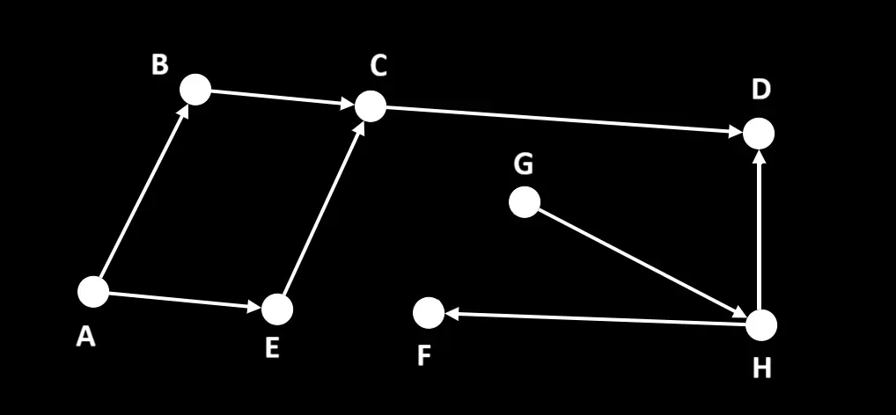

##### Шаг 1:

Пробегаясь по списку смежности графа получаем массивы ***allGraphVertices*** (содержит все узлы графа) и ***haveNoIncomingEdges*** (содержит узлы, которые не имеют входящих ребер): [ A, G ]. Из этих двух массивов создаем массив ***shouldBeConsidered*** (содержит все вершины графа, но вершины из ***haveNoIncomingEdges*** помещены в конец): [ B, E, C, D, F, H, A, G ].

Инициализируем список ***topologicalSort***, в который будут складываться топологически отсортированные вершины с метками времени добавления.

Забираем из ***shouldBeConsidered*** последний элемент – вершину ***G***, проверяем, что ее нет в ***topologicalSort***, и запускаем из нее обход в глубину.

Инициализируем  ***vStack*** – множество вершин, которые надо обработать, представленное в виде [стека](../../../DataStructures/Stack) и ***inTheCurrPath*** – список вершин, по которым сейчас проходит путь DFS.
Кладем в ***vStack*** и в ***inTheCurrPath*** вершину ***G***.

Запускаем цикл, который будет работать, пока ***vStack*** не опустеет.

Получаем из ***vStack*** последний элемент - вершину ***G*** – это рассматриваемая вершина (***ТВ***). Получаем список прямых соседей ***G***, в которые можно попасть из ***G*** – [ H ]. Последовательно обрабатываем вершины из этого списка (в данном случае только 1): вершины ***H*** нет ни в ***inTheCurrPath***, ни в ***topologicalSort***, поэтому кладем ее в конец ***vStack*** и в ***inTheCurrPath***.

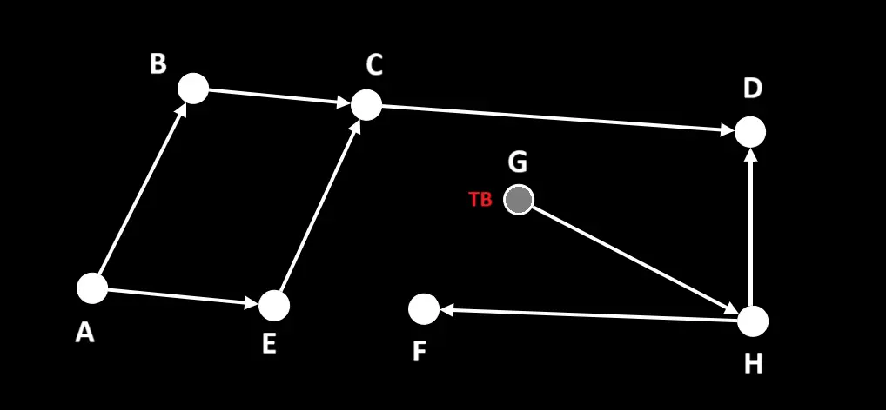

К концу шага:
- В стеке текущей итерации DFS ***vStack*** [ G, H ];
- В списке вершин, по которым проходит путь ***inTheCurrPath***: [ G, H ];
- В списке топологической сортировки ***topologicalSort***: { };
- В списке вершин, по которым должен пройтись DFS ***shouldBeConsidered***: [ B, E, C, D, F, H, A ]

 

##### Шаг 2:
Получаем из ***vStack*** последний элемент - вершину ***H*** – это рассматриваемая вершина (***ТВ***). Получаем список прямых соседей ***H***, в которые можно попасть из ***H*** – [ D, F ]. Последовательно обрабатываем вершины из этого списка: вершины ***D*** нет в ***inTheCurrPath*** и в ***topologicalSort***, поэтому кладем ее в конец ***vStack*** и в ***inTheCurrPath***, а цикл по списку соседей прерываем.

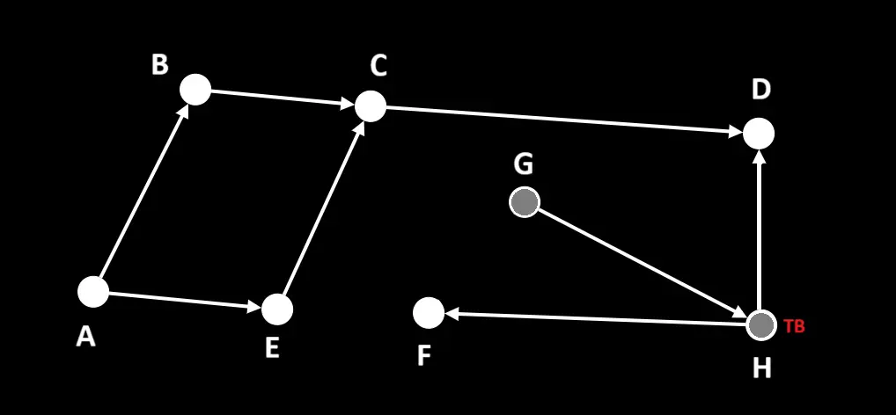

К концу шага:
- В стеке текущей итерации DFS ***vStack*** [ G, H, D ];
- В списке вершин, по которым проходит путь ***inTheCurrPath***: [ G, H, D ];
- В списке топологической сортировки ***topologicalSort***: { };
- В списке вершин, по которым должен пройтись DFS ***shouldBeConsidered***: [ B, E, C, D, F, H, A ]

 

##### Шаг 3:
Получаем из ***vStack*** последний элемент - вершину ***D*** – это рассматриваемая вершина (***ТВ***). Получаем список прямых соседей ***D***, в которые можно попасть из ***D*** – [ ]. Так как у ***D*** нет ни одного непосещенного соседа – удаляем ее из ***vStack***, ***inTheCurrPath*** и добавляем в ***topologicalSort*** с пометкой времени.

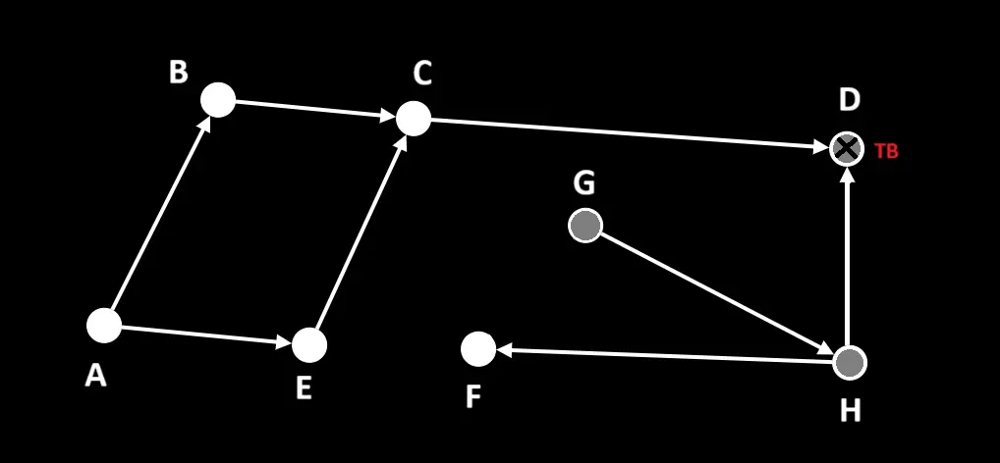

К концу шага:
- В стеке текущей итерации DFS ***vStack*** [ G, H ];
- В списке вершин, по которым проходит путь ***inTheCurrPath***: [ G, H ];
- В списке топологической сортировки ***topologicalSort***: { D: 1 };
- В списке вершин, по которым должен пройтись DFS ***shouldBeConsidered***: [ B, E, C, D, F, H, A ]

 

##### Шаг 4:
Получаем из ***vStack*** последний элемент - вершину ***H*** – это рассматриваемая вершина (***ТВ***). Получаем список прямых соседей ***H***, в которые можно попасть из ***H*** – [ D, F ]. Последовательно обрабатываем вершины из этого списка: вершина ***D*** уже есть в ***topologicalSort*** – ее пропускаем, вершины ***F*** нет ни в ***inTheCurrPath***, ни в ***topologicalSort***, поэтому кладем ее в конец ***vStack*** и в ***inTheCurrPath***.

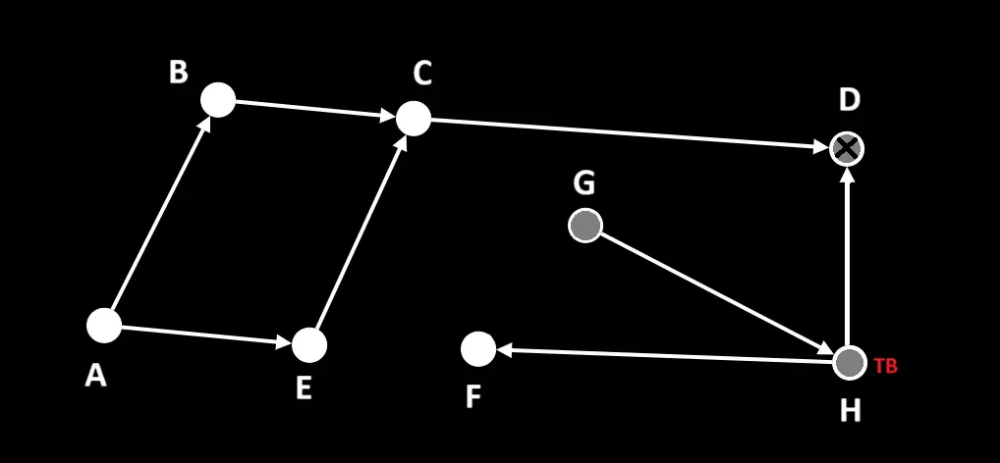

К концу шага:
- В стеке текущей итерации DFS ***vStack*** [ G, H, F ];
- В списке вершин, по которым проходит путь ***inTheCurrPath***: [ G, H, F ];
- В списке топологической сортировки ***topologicalSort***: { D: 1 };
- В списке вершин, по которым должен пройтись DFS ***shouldBeConsidered***: [ B, E, C, D, F, H, A ]

 

##### Шаг 5:
Получаем из ***vStack*** последний элемент - вершину ***F*** – это рассматриваемая вершина (***ТВ***). Получаем список прямых соседей ***F***, в которые можно попасть из ***F*** – [ ]. Так как у ***F*** нет ни одного непосещенного соседа – удаляем ее из ***vStack***, ***inTheCurrPath*** и добавляем в ***topologicalSort*** с пометкой времени.

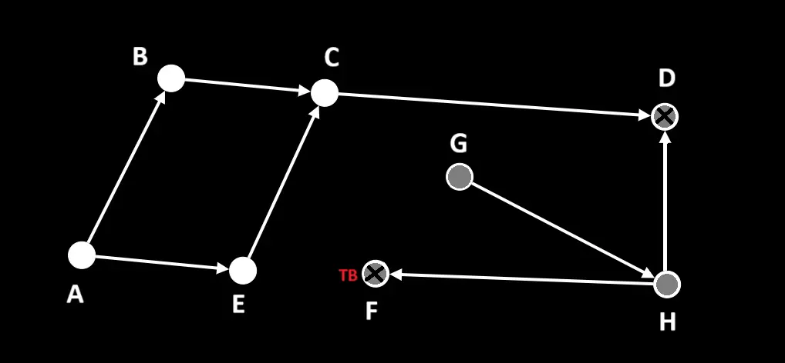

К концу шага:
- В стеке текущей итерации DFS ***vStack*** [ G, H ];
- В списке вершин, по которым проходит путь ***inTheCurrPath***: [ G, H ];
- В списке топологической сортировки ***topologicalSort***: { D: 1, F: 2 };
- В списке вершин, по которым должен пройтись DFS ***shouldBeConsidered***: [ B, E, C, D, F, H, A ]

 

##### Шаг 6:
Получаем из ***vStack*** последний элемент - вершину ***H*** – это рассматриваемая вершина (***ТВ***). Получаем список прямых соседей ***H***, в которые можно попасть из ***H*** – [ D, F ]. Так как у ***H*** нет ни одного непосещенного соседа – удаляем ее из ***vStack***, ***inTheCurrPath*** и добавляем в ***topologicalSort*** с пометкой времени.

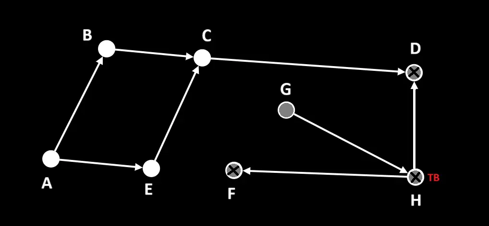

К концу шага:
- В стеке текущей итерации DFS ***vStack*** [ G ];
- В списке вершин, по которым проходит путь ***inTheCurrPath***: [ G ];
- В списке топологической сортировки ***topologicalSort***: { D: 1, F: 2, H: 3 };
- В списке вершин, по которым должен пройтись DFS ***shouldBeConsidered***: [ B, E, C, D, F, H, A ]

 

##### Шаг 7:
Получаем из ***vStack*** последний элемент - вершину ***G*** – это рассматриваемая вершина (***ТВ***). Получаем список прямых соседей ***G***, в которые можно попасть из ***G*** – [ H ]. Так как у ***G*** нет ни одного непосещенного соседа – удаляем ее из ***vStack***, ***inTheCurrPath*** и добавляем в ***topologicalSort*** с пометкой времени.

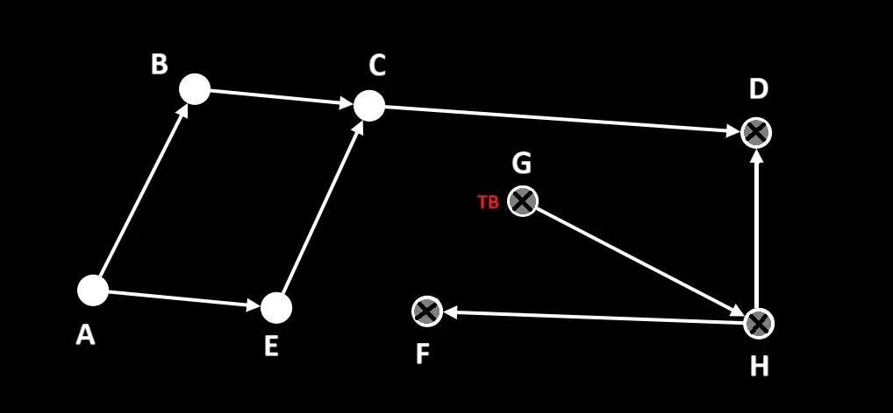

К концу шага:
- В стеке текущей итерации DFS ***vStack*** [ ];
- В списке вершин, по которым проходит путь ***inTheCurrPath***: [ ];
- В списке топологической сортировки ***topologicalSort***: { D: 1, F: 2, H: 3, G: 4 };
- В списке вершин, по которым должен пройтись DFS ***shouldBeConsidered***: [ B, E, C, D, F, H, A ]

***DFS, стартующий из G, закончил свою работу. 
Переходим к следующей вершине из shouldBeConsidered.***

 

##### Шаг 8:
Забираем из ***shouldBeConsidered*** последний элемент – вершину ***A***, проверяем, что ее нет в ***topologicalSort***, и запускаем из нее обход в глубину.

Снова инициализируем  ***vStack*** и ***inTheCurrPath***, кладем в них вершину ***A***.

Запускаем цикл, который будет работать, пока ***vStack*** не опустеет.

Получаем из ***vStack*** последний элемент - вершину ***A*** – это рассматриваемая вершина (***ТВ***). Получаем список прямых соседей ***A***, в которые можно попасть из ***A*** – [ B, E ]. Последовательно обрабатываем вершины из этого списка: вершины ***B*** нет ни в ***inTheCurrPath***, ни в ***topologicalSort*** поэтому кладем ее в конец ***vStack*** и в ***inTheCurrPath***, а цикл по списку соседей прерываем.

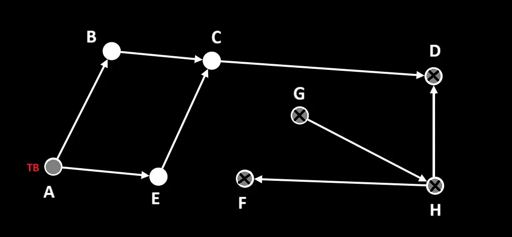

К концу шага:
- В стеке текущей итерации DFS ***vStack*** [ A, B ];
- В списке вершин, по которым проходит путь ***inTheCurrPath***: [ A, B ];
- В списке топологической сортировки ***topologicalSort***: { D: 1, F: 2, H: 3, G: 4 };
- В списке вершин, по которым должен пройтись DFS ***shouldBeConsidered***: [ B, E, C, D, F, H ]

 

##### Шаг 9:
Получаем из ***vStack*** последний элемент - вершину ***B*** – это рассматриваемая вершина (***ТВ***). Получаем список прямых соседей ***B***, в которые можно попасть из ***B*** – [ C ]. Последовательно обрабатываем вершины из этого списка (в данном случае только 1): вершины ***C*** нет ни в ***inTheCurrPath***, ни в ***topologicalSort***, поэтому кладем ее в конец ***vStack*** и в ***inTheCurrPath***.

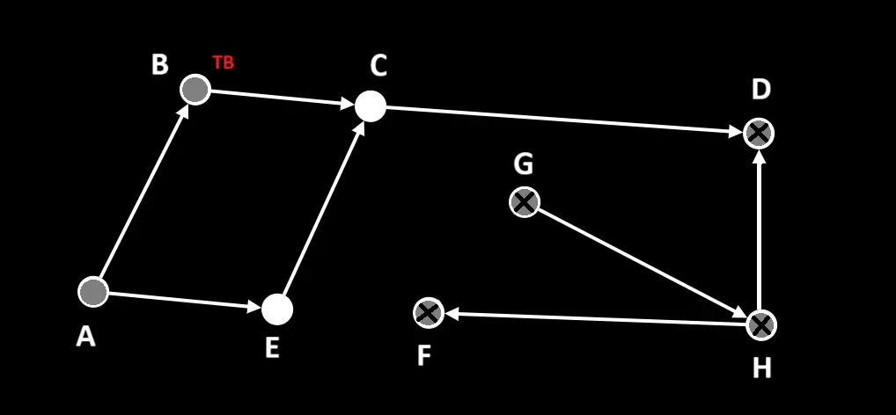

К концу шага:
- В стеке текущей итерации DFS ***vStack*** [ A, B, C ];
- В списке вершин, по которым проходит путь ***inTheCurrPath***: [ A, B, C ];
- В списке топологической сортировки ***topologicalSort***: { D: 1, F: 2, H: 3, G: 4 };
- В списке вершин, по которым должен пройтись DFS ***shouldBeConsidered***: [ B, E, C, D, F, H ]

 

##### Шаг 10:
Получаем из ***vStack*** последний элемент - вершину ***C*** – это рассматриваемая вершина (***ТВ***). Получаем список прямых соседей ***C***, в которые можно попасть из ***C*** – [ D ]. Так как у ***C*** нет ни одного непосещенного соседа – удаляем ее из ***vStack***, ***inTheCurrPath*** и добавляем в ***topologicalSort*** с пометкой времени.

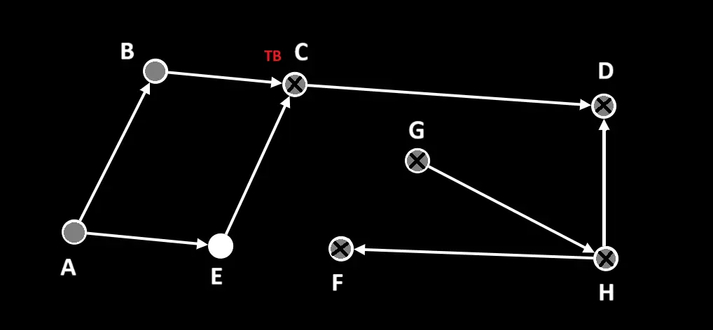

К концу шага:
- В стеке текущей итерации DFS ***vStack*** [ A, B ];
- В списке вершин, по которым проходит путь ***inTheCurrPath***: [ A, B ];
- В списке топологической сортировки ***topologicalSort***: { D: 1, F: 2, H: 3, G: 4, C: 5 };
- В списке вершин, по которым должен пройтись DFS ***shouldBeConsidered***: [ B, E, C, D, F, H ]

 

##### Шаг 11:
Получаем из ***vStack*** последний элемент - вершину ***B*** – это рассматриваемая вершина (***ТВ***). Получаем список прямых соседей ***B***, в которые можно попасть из ***B*** – [ C ]. Так как у ***B*** нет ни одного непосещенного соседа – удаляем ее из ***vStack***, ***inTheCurrPath*** и добавляем в ***topologicalSort*** с пометкой времени.

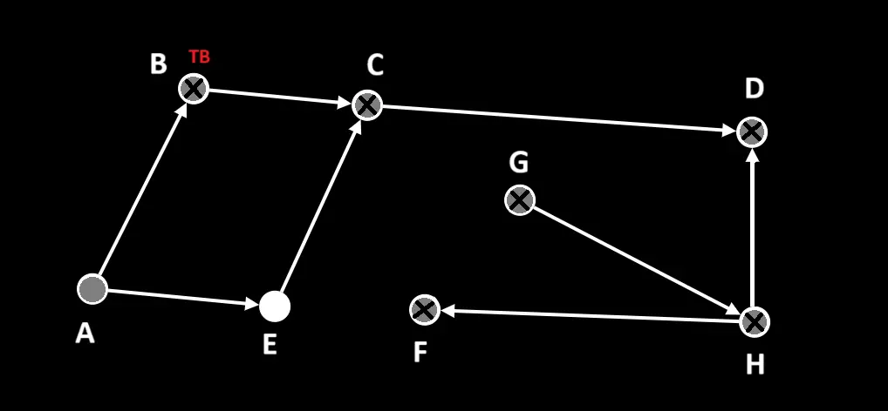

К концу шага:
- В стеке текущей итерации DFS ***vStack*** [ A ];
- В списке вершин, по которым проходит путь ***inTheCurrPath***: [ A ];
- В списке топологической сортировки ***topologicalSort***: { D: 1, F: 2, H: 3, G: 4, C: 5, B: 6 };
- В списке вершин, по которым должен пройтись DFS ***shouldBeConsidered***: [ B, E, C, D, F, H ]

 

##### Шаг 12:
Получаем из ***vStack*** последний элемент - вершину ***A*** – это рассматриваемая вершина (***ТВ***). Получаем список прямых соседей ***A***, в которые можно попасть из ***A*** – [ B, E ]. Последовательно обрабатываем вершины из этого списка: вершина ***B*** уже есть в ***topologicalSort*** – ее пропускаем, вершины ***E*** нет ни в ***inTheCurrPath***, ни в ***topologicalSort*** поэтому кладем ее в конец ***vStack*** и в ***inTheCurrPath***.

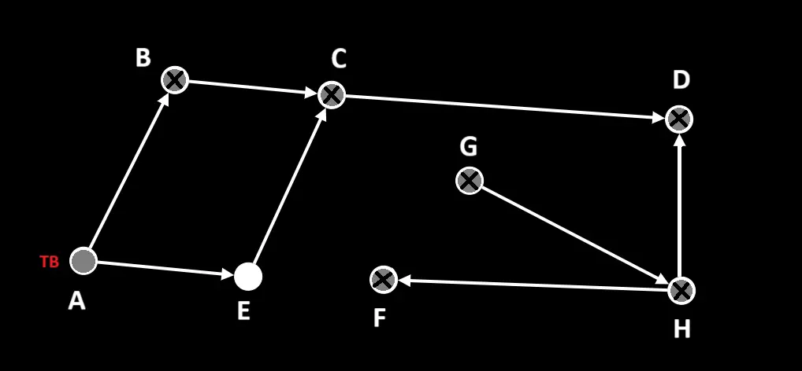

К концу шага:
- В стеке текущей итерации DFS ***vStack*** [ A, E ];
- В списке вершин, по которым проходит путь ***inTheCurrPath***: [ A, E ];
- В списке топологической сортировки ***topologicalSort***: { D: 1, F: 2, H: 3, G: 4, C: 5, B: 6 };
- В списке вершин, по которым должен пройтись DFS ***shouldBeConsidered***: [ B, E, C, D, F, H ]

 

##### Шаг 13:
Получаем из ***vStack*** последний элемент - вершину ***E*** – это рассматриваемая вершина (***ТВ***). Получаем список прямых соседей ***E***, в которые можно попасть из ***E*** – [ C ]. Так как у ***E*** нет ни одного непосещенного соседа – удаляем ее из ***vStack***, ***inTheCurrPath*** и добавляем в ***topologicalSort*** с пометкой времени.

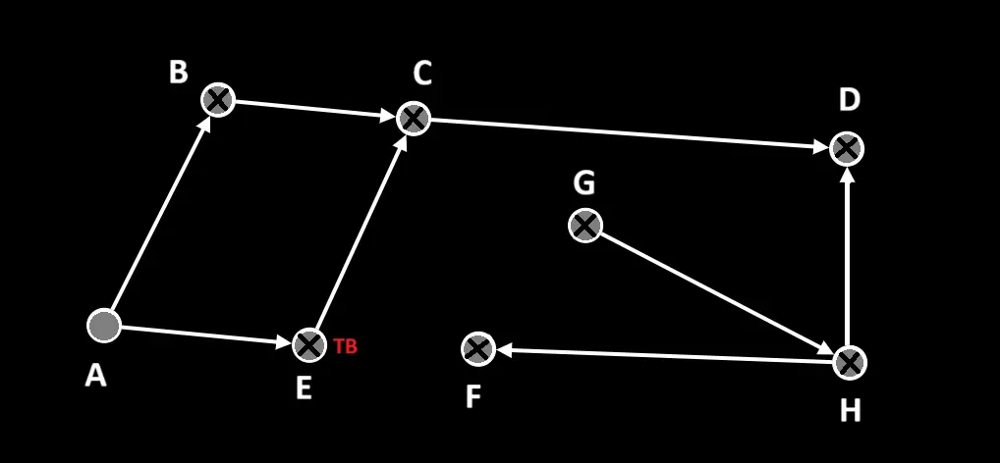

К концу шага:
- В стеке текущей итерации DFS ***vStack*** [ A ];
- В списке вершин, по которым проходит путь ***inTheCurrPath***: [ A ];
- В списке топологической сортировки ***topologicalSort***: { D: 1, F: 2, H: 3, G: 4, C: 5, B: 6, E: 7 };
- В списке вершин, по которым должен пройтись DFS ***shouldBeConsidered***: [ B, E, C, D, F, H ]

 

##### Шаг 14:
Получаем из ***vStack*** последний элемент - вершину ***A*** – это рассматриваемая вершина (***ТВ***). Получаем список прямых соседей ***A***, в которые можно попасть из ***A*** – [ B, E ]. Так как у ***A*** нет ни одного непосещенного соседа – удаляем ее из ***vStack***, ***inTheCurrPath*** и добавляем в ***topologicalSort*** с пометкой времени.

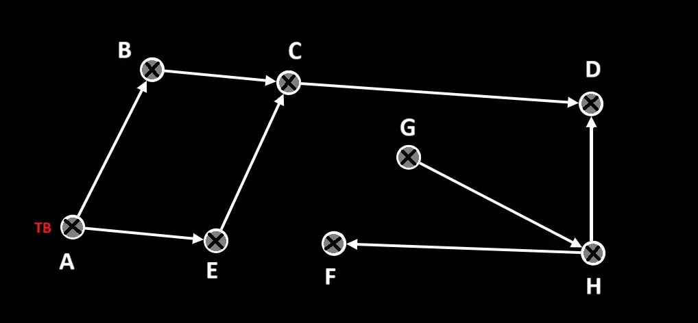

К концу шага:
- В стеке текущей итерации DFS ***vStack*** [ ];
- В списке вершин, по которым проходит путь ***inTheCurrPath***: [ ];
- В списке топологической сортировки ***topologicalSort***: { D: 1, F: 2, H: 3, G: 4, C: 5, B: 6, E: 7, A: 8 };
- В списке вершин, по которым должен пройтись DFS ***shouldBeConsidered***: [ B, E, C, D, F, H ]

***DFS, стартующий из A, закончил свою работу. 
Переходим к следующей вершине из shouldBeConsidered.***

 

##### Шаг 15:
Последовательно с конца ***shouldBeConsidered*** забираем вершины ***H***, ***F***, ***D***, ***C***, ***E*** и ***B*** и проверяем на наличие в ***topologicalSort***. Все они уже содержатся в топологической сортировке => ***shouldBeConsidered*** пуст и все узлы графа обработаны.

Сортируем вершины в ***topologicalSort*** по времени добавления по убыванию и получаем массив с именами узлов [ A, E, B, C, G, H, F, D ]  – это и есть топологическая сортировка переданного графа.
_____
#### Источники:
+ [Habr](https://habr.com/ru/articles/100953/)
+ [Habr](https://habr.com/ru/companies/otus/articles/499138/)
+ [Youtube video](https://www.youtube.com/watch?v=o0P8oNXoA_w)
+ [Algorithmica](https://ru.algorithmica.org/cs/graph-traversals/topological-sorting/)
+ [IFMO-Wiki](https://neerc.ifmo.ru/wiki/index.php?title=%D0%98%D1%81%D0%BF%D0%BE%D0%BB%D1%8C%D0%B7%D0%BE%D0%B2%D0%B0%D0%BD%D0%B8%D0%B5_%D0%BE%D0%B1%D1%85%D0%BE%D0%B4%D0%B0_%D0%B2_%D0%B3%D0%BB%D1%83%D0%B1%D0%B8%D0%BD%D1%83_%D0%B4%D0%BB%D1%8F_%D1%82%D0%BE%D0%BF%D0%BE%D0%BB%D0%BE%D0%B3%D0%B8%D1%87%D0%B5%D1%81%D0%BA%D0%BE%D0%B9_%D1%81%D0%BE%D1%80%D1%82%D0%B8%D1%80%D0%BE%D0%B2%D0%BA%D0%B8)
