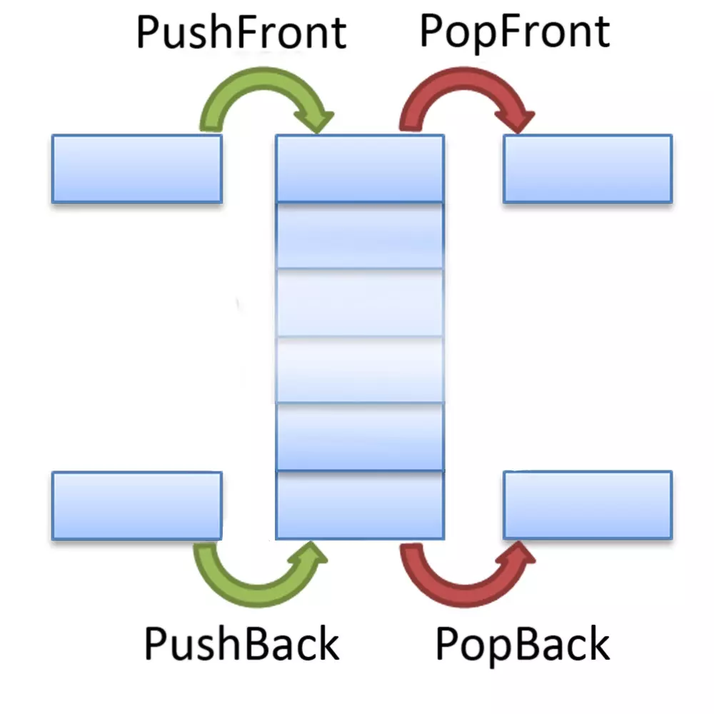

# Дек (англ. Deque — double ended queue)

__Дек__ — абстрактный тип данных, представляющий из себя список элементов, в который добавление новых элементов и удаление существующих производится с обоих концов. Эта структура поддерживает как ***FIFO (first in, first out)***, так и ***LIFO (last-in, first-out)***. Дек можно воспринимать как двустороннюю очередь.

 

__Дек поддерживает следующие операции:__
-   Операция вставки нового элемента в конец — сложность: O(1);
-   Операция удаления конечного элемента — сложность: O(1);
-   Операция вставки нового элемента в начало — сложность: O(1);
-   Операция удаления начального элемента — сложность: O(1);
-   Чтение первого или последнего элемента без извлечения — сложность: O(1);
-   Получение длины дека, проверка на пустоту — сложность: O(1).

 

Дек можно реализовать с помощью обычного массива или с помощью [связного списка](../DoubleLinkedList/).

Преимущества реализации с помощью связного списка: 
- размер дека ограничен лишь объёмом памяти (максимальная длина массива согласно спецификации ECMA-262 5th Edition = 4 294 967 295);
- сложность извлечения начального элемента - O(1) (а при реализации с помощью массива - O(N));
- сложность вставки нового элемента в начало - O(1) (а при реализации с помощью массива - O(N)).

Недостатки реализации с помощью связного списка: 
- сложнее в разработке; 
- требуется больше памяти; 
- при работе с таким деком память сильнее фрагментируется; 
- работа с деком несколько медленнее.

__Поскольку механизм реализации дека с на базе массива очевиден, в репозитории представлена реализация на базе связного списка.__

_____
#### Графическое представление дека:

_____
#### Источники:

+ [IFMO-Wiki](https://neerc.ifmo.ru/wiki/index.php?title=%D0%94%D0%B5%D0%BA)

+ [Brestprog](https://brestprog.by/topics/datastructures/)
