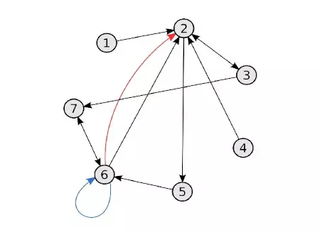
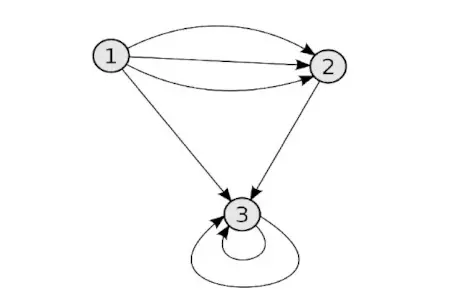
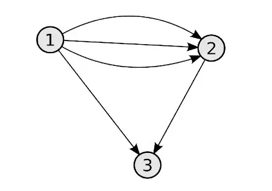
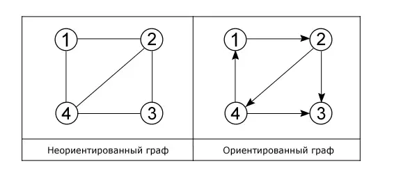
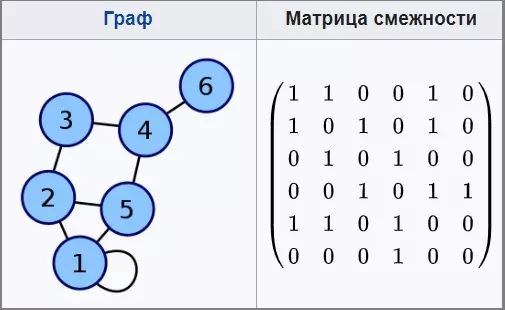

# Граф (англ. Graph)

__Граф__ — это топологичекая модель, которая состоит из множества вершин и множества соединяющих их рёбер. При этом значение имеет только сам факт, какая вершина с какой соединена.

 

__Реализация графа, представленная в репозитории, поддерживает следующие операции:__
-   Добавить вершину — сложность: O(X), где X — количество узлов, смежных с добавляемой вершиной;
-   Удалить вершину — сложность: O(V+E);
-   Добавить ребро —  — сложность: O(1);
-   Удалить ребро — сложность: O(E);
-   Удалить изолированные вершины (в том числе вершины, которые имеют только 1 инцидентное ребро-петлю) — сложность: O(V+E);
-   Получить список ребер-петель — сложность: O(E);
-   Удалить все ребра-петли — сложность: O(E);
-   Получить взвешенную/невзвешенную форму списка смежности — сложность: O(V+E);
-   Получить множество смежности для определенной вершины — сложность: O(E);
-   Получить матрицу смежности  — сложность: O(V+E);
-   Получить список ребер — сложность: O(E);
-   Получить список вершин — сложность: O(V);
-   Очистить граф — сложность: O(!)

<small>***V — количество вершин в графе, E — количество ребер.***</small>

<small>Не поддерживаются графы с отрицательным весом ребер и мультиграфы.</small>

_____

#### Базовые термины из теории графов:

***Вершина*** (***узел***) — точка, где могут сходиться/выходить рёбра и/или дуги. Множество вершин графа ***G*** обозначается ***V(G)***.

***Ребро*** — базовое понятие. Ребро соединяет две вершины графа. ***Дуга*** — ориентированное ребро.

***Инцидентность*** — понятие, используемое только в отношении ребра или дуги и вершины: если ***A***, ***B*** — вершины, а ***E = (A, B)*** — соединяющее их ребро, тогда вершина ***A*** и ребро ***E*** инцидентны, вершина ***B*** и ребро ***E*** тоже инцидентны. Две вершины (или два ребра) инцидентными быть не могут. Для обозначения ближайших вершин (рёбер) используется понятие ***смежности***.

***Смежность*** — понятие, используемое в отношении только двух рёбер либо только двух вершин: Два ребра, инцидентные одной вершине, называются смежными; две вершины, инцидентные одному ребру, также называются смежными.  

 

***Степень (валентность) вершины*** — количество рёбер графа, инцидентных данной вершине.

***Окружение*** — множество вершин, смежных с заданной.

***Множество смежности*** вершины ***V*** — множество вершин, смежных с вершиной ***V***.

***Независимые вершины*** — попарно несмежные вершины графа.

***Висячая вершина*** — вершина, степень которой равна 1.

***Изолированная вершина*** — вершина, степень которой равна 0 (то есть нет рёбер, инцидентных ей).

 

***Вес ребра*** — значение, поставленное в соответствие данному ребру взвешенного графа. Обычно вес — вещественное число, в таком случае его можно интерпретировать как «длину» ребра.

***Петля*** — ребро, начало и конец которого находятся в одной и той же вершине.

***Кратные рёбра*** — несколько рёбер, инцидентных одной и той же паре вершин. Встречаются в мультиграфах.

 
<small>Красным выделено кратное ребро. Синим обозначена петля. </small>

 

***Порядок графа*** — количество вершин графа.

***Размер графа*** — количество рёбер графа.

 

***Маршрут*** в графе — чередующаяся последовательность вершин и рёбер ***V<small>0</small>, E<small>1</small>, V<small>1</small>, E<small>2</small>, V<small>2</small>...E<small>n</small>, V<small>n</small>***, в которой любые два соседних элемента инцидентны. Если ***V<small>0</small> = V<small>n</small>***, то маршрут замкнут, иначе открыт.

***Путь*** — последовательность рёбер (в неориентированном графе) и/или дуг (в ориентированном графе), такая, что конец одной дуги (ребра) является началом другой дуги (ребра). Или последовательность вершин и дуг (рёбер), в которой каждый элемент инцидентен предыдущему и последующему. Может рассматриваться как частный случай маршрута.

***Элементарный (простой) путь*** — путь, вершины которого, за исключением, быть может, первой и последней, различны. Другими словами, простой путь не проходит дважды через одну вершину, но может начаться и закончиться в одной и той же вершине, в таком случае он называется циклом (***элементарным (простым) циклом***).

***Цепь*** в графе — маршрут, все рёбра которого различны. Если все вершины (а тем самым и рёбра) различны, то такая цепь называется ***простой (элементарной)***.  Для орграфов цепь называется ***орцепью***.

***Цикл*** — замкнутая цепь. Для орграфов цикл называется ***контуром***.

***Простой цикл*** — цикл, не проходящий дважды через одну вершину.

***Обхват*** — длина наименьшего цикла в графе.

 

***Простой граф*** — граф, в котором нет кратных рёбер и петель.

***Псевдограф*** — граф, который может содержать петли и/или кратные рёбра.

 
<small>Псевдограф </small>

***Мультиграф*** — граф, в котором может быть пара вершин, которая соединена более чем одним ребром (ненаправленным), либо более чем двумя дугами противоположных направлений.

 
<small>Мультиграф </small>

***Орграф***, ***ориентированный граф G = (V,E)*** есть пара множеств, где ***V*** — множество вершин (узлов), ***E*** — множество дуг (ориентированных рёбер). Дуга — упорядоченная пара вершин ***(v, w)***, где вершину ***v*** называют началом, а ***w*** — концом дуги. Можно сказать, что дуга ***v → w*** ведёт от вершины ***v*** к вершине ***w***, при этом вершина ***w*** смежная с вершиной ***v***.

***Пустой граф*** (***нуль-граф***) — граф без рёбер.

***Подграф*** исходного графа — граф, содержащий некое подмножество вершин данного графа и некое подмножество инцидентных им рёбер. По отношению к подграфу исходный граф называется ***суперграфом***.

 

***Остовное дерево*** (***остов***) (неориентированного) связного графа ***G = (V, E)*** — всякий частичный граф ***S = (V, T)***, являющийся деревом.

***Минимальный каркас*** (или ***каркас минимального веса***, ***минимальное остовное дерево***) графа — ациклическое (не имеющее циклов) множество рёбер в связном, взвешенном и неориентированном графе, соединяющих между собой все вершины данного графа, при этом сумма весов всех рёбер в нём минимальна.

 

***Сильная связность***. Две вершины в ориентированном графе сильно связаны, если существует путь из первой во вторую и из второй в первую. Сильно связный орграф — орграф, в котором все вершины сильно связаны.

***Компонента связности графа*** — такое подмножество вершин графа, для любых двух вершин которого существует путь из одной в другую, и не существует пути из вершины этого подмножества в вершину не из этого подмножества.

***Компонента сильной связности графа, слой*** — максимальное множество вершин ориентированного графа, такое, что для любых двух вершин из этого множества существует путь как из первой во вторую, так и из второй в первую.

***Мост*** — ребро, удаление которого увеличивает количество компонент связности в графе.

 

***Двудольный граф*** (или ***биграф***, или ***чётный граф***)  — это граф, множество вершин которого можно разбить на две части таким образом, что каждое ребро графа соединяет вершину из одной части с какой-то вершиной другой части, то есть не существует рёбер между вершинами одной и той же части графа. ***Полным двудольным*** называется двудольный граф, в котором каждая вершина одного подмножества соединена ребром с каждой вершиной другого подмножества.

 

***Гамильтонов цикл*** — простой цикл в графе, содержащий все вершины графа ровно по одному разу.

***Гамильтонов путь*** — простой путь в графе, содержащий все вершины графа ровно по одному разу.

***Гамильтонов граф*** — граф, в котором есть гамильтонов цикл.

 

***Эйлеров граф*** — граф, в котором существует цикл, содержащий все рёбра графа по одному разу (вершины могут повторяться).

***Эйлерова цепь*** (или ***эйлеров цикл***) — цепь (цикл), которая содержит все рёбра графа (вершины могут повторяться).

 

***Дерево*** — связный граф, не содержащий циклов.

***Корень дерева*** — выбранная вершина дерева; в орграфе — вершина с нулевой степенью захода.

***Лист дерева*** — вершина дерева с единственным ребром или входящей дугой.

***Лес*** — неориентированный граф без циклов. Компонентами связности леса являются деревья.

 

***Раскраска графа*** — разбиение вершин на множества (называемые цветами).

_____

#### Способы представления графа:

- __Матрица смежности__
Таблица, где как столбцы, так и строки соответствуют вершинам графа. В каждой ячейке этой матрицы записывается число, определяющее наличие связи от вершины-строки к вершине-столбцу (либо наоборот). Это наиболее удобный способ представления плотных графов. Недостатком являются требования к памяти, прямо пропорциональные квадрату количества вершин ***O(V\*V)***.

 
<small>Матрица смежности </small>

- __Матрица инцидентности__
Таблица, где строки соответствуют вершинам графа, а столбцы соответствуют связям (рёбрам) графа. В ячейку матрицы на пересечении строки ***i*** со столбцом ***j*** записывается:
***1*** — в случае, если связь ***j*** «выходит» из вершины ***i***,
***−1*** — если связь «входит» в вершину, 
***0*** — во всех остальных случаях (то есть если связь является петлёй или связь не инцидентна вершине)
Данный способ является довольно ёмким (размер пропорционален ***O(V\*E)*** для хранения, поэтому применяется очень редко, в особых случаях (например, для быстрого нахождения циклов в графе).

 

- __Список смежности__
Список, где каждой вершине графа соответствует строка, в которой хранится список смежных вершин. Такая структура данных не является таблицей в обычном понимании, а представляет собой «список списков».
Размер занимаемой памяти: ***O(V+E)***.
Это наиболее удобный способ для представления разреженных графов, а также при реализации базовых алгоритмов обхода графа в ширину или глубину, где нужно быстро получать «соседей» текущей просматриваемой вершины.

 

- __Список рёбер__
Список, где каждому ребру графа соответствует строка, в которой хранятся две вершины, инцидентные ребру.
Размер занимаемой памяти: ***O(E)***.
Это наиболее компактный способ представления графов, поэтому часто применяется для внешнего хранения или обмена данными.

_____
#### Источники:

+ [Wikipedia](https://ru.wikipedia.org/wiki/%D0%93%D0%BB%D0%BE%D1%81%D1%81%D0%B0%D1%80%D0%B8%D0%B9_%D1%82%D0%B5%D0%BE%D1%80%D0%B8%D0%B8_%D0%B3%D1%80%D0%B0%D1%84%D0%BE%D0%B2)

+ [Wikipedia](https://ru.wikipedia.org/wiki/%D0%93%D1%80%D0%B0%D1%84_(%D0%BC%D0%B0%D1%82%D0%B5%D0%BC%D0%B0%D1%82%D0%B8%D0%BA%D0%B0))

+ [Youtube video](https://www.youtube.com/watch?v=Z4tAyq8txDg)

+ [IFMO-Wiki](https://neerc.ifmo.ru/wiki/index.php?title=%D0%9E%D1%81%D0%BD%D0%BE%D0%B2%D0%BD%D1%8B%D0%B5_%D0%BE%D0%BF%D1%80%D0%B5%D0%B4%D0%B5%D0%BB%D0%B5%D0%BD%D0%B8%D1%8F_%D1%82%D0%B5%D0%BE%D1%80%D0%B8%D0%B8_%D0%B3%D1%80%D0%B0%D1%84%D0%BE%D0%B2)

+ [Habr](https://habr.com/ru/companies/otus/articles/568026/)
