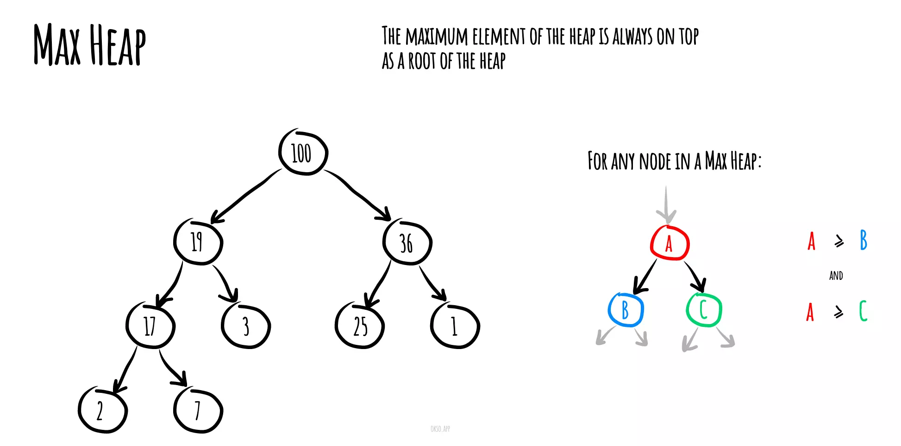
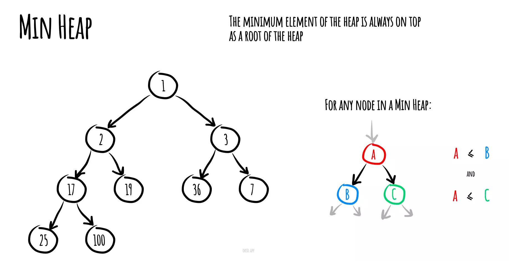
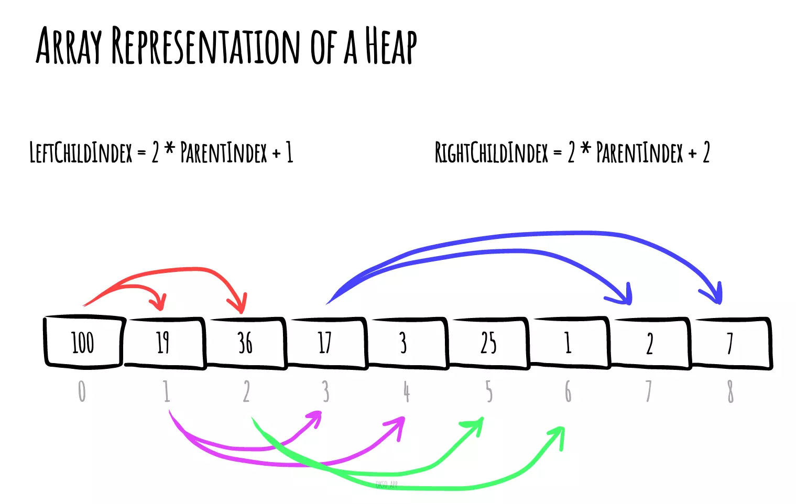

# Куча (англ. Heap)

__Куча__ - одна из простейших структур данных, основанных на деревьях. Куча используется для поддерживания некоторого множества элементов с возможностью быстрого нахождения максимума (Max-heap) (или минимума (Min-heap), это не принципиально).

 

Элементы в куче хранятся в виде полного бинарного дерева[^1]. Главное его свойство (инвариант кучи) формулируется следующим образом: ***Элемент в каждой вершине больше либо равен (для Min-heap меньше или равен) элементам во всех дочерних вершинах.***
Из этого свойства следует, что максимальный элемент всегда будет находиться в корне дерева.

 

__Классическая куча поддерживает следующие операции:__
-   Добавить элемент - сложность: O(log2N);
-   Найти корневой элемент - сложность: O(1);
-   Извлечь корневой элемент - сложность: O(log2N);
-   Найти и удалить 1 некорневой элемент - сложность: O(N).

<small>***N - высота кучи***</small>

_____

#### Графическое представление Max-heap (корневой элемент - максимальный):

 

#### Графическое представление Min-heap (корневой элемент - минимальный):

_____
#### Иллюстрация формирования индексов элементов в куче:

*Индекс левого дочернего элемента = 2\*parentIndex + 1, индекс правого дочернего элемента = 2\*parentIndex + 2*

_____
#### Основные приемы:

При добавлении в кучу нового элемента, ему присваивается первый доступный индекс. То есть, бинарное дерево заполняется по уровням слева направо. После добавления элемента возможно, что инвариант кучи перестанет выполняться, так как новый элемент будет больше (для Min-heap - меньше) своего прямого предка. В таких случаях просто меняем элемент местами с прямым предком. Если инвариант кучи всё ещё не выполняется, меняем его местами с новым предком, и так далее, пока куча не нормализуется. Такая операция называется ***проталкиванием вверх***.

При извлечении корневого элемента воспользуемся следующей хитростью: переместим последний элемент в куче (крайний правый на последнем уровне) в корень дерева на место удалённого максимума. Это почти наверняка нарушит инвариант. Сравним два дочерних элемента, выберем из них больший (для Min-heap - меньший), и поменяем его местами с текущим “максимумом (минимумом для Min-heap)”. Повторяем эту операцию, пока инвариант не восстановится. Это называется ***проталкиванием вниз***.

_____
#### Понятие очереди с приоритетом, отличия от кучи:

Вы можете услышать, как вместо термина “куча” используется термин “очередь с приоритетом”. На практике они взаимозаменимы, хотя разница в значении всё-таки присутствует.

__Очередь с приоритетом__ (англ. __Priority queue__) - абстракная структура данных, позволяющая поддерживать множество элементов, находить и извлекать минимум из него, тогда как куча - конкретная структура данных, основанная на полном бинарном дереве[^1]. Любая куча является очередью с приоритетом, но не любая очередь с приоритетом (в теории) является кучей (на практике почти что любая). Вы можете реализовать поддержку множества с извлечением максимума или минимума с помощью простого массива, она будет иметь сложность операций O(N), но всё равно являться очередью с приоритетом.
Куча является максимально эффективной реализацией абстрактного типа данных, который называется очередью с приоритетом.
*Если вы знакомы с ООП, то очередь с приоритетом - интерфейс, а куча - класс, реализующий его.*

_____
#### Источники:
+ [Github repository](https://github.com/trekhleb/javascript-algorithms/tree/master/src/data-structures/heap)

+ [Brestprog](https://brestprog.by/topics/heap/)

+ [Youtube video](https://www.youtube.com/watch?v=noQ4SUoqrQA&ab_channel=%D0%A4%D0%BE%D0%BA%D1%81%D1%84%D0%BE%D1%80%D0%B4)

[^1]:  
    <small>

     *Полным бинарным деревом называется такое дерево, в котором каждая вершина имеет не более двух дочерних элементов, а заполнение вершин осуществляется в порядке от верхних уровней к нижним, причем на одном уровне заполнение вершин производится слева направо.* 

    </small>