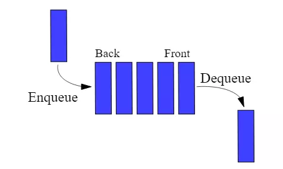

# Очередь (англ. Queue)

__Очередь__  — абстрактный тип данных с дисциплиной доступа к элементам «первый пришёл — первый вышел» ***(FIFO, англ. first in, first out)***. Добавление элемента (принято обозначать словом ***enqueue*** — поставить в очередь) возможно лишь в конец очереди, выборка — только из начала очереди (что принято называть словом ***dequeue*** — убрать из очереди), при этом выбранный элемент из очереди удаляется.

 

__Очередь поддерживает следующие операции:__
-   Вставка нового элемента в конец очереди — сложность: O(1);
-   Извлечение первого элемента — сложность: O(1);
-   Чтение первого или последнего элемента без извлечения из очереди — сложность: O(1);
-   Получение длины очереди, проверка на пустоту — сложность: O(1).

 

Очередь можно реализовать с помощью обычного массива или с помощью [связного списка](../DoubleLinkedList/).

Преимущества реализации с помощью связного списка: 
- размер очереди ограничен лишь объёмом памяти (максимальная длина массива согласно спецификации ECMA-262 5th Edition = 4 294 967 295);
- сложность извлечения элемента из начала очереди - O(1) (а при реализации с помощью массива - O(N)).

Недостатки реализации с помощью связного списка: 
- сложнее в разработке; 
- требуется больше памяти; 
- при работе с такой очередью память сильнее фрагментируется; 
- работа с очередью несколько медленнее.

__Поскольку реализация очереди с на базе массива очевидна, в репозитории представлена реализация на базе связного списка.__

_____
#### Графическое представление очереди:

_____
#### Источники:

+ [IFMO-Wiki](https://neerc.ifmo.ru/wiki/index.php?title=%D0%9E%D1%87%D0%B5%D1%80%D0%B5%D0%B4%D1%8C)

+ [Proglib](https://proglib.io/p/rasprostranennye-algoritmy-i-struktury-dannyh-v-javascript-steki-ocheredi-i-svyaznye-spiski-2021-10-13)

+ [Wikipedia](https://ru.wikipedia.org/wiki/%D0%9E%D1%87%D0%B5%D1%80%D0%B5%D0%B4%D1%8C_(%D0%BF%D1%80%D0%BE%D0%B3%D1%80%D0%B0%D0%BC%D0%BC%D0%B8%D1%80%D0%BE%D0%B2%D0%B0%D0%BD%D0%B8%D0%B5))
