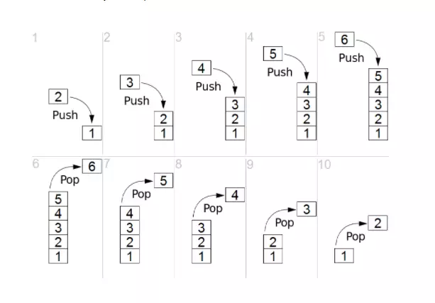

# Стек (англ. Stack — стопка)

__Стек__ — абстрактный тип данных, представляющий из себя упорядоченный набор элементов, в котором добавление новых элементов и удаление существующих производится с одного конца, называемого вершиной стека. Притом первым из стека удаляется элемент, который был помещен туда последним, то есть в стеке реализуется стратегия «последним вошел — первым вышел» ***(LIFO, англ. last-in, first-out)***. 

Примером стека в реальной жизни может являться стопка тарелок: когда мы хотим вытащить тарелку, мы должны снять все тарелки выше.

 

__Стек поддерживает следующие операции:__
-   Вставка нового элемента в конец списка — сложность: O(1);
-   Извлечение последнего элемента списка — сложность: O(1);
-   Чтение первого или последнего элемента без извлечения из стека — сложность: O(1);
-   Получение количества элементов, проверка стека на пустоту — сложность: O(1).

 

Стек можно реализовать с помощью обычного массива или с помощью [связного списка](../DoubleLinkedList/).

Преимущества реализации с помощью связного списка: 
- размер стека будет ограничен лишь объёмом памяти (максимальная длина массива согласно спецификации ECMA-262 5th Edition = 4 294 967 295);

Недостатки реализации с помощью связного списка: 
- сложнее в разработке; 
- требуется больше памяти; 
- при работе с таким стеком память сильнее фрагментируется; 
- работа со стеком несколько медленнее.

__Поскольку механизм реализации стека с на базе массива очевиден, в репозитории представлена реализация на базе связного списка.__

_____
#### Графическое представление стека:

_____
#### Источники:

+ [IFMO-Wiki](https://neerc.ifmo.ru/wiki/index.php?title=%D0%A1%D1%82%D0%B5%D0%BA)

+ [Proglib](https://proglib.io/p/rasprostranennye-algoritmy-i-struktury-dannyh-v-javascript-steki-ocheredi-i-svyaznye-spiski-2021-10-13)
