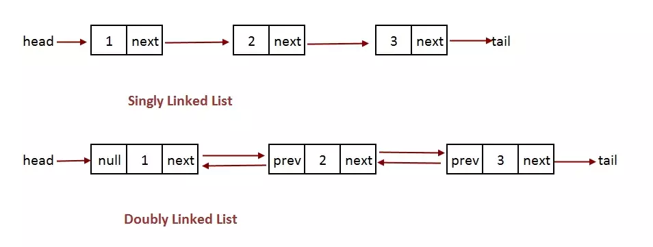

# Связный список (англ. Linked list)

__Связный список__ — структура данных, состоящая из элементов, содержащих помимо собственных данных ссылки на следующий и/или предыдущий элемент списка. С помощью списков можно реализовать такие структуры данных как стек и очередь. Принципиальным преимуществом перед массивом является структурная гибкость: порядок элементов связного списка может не совпадать с порядком расположения элементов данных в памяти компьютера, а порядок обхода списка всегда явно задаётся его внутренними связями.

 

__Связный список поддерживает следующие операции:__
-   Добавить элемент в начало или в конец списка — сложность: O(1);
-   Извлечь первый или последний элемент списка — сложность: O(1);
-   Поиск по значению и последующее удаление одного или нескольких элементов из списка — сложность: O(N);
-   Изменение порядка элементов на обратный (доступно для двусвязного списка) — сложность: O(N);

<small>***N - количество элементов в списке***</small>

_____

#### Классификация списков:
- __По количеству полей указателей__ различают однонаправленный (односвязный) и двунаправленный (двусвязный) списки. Связный список, содержащий только один указатель на следующий элемент, называется ***односвязным***. Связный список, содержащий два поля указателя – на следующий элемент и на предыдущий, называется ***двусвязным***.
- По способу связи элементов различают линейные и циклические списки. Связный список, в котором, последний элемент указывает на NULL, называется ***линейным***. Связный список, в котором последний элемент связан с первым, называется ***циклическим***.

_____

#### Графическое представление линейного односвязного и линейного двусвязного списка:

_____

#### Сравнение массивов и связных списков:

<table>
    <thead style="background-color: #8A51E6; text-align: center; color: #fff; font-weight:700">
        <tr>
            <td>Массив</td>
            <td>Список</td>
        </tr>
    </thead>
    <tbody>
        <tr>
            <td>Выделение памяти осуществляется единовременно под весь массив до начала его использования</td>
            <td style="background-color: #33ff66;">Выделение памяти осуществляется по мере ввода новых элементов</td>
        </tr>
        <tr>
            <td>При удалении/добавлении элемента требуется копирование всех последующих элементов для осуществления их
                сдвига</td>
            <td style="background-color: #33ff66;">Удаление/добавление элемента осуществляется переустановкой
                указателей, при этом сами данные не копируются</td>
        </tr>
        <tr>
            <td style="background-color: #33ff66;">Для хранения элемента требуется объем памяти, необходимый только для
                хранения данных этого элемента</td>
            <td>Для хранения элемента требуется объем памяти, достаточный для хранения данных этого элемента и
                указателей (1 или 2) на другие элементы списка</td>
        </tr>
        <tr>
            <td style="background-color: #33ff66;">Доступ к элементам может осуществляться в произвольном порядке</td>
            <td>Возможен только последовательный доступ к элементам</td>
        </tr>
    </tbody>
</table>

_____
#### Источники:
+ [Prog-cpp](https://prog-cpp.ru/data-list/)

+ [Habr](https://habr.com/ru/articles/717572/)
